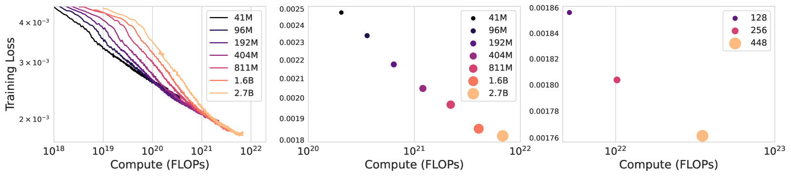
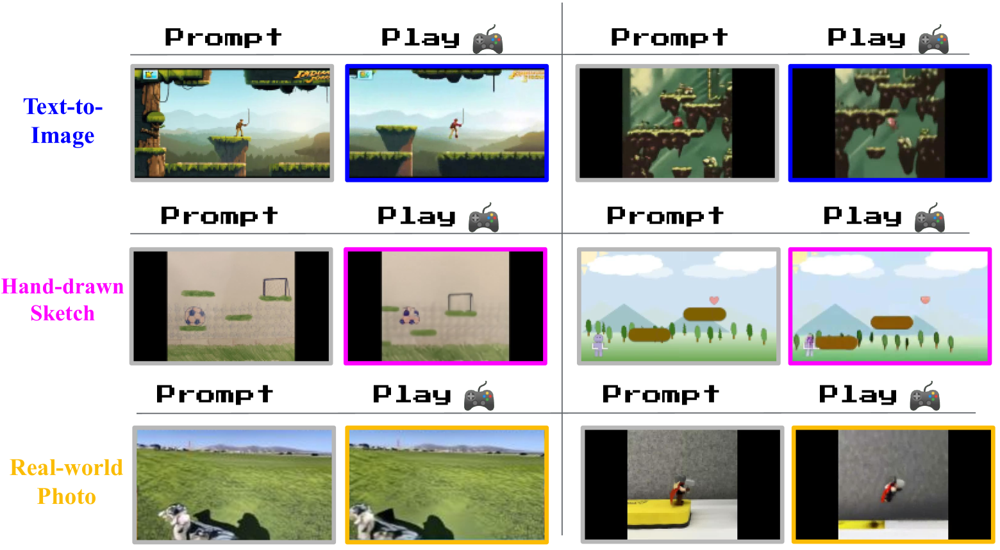
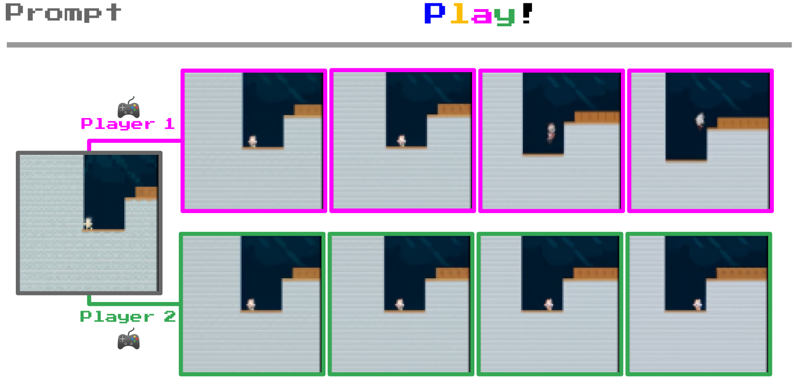
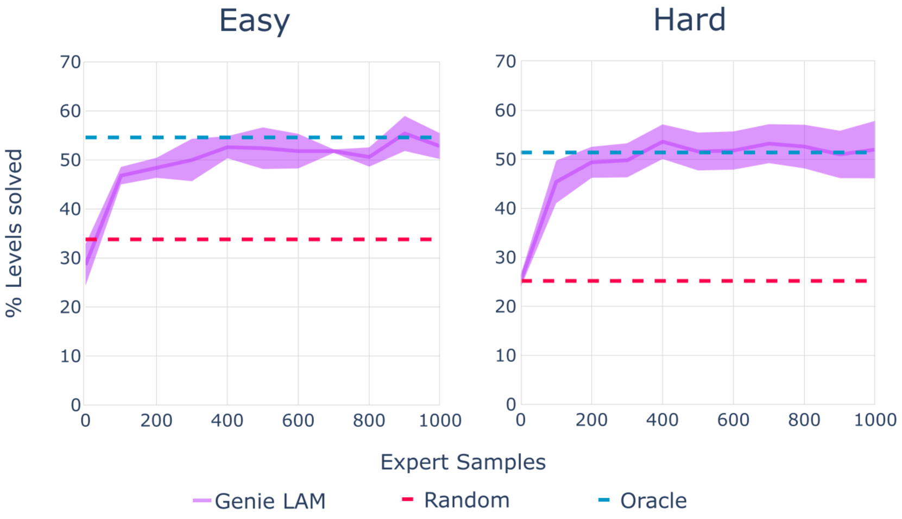

[
Back to arXiv](https://arxiv.org/)

[
Back to arXiv](https://arxiv.org/)

This is **experimental HTML** to improve accessibility. We invite you to report rendering errors. Use Alt+Y to toggle on accessible reporting links and Alt+Shift+Y to toggle off. Learn more [about this project](https://info.arxiv.org/about/accessible_HTML.html) and [help improve conversions](https://info.arxiv.org/help/submit_latex_best_practices.html).

[Why HTML?](https://info.arxiv.org/about/accessible_HTML.html)
[Report Issue](#myForm)
[Back to Abstract](https://arxiv.org/abs/2402.15391)
[Download PDF](https://arxiv.org/pdf/2402.15391)

## Table of Contents

1. [1 1. Introduction](https://arxiv.org/html/2402.15391v1#S1 "1 1. Introduction ‣ Genie: Generative Interactive Environments")
2. [2 2. Methodology](https://arxiv.org/html/2402.15391v1#S2 "2 2. Methodology ‣ Genie: Generative Interactive Environments")
   1. [2.1 Model Components](https://arxiv.org/html/2402.15391v1#S2.SS1 "2.1 Model Components ‣ 2 2. Methodology ‣ Genie: Generative Interactive Environments")
   2. [2.2 Inference: Action-Controllable Video Generation](https://arxiv.org/html/2402.15391v1#S2.SS2 "2.2 Inference: Action-Controllable Video Generation ‣ 2 2. Methodology ‣ Genie: Generative Interactive Environments")
3. [3 3. Experimental Results](https://arxiv.org/html/2402.15391v1#S3 "3 3. Experimental Results ‣ Genie: Generative Interactive Environments")
   1. [3.1 Scaling Results](https://arxiv.org/html/2402.15391v1#S3.SS1 "3.1 Scaling Results ‣ 3 3. Experimental Results ‣ Genie: Generative Interactive Environments")
   2. [3.2 Qualitative Results](https://arxiv.org/html/2402.15391v1#S3.SS2 "3.2 Qualitative Results ‣ 3 3. Experimental Results ‣ Genie: Generative Interactive Environments")
   3. [3.3 Training Agents](https://arxiv.org/html/2402.15391v1#S3.SS3 "3.3 Training Agents ‣ 3 3. Experimental Results ‣ Genie: Generative Interactive Environments")
   4. [3.4 Ablation Studies](https://arxiv.org/html/2402.15391v1#S3.SS4 "3.4 Ablation Studies ‣ 3 3. Experimental Results ‣ Genie: Generative Interactive Environments")
4. [4 4. Related Work](https://arxiv.org/html/2402.15391v1#S4 "4 4. Related Work ‣ Genie: Generative Interactive Environments")
5. [5 5. Conclusion and Future Work](https://arxiv.org/html/2402.15391v1#S5 "5 5. Conclusion and Future Work ‣ Genie: Generative Interactive Environments")
6. [A Additional Example Trajectories](https://arxiv.org/html/2402.15391v1#A1 "Appendix A Additional Example Trajectories ‣ Genie: Generative Interactive Environments")
7. [B Dataset](https://arxiv.org/html/2402.15391v1#A2 "Appendix B Dataset ‣ Genie: Generative Interactive Environments")
   1. [B.1 Platformers Dataset](https://arxiv.org/html/2402.15391v1#A2.SS1 "B.1 Platformers Dataset ‣ Appendix B Dataset ‣ Genie: Generative Interactive Environments")
      1. [Initial Dataset](https://arxiv.org/html/2402.15391v1#A2.SS1.SSS0.Px1 "Initial Dataset ‣ B.1 Platformers Dataset ‣ Appendix B Dataset ‣ Genie: Generative Interactive Environments")
      2. [Filter Pipeline](https://arxiv.org/html/2402.15391v1#A2.SS1.SSS0.Px2 "Filter Pipeline ‣ B.1 Platformers Dataset ‣ Appendix B Dataset ‣ Genie: Generative Interactive Environments")
8. [C Training details](https://arxiv.org/html/2402.15391v1#A3 "Appendix C Training details ‣ Genie: Generative Interactive Environments")
   1. [C.1 Latent Action Model Training](https://arxiv.org/html/2402.15391v1#A3.SS1 "C.1 Latent Action Model Training ‣ Appendix C Training details ‣ Genie: Generative Interactive Environments")
   2. [C.2 Video Tokenizer Training](https://arxiv.org/html/2402.15391v1#A3.SS2 "C.2 Video Tokenizer Training ‣ Appendix C Training details ‣ Genie: Generative Interactive Environments")
   3. [C.3 Dynamics Model Training](https://arxiv.org/html/2402.15391v1#A3.SS3 "C.3 Dynamics Model Training ‣ Appendix C Training details ‣ Genie: Generative Interactive Environments")
9. [D Scaling Experiments Details](https://arxiv.org/html/2402.15391v1#A4 "Appendix D Scaling Experiments Details ‣ Genie: Generative Interactive Environments")
   1. [Scaling model size](https://arxiv.org/html/2402.15391v1#A4.SS0.SSS0.Px1 "Scaling model size ‣ Appendix D Scaling Experiments Details ‣ Genie: Generative Interactive Environments")
   2. [Scaling batch size](https://arxiv.org/html/2402.15391v1#A4.SS0.SSS0.Px2 "Scaling batch size ‣ Appendix D Scaling Experiments Details ‣ Genie: Generative Interactive Environments")
   3. [Genie Model](https://arxiv.org/html/2402.15391v1#A4.SS0.SSS0.Px3 "Genie Model ‣ Appendix D Scaling Experiments Details ‣ Genie: Generative Interactive Environments")
10. [E Behavioral Cloning Details](https://arxiv.org/html/2402.15391v1#A5 "Appendix E Behavioral Cloning Details ‣ Genie: Generative Interactive Environments")
    1. [E.1 Genie LAM](https://arxiv.org/html/2402.15391v1#A5.SS1 "E.1 Genie LAM ‣ Appendix E Behavioral Cloning Details ‣ Genie: Generative Interactive Environments")
    2. [E.2 Architecture](https://arxiv.org/html/2402.15391v1#A5.SS2 "E.2 Architecture ‣ Appendix E Behavioral Cloning Details ‣ Genie: Generative Interactive Environments")
11. [F Reproducible Case Study](https://arxiv.org/html/2402.15391v1#A6 "Appendix F Reproducible Case Study ‣ Genie: Generative Interactive Environments")
    1. [F.1 Data Collection](https://arxiv.org/html/2402.15391v1#A6.SS1 "F.1 Data Collection ‣ Appendix F Reproducible Case Study ‣ Genie: Generative Interactive Environments")
    2. [F.2 Video Tokenizer Training](https://arxiv.org/html/2402.15391v1#A6.SS2 "F.2 Video Tokenizer Training ‣ Appendix F Reproducible Case Study ‣ Genie: Generative Interactive Environments")
    3. [F.3 Dynamics + Latent Action Model Training](https://arxiv.org/html/2402.15391v1#A6.SS3 "F.3 Dynamics + Latent Action Model Training ‣ Appendix F Reproducible Case Study ‣ Genie: Generative Interactive Environments")

Report issue for preceding element

HTML conversions [sometimes display errors](https://info.dev.arxiv.org/about/accessibility_html_error_messages.html) due to content that did not convert correctly from the source. This paper uses the following packages that are not yet supported by the HTML conversion tool. Feedback on these issues are not necessary; they are known and are being worked on.

Report issue for preceding element

* failed: kantlipsum
* failed: textpos

Authors: achieve the best HTML results from your LaTeX submissions by following these [best practices](https://info.arxiv.org/help/submit_latex_best_practices.html).

Report issue for preceding element

License: arXiv.org perpetual non-exclusive license

arXiv:2402.15391v1 [cs.LG] 23 Feb 2024

\pdftrailerid

redacted
\correspondingauthorAshley Edwards (edwardsashley@google.com), Jack Parker-Holder (jparkerholder@google.com).
\bannerfigures/hook.pdfA whole new world: Genie is capable of converting a variety of different prompts into interactive, playable environments that can be easily created, stepped into, and explored. This is made possible via a latent action interface, learned fully unsupervised from Internet videos. On the right we see a few generated steps for taking two latent actions. See more examples on our [website](https://sites.google.com/view/genie-2024/home).

Report issue for preceding element

# ![[Uncaptioned image]](x1.png) Genie: Generative Interactive Environments

Report issue for preceding element

Jake Bruce
Equal contributions
Google DeepMind

Michael Dennis
Equal contributions
Google DeepMind

Ashley Edwards
Equal contributions
Google DeepMind

Jack Parker-Holder
Equal contributions
Google DeepMind

Yuge (Jimmy) Shi
Equal contributions
Google DeepMind

Edward Hughes
Google DeepMind

Matthew Lai
Google DeepMind

Aditi Mavalankar
Google DeepMind

Richie Steigerwald
Google DeepMind

Chris Apps
Google DeepMind

Yusuf Aytar
Google DeepMind

Sarah Bechtle
Google DeepMind

Feryal Behbahani
Google DeepMind

Stephanie Chan
Google DeepMind

Nicolas Heess
Google DeepMind

Lucy Gonzalez
Google DeepMind

Simon Osindero
Google DeepMind

Sherjil Ozair
Google DeepMind

Scott Reed
Google DeepMind

Jingwei Zhang
Google DeepMind

Konrad Zolna
Google DeepMind

Jeff Clune
Google DeepMind
University of British Columbia

Nando de Freitas
Google DeepMind

Satinder Singh
Google DeepMind

Tim Rocktäschel
Equal contributions
Google DeepMind

Report issue for preceding element

###### Abstract

Report issue for preceding element

We introduce Genie, the first *generative interactive environment* trained in an unsupervised manner from unlabelled Internet videos. The model can be prompted to generate an endless variety of action-controllable virtual worlds described through text, synthetic images, photographs, and even sketches. At 11B parameters, Genie can be considered a *foundation world model*. It is comprised of a spatiotemporal video tokenizer, an autoregressive dynamics model, and a simple and scalable latent action model. Genie enables users to act in the generated environments on a frame-by-frame basis *despite training without any ground-truth action labels* or other domain-specific requirements typically found in the world model literature. Further the resulting learned latent action space facilitates training agents to imitate behaviors from unseen videos, opening the path for training generalist agents of the future.

Report issue for preceding element

###### keywords:

Report issue for preceding elementGenerative AI, Foundation Models, World Models, Video Models, Open-Endedness

## 1 1. Introduction

Report issue for preceding element

The last few years have seen an emergence of *generative AI*, with models capable of generating novel and creative content. Driven by breakthroughs in architectures such as transformers (Vaswani et al., [2017](https://arxiv.org/html/2402.15391v1#bib.bib74)), advances in hardware, and a recent focus on scaling models and datasets, we can now generate coherent, conversational language (Radford et al., [2018](https://arxiv.org/html/2402.15391v1#bib.bib52), [2019](https://arxiv.org/html/2402.15391v1#bib.bib53); Brown et al., [2020](https://arxiv.org/html/2402.15391v1#bib.bib10)), as well as crisp and aesthetically pleasing images from a text prompt (Ramesh et al., [2021](https://arxiv.org/html/2402.15391v1#bib.bib55), [2022](https://arxiv.org/html/2402.15391v1#bib.bib56); Saharia et al., [2022](https://arxiv.org/html/2402.15391v1#bib.bib63); Rombach et al., [2022](https://arxiv.org/html/2402.15391v1#bib.bib61)). Early signs indicate video generation will be yet another frontier, with recent results suggesting that such models may also benefit from scale (Hong et al., [2023](https://arxiv.org/html/2402.15391v1#bib.bib31); Ho et al., [2022a](https://arxiv.org/html/2402.15391v1#bib.bib28); Esser et al., [2023](https://arxiv.org/html/2402.15391v1#bib.bib20); Blattmann et al., [2023a](https://arxiv.org/html/2402.15391v1#bib.bib6)). Still, there remains a gulf between the level of interactions and engagement of video generative models and language tools such as ChatGPT, let alone more immersive experiences.

Report issue for preceding element

What if, given a large corpus of videos from the Internet, we could not only train models capable of generating novel images or videos, but entire interactive experiences? We propose *generative interactive environments*, a new paradigm for generative AI whereby interactive environments can be generated from a single text or image prompt. Our approach, Genie, is trained from a large dataset of over 200,000 hours of publicly available Internet gaming videos and, despite training *without action or text annotations*, is controllable on a frame-by-frame basis via a learned latent action space (see [Table 1](https://arxiv.org/html/2402.15391v1#S1.T1 "Table 1 ‣ 1 1. Introduction ‣ Genie: Generative Interactive Environments") for a comparison to other approaches). At 11B parameters, Genie exhibits properties typically seen in foundation models—it can take an unseen image as a prompt making it possible to create and play entirely imagined virtual worlds (e.g [Figure 1](https://arxiv.org/html/2402.15391v1#S1.F1 "Figure 1 ‣ 1 1. Introduction ‣ Genie: Generative Interactive Environments")).

Report issue for preceding element

Figure 1: Diverse trajectories: Genie is a generative model that can be used as an interactive environment. The model can be prompted in various ways, either with a generated image (top) or a hand-drawn sketch (bottom). At each time step, the model takes a user-provided latent action to generate the next frame, producing trajectories with interesting and diverse character actions.

Report issue for preceding element

Genie builds on ideas from state-of-the-art video generation models (Villegas et al., [2023](https://arxiv.org/html/2402.15391v1#bib.bib75); Gupta et al., [2023](https://arxiv.org/html/2402.15391v1#bib.bib22)), with a core design choice being spatiotemporal (ST) transformers (Xu et al., [2020](https://arxiv.org/html/2402.15391v1#bib.bib80)) which are used in all of our model components. Genie utilizes a novel video tokenizer, and extracts latent actions via a causal action model. Both the video tokens and latent actions are passed to a dynamics model, which autoregressively predicts the next frame using MaskGIT (Chang et al., [2022](https://arxiv.org/html/2402.15391v1#bib.bib11)). We provide a rigorous scaling analysis of our architecture with respect to both batch and model size, which we vary from 40M to 2.7B parameters. The results show that our architecture scales gracefully with additional computational resources, leading to a final 11B parameter model. We train Genie on a filtered set of 30,000 hours of Internet gameplay videos from hundreds of 2D platformer games, producing a foundation world model for this setting.

Report issue for preceding element

To demonstrate the generality of our approach, we also train a separate model on action-free robot videos from the RT1 dataset (Brohan et al., [2023](https://arxiv.org/html/2402.15391v1#bib.bib8)), learning a generative environment with consistent latent actions. Finally, we show that latent actions learned from Internet videos can be used for inferring policies from unseen action-free videos of simulated reinforcement learning (RL) environments, indicating that Genie may hold the key to unlocking unlimited data for training the next generation of generalist agents (Open Ended Learning Team et al., [2021](https://arxiv.org/html/2402.15391v1#bib.bib49); Bauer et al., [2023](https://arxiv.org/html/2402.15391v1#bib.bib5); Reed et al., [2022](https://arxiv.org/html/2402.15391v1#bib.bib57); Clune, [2019](https://arxiv.org/html/2402.15391v1#bib.bib14)).

Report issue for preceding element

Figure 2: Genie model training: Genie takes in T𝑇Titalic\_T frames of video as input, tokenizes them into discrete tokens 𝒛𝒛\bm{z}bold\_italic\_z via the video tokenizer, and infers the latent actions 𝒂~~𝒂\tilde{\bm{a}}over~ start\_ARG bold\_italic\_a end\_ARG between each frame with the latent action model. Both are then passed to the dynamics model to generate predictions for the next frames in an iterative manner.

Report issue for preceding element

Table 1: A new class of generative model: Genie is a novel video and world model that is controllable on a frame-by-frame basis, which requires only video data at train time.

| Model Class | Training Data | Controllability |
| --- | --- | --- |
| World Models | Video + Actions | Frame-level |
| Video Models | Video + Text | Video-level |
| Genie | Video | Frame-level |

Report issue for preceding element

## 2 2. Methodology

Report issue for preceding element

Genie is a generative interactive environment trained from video-only data. In this section we begin with preliminaries before explaining the main components of our model.

Report issue for preceding element

Several components in the Genie architecture are based on the Vision Transformer (ViT) (Vaswani et al., [2017](https://arxiv.org/html/2402.15391v1#bib.bib74); Dosovitskiy et al., [2021](https://arxiv.org/html/2402.15391v1#bib.bib17)). Notably, the quadratic memory cost of transformers poses challenges for videos, which can contain up to O⁢(104)𝑂superscript104O(10^{4})italic\_O ( 10 start\_POSTSUPERSCRIPT 4 end\_POSTSUPERSCRIPT ) tokens. We thus adopt a memory efficient ST-transformer architecture (inspired by Xu et al. ([2020](https://arxiv.org/html/2402.15391v1#bib.bib80)), see [Figure 3](https://arxiv.org/html/2402.15391v1#S2.F3 "Figure 3 ‣ 2 2. Methodology ‣ Genie: Generative Interactive Environments")) across all model components, balancing model capacity with computational constraints.

Report issue for preceding element

Figure 3: ST-transformer architecture. The architecture is composed of L𝐿Litalic\_L spatiotemporal blocks, each containing a spatial layer, temporal layer and feed-forward layer. Each color represents a single self-attention map, with the spatial layer attending over the H×W𝐻𝑊H\times Witalic\_H × italic\_W tokens from within a single time step, and temporal the same token from across the T𝑇Titalic\_T time steps.

Report issue for preceding element

Unlike a traditional transformer where every token attends to all others, an ST-transformer contains L𝐿Litalic\_L spatiotemporal blocks with interleaved spatial and temporal attention layers, followed by a feed-forward layer (FFW) as standard attention blocks. The self-attention in the spatial layer attends over the 1×H×W1𝐻𝑊1\times H\times W1 × italic\_H × italic\_W tokens within each time step, and in the temporal layer attends over T×1×1𝑇11T\times 1\times 1italic\_T × 1 × 1 tokens across the T𝑇Titalic\_T time steps. Similar to sequence transformers, the temporal layer assumes a causal structure with a causal mask. Crucially, the dominating factor of computation complexity (i.e. the spatial attention layer) in our architecture scales linearly with the number of frames rather than quadratically, making it much more efficient for video generation with consistent dynamics over extended interactions. Further, note that in the ST block, we include only one FFW after both spatial and temporal components, omitting the post-spatial FFW to allow for scaling up other components of the model, which we observe to improve results significantly.

Report issue for preceding element

### 2.1 Model Components

Report issue for preceding element

As shown in [Figure 2](https://arxiv.org/html/2402.15391v1#S1.F2 "Figure 2 ‣ 1 1. Introduction ‣ Genie: Generative Interactive Environments"), our model contains three key components: 1) a *latent action model* that infers the latent action 𝒂𝒂\bm{a}bold\_italic\_a between each pair of frames and 2) a *video tokenizer* that converts raw video frames into discrete tokens 𝒛𝒛\bm{z}bold\_italic\_z and 3) a *dynamics model* that, given a latent action and past frame tokens, predicts the next frame of the video. The model is trained in two phases following a standard autoregressive video generation pipeline: we train the video tokenizer first, which is used for the dynamics model. We then co-train the latent action model (directly from pixels) and the dynamics model (on video tokens).

Report issue for preceding element

Latent Action Model (LAM) To achieve controllable video generation, we condition each future frame prediction on the action taken at the previous frame. However, such action labels are rarely available in videos from the Internet and action annotation can be costly to obtain. Instead, we learn *latent actions* in a fully unsupervised manner (see [Figure 4](https://arxiv.org/html/2402.15391v1#S2.F4 "Figure 4 ‣ 2.1 Model Components ‣ 2 2. Methodology ‣ Genie: Generative Interactive Environments")).

Report issue for preceding element

Figure 4: Latent action model: learns actions atsubscript𝑎𝑡a\_{t}italic\_a start\_POSTSUBSCRIPT italic\_t end\_POSTSUBSCRIPT unsupervised from unlabelled video frames.

Report issue for preceding element

First, an encoder takes as inputs all previous frames 𝒙1:t=(x1,⋯⁢xt)subscript𝒙:1𝑡subscript𝑥1⋯subscript𝑥𝑡\bm{x}\_{1:t}=(x\_{1},\cdots x\_{t})bold\_italic\_x start\_POSTSUBSCRIPT 1 : italic\_t end\_POSTSUBSCRIPT = ( italic\_x start\_POSTSUBSCRIPT 1 end\_POSTSUBSCRIPT , ⋯ italic\_x start\_POSTSUBSCRIPT italic\_t end\_POSTSUBSCRIPT ) as well as the next frame xt+1subscript𝑥𝑡1x\_{t+1}italic\_x start\_POSTSUBSCRIPT italic\_t + 1 end\_POSTSUBSCRIPT, and outputs a corresponding set of continuous latent actions 𝒂~1:t=(a~1,⋯⁢a~t)subscript~𝒂:1𝑡subscript~𝑎1⋯subscript~𝑎𝑡\tilde{\bm{a}}\_{1:t}=(\tilde{a}\_{1},\cdots\tilde{a}\_{t})over~ start\_ARG bold\_italic\_a end\_ARG start\_POSTSUBSCRIPT 1 : italic\_t end\_POSTSUBSCRIPT = ( over~ start\_ARG italic\_a end\_ARG start\_POSTSUBSCRIPT 1 end\_POSTSUBSCRIPT , ⋯ over~ start\_ARG italic\_a end\_ARG start\_POSTSUBSCRIPT italic\_t end\_POSTSUBSCRIPT ). A decoder then takes all previous frames and latent actions as input and predicts the next frame x^t+1subscript^𝑥𝑡1\hat{x}\_{t+1}over^ start\_ARG italic\_x end\_ARG start\_POSTSUBSCRIPT italic\_t + 1 end\_POSTSUBSCRIPT.

Report issue for preceding element

To train the model, we leverage a VQ-VAE-based objective (van den Oord et al., [2017](https://arxiv.org/html/2402.15391v1#bib.bib73)), which enables us to limit the number of predicted actions to a small discrete set of codes. We limit the vocabulary size |A|𝐴|A|| italic\_A | of the VQ codebook, i.e. the maximum number of possible latent actions, to a small value to permit human playability and further enforce controllability (we use |A|=8𝐴8|A|=8| italic\_A | = 8 in our experiments). As the decoder only has access to the history and latent action, a~tsubscript~𝑎𝑡\tilde{a}\_{t}over~ start\_ARG italic\_a end\_ARG start\_POSTSUBSCRIPT italic\_t end\_POSTSUBSCRIPT should encode the most meaningful changes between the past and the future for the decoder to successfully reconstruct the future frame. Note that this decoder exists only to give the LAM training signal. In fact, apart from the VQ codebook, the entire LAM is discarded at inference time and replaced with actions from the user.

Report issue for preceding element

We utilize our ST-transformer architecture for the latent action model. The causal mask in the temporal layer allows us to take the entire video 𝒙1:Tsubscript𝒙:1𝑇\bm{x}\_{1:T}bold\_italic\_x start\_POSTSUBSCRIPT 1 : italic\_T end\_POSTSUBSCRIPT as input and generate all latent actions between each frame 𝒂~1:T−1subscript~𝒂:1𝑇1\tilde{\bm{a}}\_{1:T-1}over~ start\_ARG bold\_italic\_a end\_ARG start\_POSTSUBSCRIPT 1 : italic\_T - 1 end\_POSTSUBSCRIPT.

Report issue for preceding element

Video Tokenizer Following prior work (Villegas et al., [2023](https://arxiv.org/html/2402.15391v1#bib.bib75); Gupta et al., [2023](https://arxiv.org/html/2402.15391v1#bib.bib22); Yan et al., [2023](https://arxiv.org/html/2402.15391v1#bib.bib82)), we compress videos into discrete tokens to reduce dimensionality and enable higher quality video generation (see [Figure 5](https://arxiv.org/html/2402.15391v1#S2.F5 "Figure 5 ‣ 2.1 Model Components ‣ 2 2. Methodology ‣ Genie: Generative Interactive Environments")). We again make use of VQ-VAE, which takes in T𝑇Titalic\_T frames of video 𝒙1:T=(x1,x2,⋯,xT)∈ℝT×H×W×Csubscript𝒙:1𝑇subscript𝑥1subscript𝑥2⋯subscript𝑥𝑇superscriptℝ𝑇𝐻𝑊𝐶\bm{x}\_{1:T}=(x\_{1},x\_{2},\cdots,x\_{T})\in\mathbb{R}^{T\times H\times W\times C}bold\_italic\_x start\_POSTSUBSCRIPT 1 : italic\_T end\_POSTSUBSCRIPT = ( italic\_x start\_POSTSUBSCRIPT 1 end\_POSTSUBSCRIPT , italic\_x start\_POSTSUBSCRIPT 2 end\_POSTSUBSCRIPT , ⋯ , italic\_x start\_POSTSUBSCRIPT italic\_T end\_POSTSUBSCRIPT ) ∈ blackboard\_R start\_POSTSUPERSCRIPT italic\_T × italic\_H × italic\_W × italic\_C end\_POSTSUPERSCRIPT as input, generating discrete representations for each frame 𝒛1:T=(z1,z2,⋯,zT)∈𝕀T×Dsubscript𝒛:1𝑇subscript𝑧1subscript𝑧2⋯subscript𝑧𝑇superscript𝕀𝑇𝐷\bm{z}\_{1:T}=(z\_{1},z\_{2},\cdots,z\_{T})\in\mathbb{I}^{T\times D}bold\_italic\_z start\_POSTSUBSCRIPT 1 : italic\_T end\_POSTSUBSCRIPT = ( italic\_z start\_POSTSUBSCRIPT 1 end\_POSTSUBSCRIPT , italic\_z start\_POSTSUBSCRIPT 2 end\_POSTSUBSCRIPT , ⋯ , italic\_z start\_POSTSUBSCRIPT italic\_T end\_POSTSUBSCRIPT ) ∈ blackboard\_I start\_POSTSUPERSCRIPT italic\_T × italic\_D end\_POSTSUPERSCRIPT, where D𝐷Ditalic\_D is the size of the discrete latent space. The tokenizer is trained using a standard VQ-VQAE objective over the entire video sequence.

Report issue for preceding element

Figure 5: Video tokenizer: a VQ-VAE with ST-transformer.

Report issue for preceding element

Unlike prior works that focus on spatial-only compression in the tokenization phase (Hong et al., [2022](https://arxiv.org/html/2402.15391v1#bib.bib30); Wu et al., [2022](https://arxiv.org/html/2402.15391v1#bib.bib79); Gupta et al., [2023](https://arxiv.org/html/2402.15391v1#bib.bib22)), we utilize the ST-transformer in both the encoder and decoder to incorporate temporal dynamics in the encodings, which improves the video generation quality. By the causal nature of the ST-transformer, each discrete encoding ztsubscript𝑧𝑡z\_{t}italic\_z start\_POSTSUBSCRIPT italic\_t end\_POSTSUBSCRIPT contains information from all previously seen frames of the video 𝒙1:tsubscript𝒙:1𝑡\bm{x}\_{1:t}bold\_italic\_x start\_POSTSUBSCRIPT 1 : italic\_t end\_POSTSUBSCRIPT. Phenaki (Villegas et al., [2023](https://arxiv.org/html/2402.15391v1#bib.bib75)) also uses a temporal-aware tokenizer, C-ViViT, but this architecture is compute intensive, as the cost grows quadratically with the number of frames—in comparison, our ST-transformer based tokenizer (ST-ViViT) is much more compute efficient with the dominating factor in its cost increasing linearly with the number of frames.

Report issue for preceding element

Figure 6: Dynamics model: takes in video tokens and action embeddings, and predicts future masked video tokens.

Report issue for preceding element

Dynamics Model The dynamics model is a decoder-only MaskGIT (Chang et al., [2022](https://arxiv.org/html/2402.15391v1#bib.bib11)) transformer ([Figure 6](https://arxiv.org/html/2402.15391v1#S2.F6 "Figure 6 ‣ 2.1 Model Components ‣ 2 2. Methodology ‣ Genie: Generative Interactive Environments")). At each time step t∈[1,T]𝑡1𝑇t\in[1,T]italic\_t ∈ [ 1 , italic\_T ], it takes in the tokenized video 𝒛1:t−1subscript𝒛:1𝑡1\bm{z}\_{1:t-1}bold\_italic\_z start\_POSTSUBSCRIPT 1 : italic\_t - 1 end\_POSTSUBSCRIPT and stopgrad latent actions 𝒂~1:t−1subscript~𝒂:1𝑡1\tilde{\bm{a}}\_{1:t-1}over~ start\_ARG bold\_italic\_a end\_ARG start\_POSTSUBSCRIPT 1 : italic\_t - 1 end\_POSTSUBSCRIPT and predicts the next frame tokens z^tsubscript^𝑧𝑡\hat{z}\_{t}over^ start\_ARG italic\_z end\_ARG start\_POSTSUBSCRIPT italic\_t end\_POSTSUBSCRIPT.
We again utilize an ST-transformer, whose causal structure enables us to use tokens from all (T−1)𝑇1(T-1)( italic\_T - 1 ) frames 𝒛1:T−1subscript𝒛:1𝑇1\bm{z}\_{1:T-1}bold\_italic\_z start\_POSTSUBSCRIPT 1 : italic\_T - 1 end\_POSTSUBSCRIPT and latent actions 𝒂~1:T−1subscript~𝒂:1𝑇1\tilde{\bm{a}}\_{1:T-1}over~ start\_ARG bold\_italic\_a end\_ARG start\_POSTSUBSCRIPT 1 : italic\_T - 1 end\_POSTSUBSCRIPT as input, and generate predictions for all next frames 𝒛^2:Tsubscript^𝒛:2𝑇\hat{\bm{z}}\_{2:T}over^ start\_ARG bold\_italic\_z end\_ARG start\_POSTSUBSCRIPT 2 : italic\_T end\_POSTSUBSCRIPT. The model is trained with a cross-entropy loss between the predicted tokens 𝒛^2:Tsubscript^𝒛:2𝑇\hat{\bm{z}}\_{2:T}over^ start\_ARG bold\_italic\_z end\_ARG start\_POSTSUBSCRIPT 2 : italic\_T end\_POSTSUBSCRIPT and ground-truth tokens 𝒛2:Tsubscript𝒛:2𝑇\bm{z}\_{2:T}bold\_italic\_z start\_POSTSUBSCRIPT 2 : italic\_T end\_POSTSUBSCRIPT. At train time we randomly mask the input tokens 𝒛2:T−1subscript𝒛:2𝑇1\bm{z}\_{2:T-1}bold\_italic\_z start\_POSTSUBSCRIPT 2 : italic\_T - 1 end\_POSTSUBSCRIPT according to a Bernoulli distribution masking rate sampled uniformly between 0.50.50.50.5 and 1111.
Note that a common practice for training world-models, including transformer-based models, is to concatenate the action at time t𝑡titalic\_t to the corresponding frame (Micheli et al., [2023](https://arxiv.org/html/2402.15391v1#bib.bib46); Robine et al., [2023](https://arxiv.org/html/2402.15391v1#bib.bib60)). However, we found that treating the latent actions as *additive embeddings* for both the latent action and dynamics models helped to improve the controllability of the generations.

Report issue for preceding element

### 2.2 Inference: Action-Controllable Video Generation

Report issue for preceding element

Figure 7: Genie Inference: the prompt frame is tokenized, combined with the latent action taken by the user, and passed to the dynamics model for iterative generation. The predicted frame tokens are then decoded back to image space via the tokenizer’s decoder.

Report issue for preceding element

We now describe how to use Genie for action-controllable video generation at inference time (see [Figure 7](https://arxiv.org/html/2402.15391v1#S2.F7 "Figure 7 ‣ 2.2 Inference: Action-Controllable Video Generation ‣ 2 2. Methodology ‣ Genie: Generative Interactive Environments")). A player first prompts the model with an image x1subscript𝑥1x\_{1}italic\_x start\_POSTSUBSCRIPT 1 end\_POSTSUBSCRIPT that serves as the initial frame111The model can be conditioned on a varying number of prompt frames. Here we start from one image as an example.. The image is tokenized using the video encoder, yielding z1subscript𝑧1z\_{1}italic\_z start\_POSTSUBSCRIPT 1 end\_POSTSUBSCRIPT. The player then specifies a discrete latent action a1subscript𝑎1a\_{1}italic\_a start\_POSTSUBSCRIPT 1 end\_POSTSUBSCRIPT to take by choosing any integer value within [0,|A|)0𝐴[0,|A|)[ 0 , | italic\_A | ).222When first interacting with the model, it is unclear how each latent action will impact the next frame generation. However, we found that the meaning of each action *remained consistent* across different inputs. Hence, interpreting the mapping of latent actions is akin to learning the buttons on a new controller. The dynamics model takes the frame tokens z1subscript𝑧1z\_{1}italic\_z start\_POSTSUBSCRIPT 1 end\_POSTSUBSCRIPT and corresponding latent action a~1subscript~𝑎1\tilde{a}\_{1}over~ start\_ARG italic\_a end\_ARG start\_POSTSUBSCRIPT 1 end\_POSTSUBSCRIPT, which is obtained by indexing into the VQ codebook with the discrete input a1subscript𝑎1a\_{1}italic\_a start\_POSTSUBSCRIPT 1 end\_POSTSUBSCRIPT, to predict the next frame tokens z2subscript𝑧2z\_{2}italic\_z start\_POSTSUBSCRIPT 2 end\_POSTSUBSCRIPT. This process is repeated to generate the rest of the sequence 𝒛^2:Tsubscript^𝒛:2𝑇\hat{\bm{z}}\_{2:T}over^ start\_ARG bold\_italic\_z end\_ARG start\_POSTSUBSCRIPT 2 : italic\_T end\_POSTSUBSCRIPT in an autoregressive manner as actions continue to be passed to the model, while tokens are decoded into video frames 𝒙^2:Tsubscript^𝒙:2𝑇\hat{\bm{x}}\_{2:T}over^ start\_ARG bold\_italic\_x end\_ARG start\_POSTSUBSCRIPT 2 : italic\_T end\_POSTSUBSCRIPT with the tokenizer’s decoder. Note that we can regenerate ground truth videos from the dataset by passing the model the starting frame and inferred actions from the video, or generate completely new videos (or trajectories) by changing the actions.

Report issue for preceding element

## 3 3. Experimental Results

Report issue for preceding element

Figure 8: Scaling results. Left: Training curves for different model sizes, Middle: Final training loss for each model size, averaged over the last 300 updates, Right: Final training loss for a 2.3B model with different batch sizes.

Report issue for preceding element

Datasets We train Genie on a large-scale dataset collected from publicly available Internet videos of 2D Platformer games (referred to from here on as “Platformers”). We construct the Platformers dataset by filtering publicly available videos for keywords relating to platformers, yielding 55M 16s video clips at 10FPS, with 160x90 resolution. The final dataset contains 6.8M 16s video clips (30k hours), within an order of magnitude of other popular Internet video datasets (Wang et al., [2023](https://arxiv.org/html/2402.15391v1#bib.bib77); Bain et al., [2021](https://arxiv.org/html/2402.15391v1#bib.bib2)). More details can be found in [Section B.1](https://arxiv.org/html/2402.15391v1#A2.SS1 "B.1 Platformers Dataset ‣ Appendix B Dataset ‣ Genie: Generative Interactive Environments"). Unless otherwise specified, results are with a 11B-parameter model trained on this dataset.

Report issue for preceding element

To verify the generality of our method, we also consider the robotics datasets used to train RT1 Brohan et al. ([2023](https://arxiv.org/html/2402.15391v1#bib.bib8)), combining their dataset of ∼130⁢ksimilar-toabsent130𝑘{\sim}130k∼ 130 italic\_k robot demonstrations with a separate dataset of simulation data and the 209k episodes of real robot data from prior work (Kalashnikov et al., [2018](https://arxiv.org/html/2402.15391v1#bib.bib36)). Note that we do not use actions from any of these datasets, and simply treat them as videos. For simplicity, from here on we refer to this dataset as “Robotics”.

Report issue for preceding element

Metrics We examine the video generation performance of Genie via two factors, namely *video fidelity*, i.e. the quality of video generation, and *controllability*, i.e. how much impact the latent actions have in video generation.
For video fidelity we use the Frechet Video Distance (FVD), a video-level metric, which has been shown to have a high level of alignment to human evaluation on video quality (Unterthiner et al., [2019](https://arxiv.org/html/2402.15391v1#bib.bib71)). For controllability, we devise a metric based on peak signal-to-noise ratio (PSNR) which we call Δt⁢PSNRsubscriptΔ𝑡PSNR\Delta\_{t}\text{PSNR}roman\_Δ start\_POSTSUBSCRIPT italic\_t end\_POSTSUBSCRIPT PSNR, that measures how much the video generations differ when conditioned on latent actions inferred from ground-truth (x^tsubscript^𝑥𝑡\hat{x}\_{t}over^ start\_ARG italic\_x end\_ARG start\_POSTSUBSCRIPT italic\_t end\_POSTSUBSCRIPT) vs. sampled from a random distribution (x^t′superscriptsubscript^𝑥𝑡′\hat{x}\_{t}^{\prime}over^ start\_ARG italic\_x end\_ARG start\_POSTSUBSCRIPT italic\_t end\_POSTSUBSCRIPT start\_POSTSUPERSCRIPT ′ end\_POSTSUPERSCRIPT):

Report issue for preceding element

|  |  |  |
| --- | --- | --- |
|  | Δt⁢PSNR=PSNR⁢(xt,x^t)−PSNR⁢(xt,x^t′),subscriptΔ𝑡PSNRPSNRsubscript𝑥𝑡subscript^𝑥𝑡PSNRsubscript𝑥𝑡superscriptsubscript^𝑥𝑡′\displaystyle\Delta\_{t}\text{PSNR}=\text{PSNR}(x\_{t},\hat{x}\_{t})-\text{PSNR}(% x\_{t},\hat{x}\_{t}^{\prime}),roman\_Δ start\_POSTSUBSCRIPT italic\_t end\_POSTSUBSCRIPT PSNR = PSNR ( italic\_x start\_POSTSUBSCRIPT italic\_t end\_POSTSUBSCRIPT , over^ start\_ARG italic\_x end\_ARG start\_POSTSUBSCRIPT italic\_t end\_POSTSUBSCRIPT ) - PSNR ( italic\_x start\_POSTSUBSCRIPT italic\_t end\_POSTSUBSCRIPT , over^ start\_ARG italic\_x end\_ARG start\_POSTSUBSCRIPT italic\_t end\_POSTSUBSCRIPT start\_POSTSUPERSCRIPT ′ end\_POSTSUPERSCRIPT ) , |  |

where xtsubscript𝑥𝑡x\_{t}italic\_x start\_POSTSUBSCRIPT italic\_t end\_POSTSUBSCRIPT denotes the ground-truth frame at time t𝑡titalic\_t, x^tsubscript^𝑥𝑡\hat{x}\_{t}over^ start\_ARG italic\_x end\_ARG start\_POSTSUBSCRIPT italic\_t end\_POSTSUBSCRIPT denotes the frame from latent actions 𝒂~1:tsubscript~𝒂:1𝑡\tilde{\bm{a}}\_{1:t}over~ start\_ARG bold\_italic\_a end\_ARG start\_POSTSUBSCRIPT 1 : italic\_t end\_POSTSUBSCRIPT inferred from ground-truth frames, and x^t′superscriptsubscript^𝑥𝑡′\hat{x}\_{t}^{\prime}over^ start\_ARG italic\_x end\_ARG start\_POSTSUBSCRIPT italic\_t end\_POSTSUBSCRIPT start\_POSTSUPERSCRIPT ′ end\_POSTSUPERSCRIPT the same frame generated from a sequence of latent actions randomly sampled from a categorical distribution. As such, the greater Δt⁢PSNRsubscriptΔ𝑡PSNR\Delta\_{t}\text{PSNR}roman\_Δ start\_POSTSUBSCRIPT italic\_t end\_POSTSUBSCRIPT PSNR is, the more the video generated from random latent actions differs from ground-truth, which indicates a higher level of controllability from the latent actions. For all experiments we report Δt⁢PSNRsubscriptΔ𝑡PSNR\Delta\_{t}\text{PSNR}roman\_Δ start\_POSTSUBSCRIPT italic\_t end\_POSTSUBSCRIPT PSNR with t=4𝑡4t=4italic\_t = 4.

Report issue for preceding element

Training Details Our video tokenizer uses 200M parameters, a patch size of 4 and a codebook with embedding size 32 and 1024 unique codes, which we found to be the most effective given the trade-off between reconstruction quality of the tokenizer and downstream performance of video prediction. The latent action model has 300M parameters, a patch size of 16, and a codebook with embedding size 32 and 8 unique codes (latent actions). For all modelling components we use a sequence length of 16 frames with an FPS of 10. Further, we employ bfloat16 and QK norm for training our dynamics model, which has been shown to stabilize training at large scale (Henry et al., [2020](https://arxiv.org/html/2402.15391v1#bib.bib27); Dehghani et al., [2023](https://arxiv.org/html/2402.15391v1#bib.bib16)). At inference time, we perform 25 MaskGIT steps for the sampling of each frame with a temperature of 2 using random sampling. See [Appendix C](https://arxiv.org/html/2402.15391v1#A3 "Appendix C Training details ‣ Genie: Generative Interactive Environments") for more details.

Report issue for preceding element

### 3.1 Scaling Results

Report issue for preceding element

In this section, we investigate the scaling behavior of our model. To this end, we conduct studies that explore the impact of both model size and batch size. See [Appendix D](https://arxiv.org/html/2402.15391v1#A4 "Appendix D Scaling Experiments Details ‣ Genie: Generative Interactive Environments") for more details on architecture and compute usage.

Report issue for preceding element

Figure 9: Playing from Image Prompts: We can prompt Genie with images generated by text-to-image models, hand-drawn sketches or real-world photos. In each case we show the prompt frame and a second frame after taking one of the latent actions four consecutive times. In each case we see clear character movement, despite some of the images being visually distinct from the dataset.

Report issue for preceding element

Scaling Model Size Given a fixed video tokenizer and action model architecture, we train a series of dynamics models ranging from 40M to 2.7B parameters. [Figure 8](https://arxiv.org/html/2402.15391v1#S3.F8 "Figure 8 ‣ 3 3. Experimental Results ‣ Genie: Generative Interactive Environments") shows our architecture scales gracefully with model parameters, with each increase in size corresponding to a consistent decrease in the final training loss. This is a strong indication that our approach benefits from scaling, which we exploit with our main Genie model.

Report issue for preceding element

Scaling Batch Size We also investigate the effect of scaling the batch size, considering a 2.3B model with batch sizes of 128, 256, and 448, equating to 1.9M, 3.8M and 6.6M tokens. As shown in Figure [8](https://arxiv.org/html/2402.15391v1#S3.F8 "Figure 8 ‣ 3 3. Experimental Results ‣ Genie: Generative Interactive Environments"), increasing the batch size leads to a similarly favorable gain in terms of model performance.

Report issue for preceding element

Genie Model It is clear that increasing both model size and batch size helps improve model performance. As a result, for our final model, we train a 10.1B dynamics model with a batch size of 512, for a total of 125k steps, using 256 TPUv5p. When combined with the tokenizer and action model this brings the total to 10.7B parameters, trained on 942B tokens, which we refer to as the Genie model. For our website, we train a larger decoder mapping tokens to 360p videos, adding additional parameters.

Report issue for preceding element

### 3.2 Qualitative Results

Report issue for preceding element

We now present qualitative results from the Genie model. We showcase a 11B parameter model trained on the Platformers dataset and a smaller model trained on the Robotics dataset. Our model generates high-quality, controllable videos across diverse domains. Notably, we qualitatively evaluate our Platformers-trained model using *only out-of-distribution (OOD) image prompts*, including those generated from text-to-image models, hand-drawn sketches, and even realistic photos. The ability to generalize to such significantly OOD inputs underscores the robustness of our approach and the value of training on large-scale data, which would not have been feasible with real actions as input.

Report issue for preceding element

Figure 10: Learning to simulate deformable objects: we show frames from a ten step trajectory in the model, taking the same action. Genie is capable of learning the physical properties of objects such as bags of chips.

Report issue for preceding element

Platformers-trained model [Figure 9](https://arxiv.org/html/2402.15391v1#S3.F9 "Figure 9 ‣ 3.1 Scaling Results ‣ 3 3. Experimental Results ‣ Genie: Generative Interactive Environments") showcases examples of our model’s generations prompted from OOD images, including (top row) images generated from Imagen2 (Ho et al., [2022a](https://arxiv.org/html/2402.15391v1#bib.bib28); [van den Oord et al.,](https://arxiv.org/html/2402.15391v1#bib.bib72) ), (second row) hand-drawn sketches and (bottom row) real-world photos. Genie is able to bring these imagined worlds to life, as we see game-like behaviour when interacting with each example. We showcase more generations by our model in [Appendix A](https://arxiv.org/html/2402.15391v1#A1 "Appendix A Additional Example Trajectories ‣ Genie: Generative Interactive Environments"), additionally highlighting the consistency of the latent actions.

Report issue for preceding element

Figure 11: Emulating parallax, a common feature in platformer games. From this initial text-generated image, the foreground moves more than the near and far middle ground, while the background moves only slightly.

Report issue for preceding element

Another emergent capability of our model is its ability to understand 3D scenes and emulate parallax, which is commonly seen in platformer games. In [Figure 11](https://arxiv.org/html/2402.15391v1#S3.F11 "Figure 11 ‣ 3.2 Qualitative Results ‣ 3 3. Experimental Results ‣ Genie: Generative Interactive Environments") we show an image generated by Imagen2, where taking a latent action moves the foreground at a different rate to the background (as indicated by the length of different colored arrows).

Report issue for preceding element

Figure 12: Controllable, consistent latent actions in Robotics: trajectories beginning from three different starting frames from our Robotics dataset. Each column shows the resulting frame from taking the same latent action five times. Despite training without action labels, the same actions are consistent across varied prompt frames and have semantic meaning: *down*, *up* and *left*.

Report issue for preceding element

Robotics-trained model We trained a 2.5B-parameter model on the Robotics dataset using the same hyperparameters found to be best on Platformers, achieving an FVD of 82.7 on the test split. As shown in [Figure 12](https://arxiv.org/html/2402.15391v1#S3.F12 "Figure 12 ‣ 3.2 Qualitative Results ‣ 3 3. Experimental Results ‣ Genie: Generative Interactive Environments"), this model successfully learns distinct and consistent actions from video data, requiring neither text nor action labels (as in e.g. Yang et al. ([2023](https://arxiv.org/html/2402.15391v1#bib.bib83))). Notably, our model learns not only the controls of the robotic arm but also the interactions and deformations of various objects ([Figure 10](https://arxiv.org/html/2402.15391v1#S3.F10 "Figure 10 ‣ 3.2 Qualitative Results ‣ 3 3. Experimental Results ‣ Genie: Generative Interactive Environments")). We believe this shows our approach presents a path to using larger video datasets from the Internet to create a foundational world model for robotics, with low-level controllable simulation that could be used for a variety of applications.

Report issue for preceding element

### 3.3 Training Agents

Report issue for preceding element

We believe Genie could one day be used as a foundation world model for training generalist agents. In Figure [13](https://arxiv.org/html/2402.15391v1#S3.F13 "Figure 13 ‣ 3.3 Training Agents ‣ 3 3. Experimental Results ‣ Genie: Generative Interactive Environments") we show that the model can already be used for generating diverse trajectories in unseen RL environments given starting frames. We further investigate if latent actions learnt from Internet videos can be used for imitating behaviors from unseen videos. We use a frozen LAM to label a sequence of expert videos from a target environment with discrete latent actions and then train a policy that predicts the likelihood of the expert taking a latent action given an observation. We then use a small dataset with expert ground-truth actions for mapping latent to real actions (see [Appendix E](https://arxiv.org/html/2402.15391v1#A5 "Appendix E Behavioral Cloning Details ‣ Genie: Generative Interactive Environments") for more details).

Report issue for preceding element

Figure 13: Playing from RL environments: Genie can generate diverse trajectories given an image of an unseen RL environment.

Report issue for preceding element

We evaluate in both hard and easy settings of a procedurally generated 2D-platformer environment, CoinRun (Cobbe et al., [2020](https://arxiv.org/html/2402.15391v1#bib.bib15)), and compare against an oracle behavioral cloning (BC) model that has access to expert actions as an upper bound, and a random agent as a lower bound (Figure [14](https://arxiv.org/html/2402.15391v1#S3.F14 "Figure 14 ‣ 3.3 Training Agents ‣ 3 3. Experimental Results ‣ Genie: Generative Interactive Environments")). The LAM-based policy achieves the same score as the oracle given as few as 200 expert samples to adapt, despite almost certainly never seeing CoinRun before. This provides evidence that the learnt latent actions are consistent and meaningful for transfer, as the mapping from latent to real contains no information about the current observation.

Report issue for preceding element

Figure 14: BC results. Mean percentage of levels solved out of 100 samples, averaged over 5555 seeds with 95%percent9595\%95 % confidence intervals.

Report issue for preceding element

### 3.4 Ablation Studies

Report issue for preceding element

Design choices for latent action model
In designing our latent action model, we carefully considered the type of input to use. While we ultimately chose to use the original images (pixels), we evaluated this choice against the alternative of using tokenized images (replacing x with z in [Figure 4](https://arxiv.org/html/2402.15391v1#S2.F4 "Figure 4 ‣ 2.1 Model Components ‣ 2 2. Methodology ‣ Genie: Generative Interactive Environments")). We refer to this alternative approach as the “token-input" model (see [Table 2](https://arxiv.org/html/2402.15391v1#S3.T2 "Table 2 ‣ 3.4 Ablation Studies ‣ 3 3. Experimental Results ‣ Genie: Generative Interactive Environments")).

Report issue for preceding element

While this model achieved a slightly lower FVD score on the Platformers dataset, it did not maintain this advantage on the Robotics dataset. More importantly, in both environments, the token-input model exhibited worse controllability (as measured by Δt⁢PSNRsubscriptΔ𝑡PSNR\Delta\_{t}\text{PSNR}roman\_Δ start\_POSTSUBSCRIPT italic\_t end\_POSTSUBSCRIPT PSNR). This suggests that some information about video dynamics and movement might have been lost during tokenization, and as a result it is beneficial for the latent action model to take in raw videos as input.

Report issue for preceding element

Table 2: Latent action model input ablation. We see that Genie achieves higher controllability.

|  | Dataset | #Params | FVD (↓↓\downarrow↓) | Δt⁢PSNRsubscriptΔ𝑡PSNR\Delta\_{t}\text{PSNR}roman\_Δ start\_POSTSUBSCRIPT italic\_t end\_POSTSUBSCRIPT PSNR(↑↑\uparrow↑) |
| --- | --- | --- | --- | --- |
| Token-input | Platformers | 2.3B | 38.8 | 1.33 |
| Pixel-input (Genie) | Platformers | 2.5B | 40.1 | 1.91 |
| Token-input | Robotics | 1B | 257.8 | 1.65 |
| Pixel-input (Genie) | Robotics | 1B | 136.4 | 2.07 |

Report issue for preceding element

Tokenizer architecture ablations We compare the performance of three choices of tokenizers, including 1) (spatial-only) ViT, 2) (spatial-temporal) ST-ViViT and 3) (spatial-temporal) C-ViViT ([Table 3](https://arxiv.org/html/2402.15391v1#S3.T3 "Table 3 ‣ 3.4 Ablation Studies ‣ 3 3. Experimental Results ‣ Genie: Generative Interactive Environments")). For comparison we use similar number of parameters for all tokenizers, with patch size 10, batch size 128 and sequence length 16. We then train the same dynamics and latent action model on these three different tokenizers, and report their FVD as well as Δt⁢PSNRsubscriptΔ𝑡PSNR\Delta\_{t}\text{PSNR}roman\_Δ start\_POSTSUBSCRIPT italic\_t end\_POSTSUBSCRIPT PSNR.

Report issue for preceding element

Table 3: Tokenizer architecture ablation: Our ST-ViViT architecture results in the best performing tokenizer.

|  | #Params | Memory | FVD (↓↓\downarrow↓) | Δt⁢PSNRsubscriptΔ𝑡PSNR\Delta\_{t}\text{PSNR}roman\_Δ start\_POSTSUBSCRIPT italic\_t end\_POSTSUBSCRIPT PSNR(↑↑\uparrow↑) |
| --- | --- | --- | --- | --- |
| ViT | 230M | 0.3GB | 114.5 | 1.39 |
| C-ViViT (Villegas et al., [2023](https://arxiv.org/html/2402.15391v1#bib.bib75)) | 225M | 1.6GB | 272.7 | 1.37 |
| ST-ViViT (ours) | 205M | 0.9GB | 81.4 | 1.66 |

Report issue for preceding element

Our proposed ST-ViViT architecture provides both improved video generation (FVD) and Δt⁢PSNRsubscriptΔ𝑡PSNR\Delta\_{t}\text{PSNR}roman\_Δ start\_POSTSUBSCRIPT italic\_t end\_POSTSUBSCRIPT PSNR, for a reasonable trade-off in memory, as compared to to C-ViViT and the spatial-only ViT. This demonstrates its ability to generate videos of high fidelity and controllability, respectively. While C-ViViT employs a full space-time attention mechanism, resulting in significantly higher memory consumption compared to the other two architectures at the same parameter count, this does not translate to improved performance. In fact, C-ViViT exhibits a tendency towards overfitting, necessitating strong regularization during training, which might explain its considerably lower performance.

Report issue for preceding element

## 4 4. Related Work

Report issue for preceding element

World models
Generative interactive environments can be considered a class of *World Models* (Ha and Schmidhuber, [2018](https://arxiv.org/html/2402.15391v1#bib.bib23); Oh et al., [2015](https://arxiv.org/html/2402.15391v1#bib.bib48)), which enable next-frame prediction that is conditioned on action inputs (Nunes et al., [2020](https://arxiv.org/html/2402.15391v1#bib.bib47); Hafner et al., [2020](https://arxiv.org/html/2402.15391v1#bib.bib24), [2021](https://arxiv.org/html/2402.15391v1#bib.bib25); Micheli et al., [2023](https://arxiv.org/html/2402.15391v1#bib.bib46); Robine et al., [2023](https://arxiv.org/html/2402.15391v1#bib.bib60); Kim et al., [2020](https://arxiv.org/html/2402.15391v1#bib.bib39), [2021](https://arxiv.org/html/2402.15391v1#bib.bib40); Bamford and Lucas, [2020](https://arxiv.org/html/2402.15391v1#bib.bib4); Chiappa et al., [2017](https://arxiv.org/html/2402.15391v1#bib.bib12); Pan et al., [2022](https://arxiv.org/html/2402.15391v1#bib.bib51); Eslami et al., [2018](https://arxiv.org/html/2402.15391v1#bib.bib19)). Such models can be useful for training agents, as they can be used for learning policies without direct environment experience at agent training time. However, learning the models themselves typically requires action-conditioned data obtained directly from the environment. In contrast, our approach seeks to learn a world model in an unsupervised fashion from videos alone.
Recently, there has been renewed emphasis on scaling world models. GAIA-1 (Hu et al., [2023](https://arxiv.org/html/2402.15391v1#bib.bib33)) and UniSim (Yang et al., [2023](https://arxiv.org/html/2402.15391v1#bib.bib83)) learn world models for autonomous driving and robotic manipulation respectively. These approaches require both text and action labels, while we focus on training from video-only data from publicly available Internet videos.

Report issue for preceding element

Video models Our work is related to *video models*, which typically condition on initial frames (or text) and predict the remaining frames in a video (Kalchbrenner et al., [2017](https://arxiv.org/html/2402.15391v1#bib.bib37); Clark et al., [2019](https://arxiv.org/html/2402.15391v1#bib.bib13); Finn et al., [2016](https://arxiv.org/html/2402.15391v1#bib.bib21); Luc et al., [2020](https://arxiv.org/html/2402.15391v1#bib.bib43); Lotter et al., [2017](https://arxiv.org/html/2402.15391v1#bib.bib42); Yan et al., [2021](https://arxiv.org/html/2402.15391v1#bib.bib81); Blattmann et al., [2023b](https://arxiv.org/html/2402.15391v1#bib.bib7); Walker et al., [2021](https://arxiv.org/html/2402.15391v1#bib.bib76); Le Moing et al., [2021](https://arxiv.org/html/2402.15391v1#bib.bib41); Höppe et al., [2022](https://arxiv.org/html/2402.15391v1#bib.bib32); Singer et al., [2023](https://arxiv.org/html/2402.15391v1#bib.bib66); Ho et al., [2022a](https://arxiv.org/html/2402.15391v1#bib.bib28), [b](https://arxiv.org/html/2402.15391v1#bib.bib29); Brooks et al., [2024](https://arxiv.org/html/2402.15391v1#bib.bib9); Yu et al., [2023](https://arxiv.org/html/2402.15391v1#bib.bib85)). Our approach most resembles recent transformer based models such as Phenaki (Villegas et al., [2023](https://arxiv.org/html/2402.15391v1#bib.bib75)), TECO (Yan et al., [2023](https://arxiv.org/html/2402.15391v1#bib.bib82)) and MaskViT (Gupta et al., [2023](https://arxiv.org/html/2402.15391v1#bib.bib22)), as we use MaskGIT (Chang et al., [2022](https://arxiv.org/html/2402.15391v1#bib.bib11)) and an ST-Transformer (Xu et al., [2020](https://arxiv.org/html/2402.15391v1#bib.bib80)) over tokenized images. While video models are becoming increasingly controllable (e.g. (Huang et al., [2022](https://arxiv.org/html/2402.15391v1#bib.bib34))), we seek a more agentic goal and explicitly learn a *latent action space* from data, allowing users or agents to “play” the model using latent action-conditioned predictions.

Report issue for preceding element

Playable Video Generation Genie generalizes beyond Playable Video Generation (PVG) (Menapace et al., [2021](https://arxiv.org/html/2402.15391v1#bib.bib44)), where latent actions are used for controlling world models learnt directly from videos (Menapace et al., [2021](https://arxiv.org/html/2402.15391v1#bib.bib44), [2022](https://arxiv.org/html/2402.15391v1#bib.bib45)). In contrast to Genie, PVG considers domain-specific static examples, rather than generating entirely new environments via prompting. Thus, scaling beyond this setting required non-trivial architectural changes, dropping inductive biases in exchange for a general method.

Report issue for preceding element

Environment generation Our work is also related to *Procedural Content Generation* (PCG, e.g. Risi and Togelius, [2020a](https://arxiv.org/html/2402.15391v1#bib.bib58), [b](https://arxiv.org/html/2402.15391v1#bib.bib59)) where machine learning has proven highly effective for generating game levels (Summerville et al., [2018](https://arxiv.org/html/2402.15391v1#bib.bib68)), recently via language models that directly write game code (Sudhakaran et al., [2023](https://arxiv.org/html/2402.15391v1#bib.bib67); Todd et al., [2023](https://arxiv.org/html/2402.15391v1#bib.bib69)). Language models themselves can also be considered to be interactive environments (Wong et al., [2023](https://arxiv.org/html/2402.15391v1#bib.bib78)), albeit lacking a visual component. By contrast in our setting the levels can be learnt and generated directly from pixels, which enables us to utilize the diversity of Internet video data.

Report issue for preceding element

Training agents with latent actions Prior works have used latent actions for imitation from observation (Edwards et al., [2019](https://arxiv.org/html/2402.15391v1#bib.bib18)), planning (Rybkin\* et al., [2019](https://arxiv.org/html/2402.15391v1#bib.bib62)) and pre-training RL agents (Ye et al., [2022](https://arxiv.org/html/2402.15391v1#bib.bib84); Schmidt and Jiang, [2024](https://arxiv.org/html/2402.15391v1#bib.bib64)). These approaches have similar objectives to our latent action model, though have not been applied at scale. VPT (Baker et al., [2022](https://arxiv.org/html/2402.15391v1#bib.bib3)) is a recent approach that uses an inverse dynamics model learnt from human-provided action labeled data, to label Internet-scale videos with actions that can then be used for training a policy. We showed, in contrast, that we can use *latent* actions learnt from Internet videos to infer policies for arbitrary environments, avoiding the need for ground-truth actions that are costly and may not generalize.

Report issue for preceding element

## 5 5. Conclusion and Future Work

Report issue for preceding element

We proposed Genie, a new form of generative AI that enables anyone, even children, to dream up, create, and step into generated worlds as we can with human-designed simulated environments. Genie can be prompted to generate a diverse set of interactive and controllable environments despite training from video-only data.

Report issue for preceding element

There are clear improvements that can be made to the model. Genie inherits some of the weaknesses of other autoregressive transformer models, and can hallucinate unrealistic futures. And while we have made progress with spatiotemporal representations, we are still limited to 16 frames of memory which makes it challenging to get consistent environments over long horizons. Finally, Genie currently operates around 1FPS and requires future advances to achieve an efficient frame rate for interaction.

Report issue for preceding element

Still, we believe Genie opens up vast potential for future research. Given its generality, the model could be trained from an even larger proportion of Internet videos to simulate diverse, realistic, and imagined environments. Furthermore, we only briefly touched upon the capabilities of using Genie for training agents, but given that the lack of rich and diverse environments is one of the key limitations in RL, we could unlock new paths to creating more generally capable agents.

Report issue for preceding element

## Broader Impact

Report issue for preceding element

Societal Impact Genie could enable a large amount of people to generate their own game-like experiences. This could be positive for those who wish to express their creativity in a new way, for example children who could design and step into their own imagined worlds. We also recognize that with significant advances, it will be critical to explore the possibilities of using this technology to amplify existing human game generation and creativity—and empowering relevant industries to utilize Genie to enable their next generation of playable world development.

Report issue for preceding element

Training Data and Weights: We have chosen not to release the trained model checkpoints, the model’s training dataset, or examples from that data to accompany this paper or the website. We would like to have the opportunity to further engage with the research (and video game) community and to ensure that any future such releases are respectful, safe and responsible.

Report issue for preceding element

Reproducibility: We understand that it may be challenging for researchers with fewer computational to reproduce our main results. In order to mitigate this issue, we describe a smaller scale, fully reproducible example in [Appendix F](https://arxiv.org/html/2402.15391v1#A6 "Appendix F Reproducible Case Study ‣ Genie: Generative Interactive Environments") that can run on a single mid-range TPU (or GPU). Given that many design choices translate between the two settings, we believe this will make it possible for the broader community to investigate future architectural improvements as well as additional research directions resulting from our work.

Report issue for preceding element

## Acknowledgements

Report issue for preceding element

We thank Mateusz Malinowski, Philip Ball and Louis Kirsch for reviewing a draft of our paper; Cassidy Hardin, David Bridson, Eric Lau, Lars Lowe Sjoesund, Lucas Smaira and Bernardo Avila Pires for help with our Platformers dataset; Ruben Villegas for valuable discussions on our video model training and evaluation; and Adrian Bolton, Rushil Mistry, Hannah Openshaw, Zoubin Ghahramani, Raia Hadsell, Koray Kavukcuoglu, Daan Wierstra, Doina Precup and Ed Hirst for strategic advice and guidance. We make use of the DeepMind Jax ecosystem (Babuschkin et al., [2010](https://arxiv.org/html/2402.15391v1#bib.bib1)) and specifically thank Andy Brock for building the internal framework we used for our model training and Arthur Brussee who provided an initial interface that enabled us to “play” our models. Finally, thank you to Seneca and Caspian Clune for their creative sketches, potentially making them the youngest ever game designers.

Report issue for preceding element

## Author Contributions

Report issue for preceding element

We list authors alphabetically by last name. Please direct all correspondence to Ashley Edwards (edwardsashley@google.com) and Jack Parker-Holder (jparkerholder@google.com).

Report issue for preceding element

### Core Contributors

Report issue for preceding element

* •

  Jake Bruce: project leadership, video tokenizer research, action model research, dynamics model research, scaling, model demo, infrastructure

  Report issue for preceding element
* •

  Michael Dennis: dynamics model research, scaling, metrics, model demo, infrastructure

  Report issue for preceding element
* •

  Ashley Edwards: genie concept, project leadership, action model research, agent training, model demo

  Report issue for preceding element
* •

  Edward Hughes: dynamics model research, infrastructure

  Report issue for preceding element
* •

  Matthew Lai: dataset curation, infrastructure

  Report issue for preceding element
* •

  Aditi Mavalankar: action model research, metrics, agent training

  Report issue for preceding element
* •

  Jack Parker-Holder: genie concept, project leadership, dynamics model research, scaling, dataset curation

  Report issue for preceding element
* •

  Yuge (Jimmy) Shi: video tokenizer research, dynamics model research, dataset curation, metrics

  Report issue for preceding element
* •

  Richie Steigerwald: dataset curation, metrics

  Report issue for preceding element

### Partial Contributors and Advisors

Report issue for preceding element

* •

  Chris Apps: project management

  Report issue for preceding element
* •

  Yusuf Aytar: technical advice

  Report issue for preceding element
* •

  Sarah Bechtle: technical advice

  Report issue for preceding element
* •

  Feryal Behbahani: strategic advice

  Report issue for preceding element
* •

  Stephanie Chan: technical advice

  Report issue for preceding element
* •

  Jeff Clune: technical advice, strategic advice

  Report issue for preceding element
* •

  Lucy Gonzalez: project management

  Report issue for preceding element
* •

  Nicolas Heess: strategic advice

  Report issue for preceding element
* •

  Simon Osindero: technical advice

  Report issue for preceding element
* •

  Sherjil Ozair: technical advice

  Report issue for preceding element
* •

  Scott Reed: technical advice

  Report issue for preceding element
* •

  Jingwei Zhang: technical advice

  Report issue for preceding element
* •

  Konrad Zolna: scaling, technical advice

  Report issue for preceding element

### Sponsors

Report issue for preceding element

* •

  Nando de Freitas: strategic advice

  Report issue for preceding element
* •

  Tim Rocktäschel: genie concept, project leadership

  Report issue for preceding element
* •

  Satinder Singh: strategic advice

  Report issue for preceding element

\nobibliography

\*

Report issue for preceding element

## References

Report issue for preceding element

* Babuschkin et al. (2010)↑

  I. Babuschkin, K. Baumli, A. Bell, S. Bhupatiraju, J. Bruce, P. Buchlovsky,
  D. Budden, T. Cai, A. Clark, I. Danihelka, et al.
  The deepmind jax ecosystem, 2020.
  *URL http://github. com/deepmind*, 2010.
* Bain et al. (2021)↑

  M. Bain, A. Nagrani, G. Varol, and A. Zisserman.
  Frozen in time: A joint video and image encoder for end-to-end
  retrieval.
  In *2021 IEEE/CVF International Conference on Computer Vision
  (ICCV)*, pages 1708–1718, Los Alamitos, CA, USA, oct 2021. IEEE Computer
  Society.
  [10.1109/ICCV48922.2021.00175](https:///doi.org/10.1109/ICCV48922.2021.00175).
* Baker et al. (2022)↑

  B. Baker, I. Akkaya, P. Zhokov, J. Huizinga, J. Tang, A. Ecoffet, B. Houghton,
  R. Sampedro, and J. Clune.
  Video pretraining (vpt): Learning to act by watching unlabeled online
  videos.
  *Advances in Neural Information Processing Systems*,
  35:24639–24654, 2022.
* Bamford and Lucas (2020)↑

  C. Bamford and S. M. Lucas.
  Neural game engine: Accurate learning ofgeneralizable forward models
  from pixels.
  In *Conference on Games*, 2020.
* Bauer et al. (2023)↑

  J. Bauer, K. Baumli, F. Behbahani, A. Bhoopchand, N. Bradley-Schmieg, M. Chang,
  N. Clay, A. Collister, V. Dasagi, L. Gonzalez, K. Gregor, E. Hughes,
  S. Kashem, M. Loks-Thompson, H. Openshaw, J. Parker-Holder, S. Pathak,
  N. Perez-Nieves, N. Rakicevic, T. Rocktäschel, Y. Schroecker, S. Singh,
  J. Sygnowski, K. Tuyls, S. York, A. Zacherl, and L. M. Zhang.
  Human-timescale adaptation in an open-ended task space.
  In A. Krause, E. Brunskill, K. Cho, B. Engelhardt, S. Sabato, and
  J. Scarlett, editors, *Proceedings of the 40th International Conference
  on Machine Learning*, volume 202 of *Proceedings of Machine Learning
  Research*, pages 1887–1935. PMLR, 23–29 Jul 2023.
* Blattmann et al. (2023a)↑

  A. Blattmann, T. Dockhorn, S. Kulal, D. Mendelevitch, M. Kilian, D. Lorenz,
  Y. Levi, Z. English, V. Voleti, A. Letts, V. Jampani, and R. Rombach.
  Stable video diffusion: Scaling latent video diffusion models to
  large datasets, 2023a.
* Blattmann et al. (2023b)↑

  A. Blattmann, R. Rombach, H. Ling, T. Dockhorn, S. W. Kim, S. Fidler, and
  K. Kreis.
  Align your latents: High-resolution video synthesis with latent
  diffusion models.
  *2023 IEEE/CVF Conference on Computer Vision and Pattern
  Recognition (CVPR)*, pages 22563–22575, 2023b.
* Brohan et al. (2023)↑

  A. Brohan, N. Brown, J. Carbajal, Y. Chebotar, J. Dabis, C. Finn,
  K. Gopalakrishnan, K. Hausman, A. Herzog, J. Hsu, J. Ibarz, B. Ichter,
  A. Irpan, T. Jackson, S. Jesmonth, N. J. Joshi, R. Julian, D. Kalashnikov,
  Y. Kuang, I. Leal, K.-H. Lee, S. Levine, Y. Lu, U. Malla, D. Manjunath,
  I. Mordatch, O. Nachum, C. Parada, J. Peralta, E. Perez, K. Pertsch,
  J. Quiambao, K. Rao, M. Ryoo, G. Salazar, P. Sanketi, K. Sayed, J. Singh,
  S. Sontakke, A. Stone, C. Tan, H. Tran, V. Vanhoucke, S. Vega, Q. Vuong,
  F. Xia, T. Xiao, P. Xu, S. Xu, T. Yu, and B. Zitkovich.
  Rt-1: Robotics transformer for real-world control at scale.
  In *Robotics: Science and Systems*, 2023.
* Brooks et al. (2024)↑

  T. Brooks, B. Peebles, C. Homes, W. DePue, Y. Guo, L. Jing, D. Schnurr,
  J. Taylor, T. Luhman, E. Luhman, C. W. Y. Ng, R. Wang, and A. Ramesh.
  Video generation models as world simulators.
  2024.
  URL
  <https://openai.com/research/video-generation-models-as-world-simulators>.
* Brown et al. (2020)↑

  T. Brown, B. Mann, N. Ryder, M. Subbiah, J. D. Kaplan, P. Dhariwal,
  A. Neelakantan, P. Shyam, G. Sastry, A. Askell, et al.
  Language models are few-shot learners.
  *Advances in neural information processing systems*,
  33:1877–1901, 2020.
* Chang et al. (2022)↑

  H. Chang, H. Zhang, L. Jiang, C. Liu, and W. T. Freeman.
  Maskgit: Masked generative image transformer.
  In *Proceedings of the IEEE/CVF Conference on Computer Vision
  and Pattern Recognition (CVPR)*, pages 11315–11325, June 2022.
* Chiappa et al. (2017)↑

  S. Chiappa, S. Racaniere, D. Wierstra, and S. Mohamed.
  Recurrent environment simulators.
  In *International Conference on Learning Representations*, 2017.
* Clark et al. (2019)↑

  A. Clark, J. Donahue, and K. Simonyan.
  Efficient video generation on complex datasets.
  *CoRR*, abs/1907.06571, 2019.
  URL <http://arxiv.org/abs/1907.06571>.
* Clune (2019)↑

  J. Clune.
  Ai-gas: Ai-generating algorithms, an alternate paradigm for producing
  general artificial intelligence.
  *arXiv preprint arXiv:1905.10985*, 2019.
* Cobbe et al. (2020)↑

  K. Cobbe, C. Hesse, J. Hilton, and J. Schulman.
  Leveraging procedural generation to benchmark reinforcement learning.
  In *Proceedings of the 37th International Conference on Machine
  Learning*, pages 2048–2056, 2020.
* Dehghani et al. (2023)↑

  M. Dehghani, J. Djolonga, B. Mustafa, P. Padlewski, J. Heek, J. Gilmer, A. P.
  Steiner, M. Caron, R. Geirhos, I. Alabdulmohsin, R. Jenatton, L. Beyer,
  M. Tschannen, A. Arnab, X. Wang, C. Riquelme Ruiz, M. Minderer,
  J. Puigcerver, U. Evci, M. Kumar, S. V. Steenkiste, G. F. Elsayed,
  A. Mahendran, F. Yu, A. Oliver, F. Huot, J. Bastings, M. Collier, A. A.
  Gritsenko, V. Birodkar, C. N. Vasconcelos, Y. Tay, T. Mensink, A. Kolesnikov,
  F. Pavetic, D. Tran, T. Kipf, M. Lucic, X. Zhai, D. Keysers, J. J. Harmsen,
  and N. Houlsby.
  Scaling vision transformers to 22 billion parameters.
  In A. Krause, E. Brunskill, K. Cho, B. Engelhardt, S. Sabato, and
  J. Scarlett, editors, *Proceedings of the 40th International Conference
  on Machine Learning*, volume 202 of *Proceedings of Machine Learning
  Research*, pages 7480–7512. PMLR, 23–29 Jul 2023.
* Dosovitskiy et al. (2021)↑

  A. Dosovitskiy, L. Beyer, A. Kolesnikov, D. Weissenborn, X. Zhai,
  T. Unterthiner, M. Dehghani, M. Minderer, G. Heigold, S. Gelly, J. Uszkoreit,
  and N. Houlsby.
  An image is worth 16x16 words: Transformers for image recognition at
  scale.
  In *International Conference on Learning Representations*, 2021.
  URL <https://openreview.net/forum?id=YicbFdNTTy>.
* Edwards et al. (2019)↑

  A. Edwards, H. Sahni, Y. Schroecker, and C. Isbell.
  Imitating latent policies from observation.
  In *International conference on machine learning*, pages
  1755–1763. PMLR, 2019.
* Eslami et al. (2018)↑

  S. M. A. Eslami, D. J. Rezende, F. Besse, F. Viola, A. S. Morcos, M. Garnelo,
  A. Ruderman, A. A. Rusu, I. Danihelka, K. Gregor, D. P. Reichert, L. Buesing,
  T. Weber, O. Vinyals, D. Rosenbaum, N. Rabinowitz, H. King, C. Hillier,
  M. Botvinick, D. Wierstra, K. Kavukcuoglu, and D. Hassabis.
  Neural scene representation and rendering.
  *Science*, 360(6394):1204–1210, 2018.
  [10.1126/science.aar6170](https:///doi.org/10.1126/science.aar6170).
* Esser et al. (2023)↑

  P. Esser, J. Chiu, P. Atighehchian, J. Granskog, and A. Germanidis.
  Structure and content-guided video synthesis with diffusion models.
  In *2023 IEEE/CVF International Conference on Computer Vision
  (ICCV)*, 2023.
* Finn et al. (2016)↑

  C. Finn, I. Goodfellow, and S. Levine.
  Unsupervised learning for physical interaction through video
  prediction.
  In *Proceedings of the 30th International Conference on Neural
  Information Processing Systems*, NIPS’16, page 64–72, Red Hook, NY, USA,
  2016. Curran Associates Inc.
  ISBN 9781510838819.
* Gupta et al. (2023)↑

  A. Gupta, S. Tian, Y. Zhang, J. Wu, R. Martín-Martín, and L. Fei-Fei.
  Maskvit: Masked visual pre-training for video prediction.
  In *The Eleventh International Conference on Learning
  Representations*, 2023.
* Ha and Schmidhuber (2018)↑

  D. Ha and J. Schmidhuber.
  Recurrent world models facilitate policy evolution.
  In *Proceedings of the 32Nd International Conference on Neural
  Information Processing Systems*, NeurIPS’18, pages 2455–2467, 2018.
* Hafner et al. (2020)↑

  D. Hafner, T. Lillicrap, J. Ba, and M. Norouzi.
  Dream to control: Learning behaviors by latent imagination.
  In *International Conference on Learning Representations*, 2020.
* Hafner et al. (2021)↑

  D. Hafner, T. P. Lillicrap, M. Norouzi, and J. Ba.
  Mastering atari with discrete world models.
  In *International Conference on Learning Representations*, 2021.
* He et al. (2016)↑

  K. He, X. Zhang, S. Ren, and J. Sun.
  Deep residual learning for image recognition.
  In *2016 IEEE Conference on Computer Vision and Pattern
  Recognition (CVPR)*, pages 770–778, 2016.
  [10.1109/CVPR.2016.90](https:///doi.org/10.1109/CVPR.2016.90).
* Henry et al. (2020)↑

  A. Henry, P. R. Dachapally, S. S. Pawar, and Y. Chen.
  Query-key normalization for transformers.
  In *Findings of the Association for Computational Linguistics:
  EMNLP 2020*, pages 4246–4253, Online, Nov. 2020. Association for
  Computational Linguistics.
  [10.18653/v1/2020.findings-emnlp.379](https:///doi.org/10.18653/v1/2020.findings-emnlp.379).
* Ho et al. (2022a)↑

  J. Ho, W. Chan, C. Saharia, J. Whang, R. Gao, A. Gritsenko, D. P. Kingma,
  B. Poole, M. Norouzi, D. J. Fleet, and T. Salimans.
  Imagen video: High definition video generation with diffusion models,
  2022a.
* Ho et al. (2022b)↑

  J. Ho, T. Salimans, A. Gritsenko, W. Chan, M. Norouzi, and D. J. Fleet.
  Video diffusion models.
  In S. Koyejo, S. Mohamed, A. Agarwal, D. Belgrave, K. Cho, and A. Oh,
  editors, *Advances in Neural Information Processing Systems*, volume 35,
  pages 8633–8646. Curran Associates, Inc., 2022b.
* Hong et al. (2022)↑

  W. Hong, M. Ding, W. Zheng, X. Liu, and J. Tang.
  Cogvideo: Large-scale pretraining for text-to-video generation via
  transformers.
  *arXiv preprint arXiv:2205.15868*, 2022.
* Hong et al. (2023)↑

  W. Hong, M. Ding, W. Zheng, X. Liu, and J. Tang.
  Cogvideo: Large-scale pretraining for text-to-video generation via
  transformers.
  In *The Eleventh International Conference on Learning
  Representations*, 2023.
  URL <https://openreview.net/forum?id=rB6TpjAuSRy>.
* Höppe et al. (2022)↑

  T. Höppe, A. Mehrjou, S. Bauer, D. Nielsen, and A. Dittadi.
  Diffusion models for video prediction and infilling.
  *Transactions on Machine Learning Research*, 2022.
  ISSN 2835-8856.
* Hu et al. (2023)↑

  A. Hu, L. Russell, H. Yeo, Z. Murez, G. Fedoseev, A. Kendall, J. Shotton, and
  G. Corrado.
  Gaia-1: A generative world model for autonomous driving, 2023.
* Huang et al. (2022)↑

  J. Huang, Y. Jin, K. M. Yi, and L. Sigal.
  Layered controllable video generation.
  In *Computer Vision – ECCV 2022: 17th European Conference, Tel
  Aviv, Israel, October 23–27, 2022, Proceedings, Part XVI*, page 546–564,
  Berlin, Heidelberg, 2022. Springer-Verlag.
  ISBN 978-3-031-19786-4.
* Jouppi et al. (2020)↑

  N. P. Jouppi, D. H. Yoon, G. Kurian, S. Li, N. Patil, J. Laudon, C. Young, and
  D. Patterson.
  A domain-specific supercomputer for training deep neural networks.
  *Communications of the ACM*, 63(7):67–78,
  2020.
* Kalashnikov et al. (2018)↑

  D. Kalashnikov, A. Irpan, P. Pastor, J. Ibarz, A. Herzog, E. Jang, D. Quillen,
  E. Holly, M. Kalakrishnan, V. Vanhoucke, et al.
  Qt-opt: Scalable deep reinforcement learning for vision-based robotic
  manipulation.
  *arXiv preprint arXiv:1806.10293*, 2018.
* Kalchbrenner et al. (2017)↑

  N. Kalchbrenner, A. van den Oord, K. Simonyan, I. Danihelka, O. Vinyals,
  A. Graves, and K. Kavukcuoglu.
  Video pixel networks.
  In D. Precup and Y. W. Teh, editors, *Proceedings of the 34th
  International Conference on Machine Learning*, volume 70 of *Proceedings
  of Machine Learning Research*, pages 1771–1779. PMLR, 06–11 Aug 2017.
  URL <https://proceedings.mlr.press/v70/kalchbrenner17a.html>.
* Kapturowski et al. (2018)↑

  S. Kapturowski, G. Ostrovski, J. Quan, R. Munos, and W. Dabney.
  Recurrent experience replay in distributed reinforcement learning.
  In *International conference on learning representations*, 2018.
* Kim et al. (2020)↑

  S. W. Kim, Y. Zhou, J. Philion, A. Torralba, and S. Fidler.
  Learning to simulate dynamic environments with gamegan.
  In *Proceedings of the IEEE/CVF Conference on Computer Vision
  and Pattern Recognition (CVPR)*, June 2020.
* Kim et al. (2021)↑

  S. W. Kim, J. Philion, A. Torralba, and S. Fidler.
  Drivegan: Towards a controllable high-quality neural simulation.
  In *Proceedings of the IEEE/CVF Conference on Computer Vision
  and Pattern Recognition (CVPR)*, pages 5820–5829, June 2021.
* Le Moing et al. (2021)↑

  G. Le Moing, J. Ponce, and C. Schmid.
  Ccvs: Context-aware controllable video synthesis.
  In M. Ranzato, A. Beygelzimer, Y. Dauphin, P. Liang, and J. W.
  Vaughan, editors, *Advances in Neural Information Processing Systems*,
  volume 34, pages 14042–14055. Curran Associates, Inc., 2021.
* Lotter et al. (2017)↑

  W. Lotter, G. Kreiman, and D. Cox.
  Deep predictive coding networks for video prediction and unsupervised
  learning.
  In *International Conference on Learning Representations*, 2017.
  URL <https://openreview.net/forum?id=B1ewdt9xe>.
* Luc et al. (2020)↑

  P. Luc, A. Clark, S. Dieleman, D. de Las Casas, Y. Doron, A. Cassirer, and
  K. Simonyan.
  Transformation-based adversarial video prediction on large-scale
  data.
  *CoRR*, abs/2003.04035, 2020.
* Menapace et al. (2021)↑

  W. Menapace, S. Lathuilière, S. Tulyakov, A. Siarohin, and E. Ricci.
  Playable video generation.
  In *IEEE Conference on Computer Vision and Pattern
  Recognition, CVPR 2021, virtual, June 19-25, 2021*, pages 10061–10070.
  Computer Vision Foundation / IEEE, 2021.
* Menapace et al. (2022)↑

  W. Menapace, S. Lathuilière, A. Siarohin, C. Theobalt, S. Tulyakov,
  V. Golyanik, and E. Ricci.
  Playable environments: Video manipulation in space and time.
  In *Proceedings of the IEEE/CVF Conference on Computer Vision
  and Pattern Recognition*, 2022.
* Micheli et al. (2023)↑

  V. Micheli, E. Alonso, and F. Fleuret.
  Transformers are sample-efficient world models.
  In *The Eleventh International Conference on Learning
  Representations*, 2023.
* Nunes et al. (2020)↑

  M. S. Nunes, A. Dehban, P. Moreno, and J. Santos-Victor.
  Action-conditioned benchmarking of robotic video prediction models: a
  comparative study.
  In *2020 IEEE International Conference on Robotics and
  Automation (ICRA)*, pages 8316–8322, 2020.
  [10.1109/ICRA40945.2020.9196839](https:///doi.org/10.1109/ICRA40945.2020.9196839).
* Oh et al. (2015)↑

  J. Oh, X. Guo, H. Lee, R. Lewis, and S. Singh.
  Action-conditional video prediction using deep networks in atari
  games.
  In *Proceedings of the 28th International Conference on Neural
  Information Processing Systems - Volume 2*, NIPS’15, page 2863–2871,
  Cambridge, MA, USA, 2015. MIT Press.
* Open Ended Learning Team et al. (2021)↑

  Open Ended Learning Team, A. Stooke, A. Mahajan, C. Barros, C. Deck,
  J. Bauer, J. Sygnowski, M. Trebacz, M. Jaderberg, M. Mathieu, N. McAleese,
  N. Bradley-Schmieg, N. Wong, N. Porcel, R. Raileanu, S. Hughes-Fitt,
  V. Dalibard, and W. M. Czarnecki.
  Open-ended learning leads to generally capable agents.
  *CoRR*, abs/2107.12808, 2021.
* Oquab et al. (2023)↑

  M. Oquab, T. Darcet, T. Moutakanni, H. Vo, M. Szafraniec, V. Khalidov,
  P. Fernandez, D. Haziza, F. Massa, A. El-Nouby, et al.
  Dinov2: Learning robust visual features without supervision.
  *arXiv preprint arXiv:2304.07193*, 2023.
* Pan et al. (2022)↑

  M. Pan, X. Zhu, Y. Wang, and X. Yang.
  Iso-dream: Isolating and leveraging noncontrollable visual dynamics
  in world models.
  In S. Koyejo, S. Mohamed, A. Agarwal, D. Belgrave, K. Cho, and A. Oh,
  editors, *Advances in Neural Information Processing Systems*, volume 35,
  pages 23178–23191. Curran Associates, Inc., 2022.
* Radford et al. (2018)↑

  A. Radford, K. Narasimhan, T. Salimans, and I. Sutskever.
  Improving language understanding by generative pre-training.
  2018.
* Radford et al. (2019)↑

  A. Radford, J. Wu, R. Child, D. Luan, D. Amodei, I. Sutskever, et al.
  Language models are unsupervised multitask learners.
  *OpenAI blog*, 1(8):9, 2019.
* Rajbhandari et al. (2020)↑

  S. Rajbhandari, J. Rasley, O. Ruwase, and Y. He.
  Zero: Memory optimizations toward training trillion parameter models.
  In *SC20: International Conference for High Performance
  Computing, Networking, Storage and Analysis*, pages 1–16. IEEE, 2020.
* Ramesh et al. (2021)↑

  A. Ramesh, M. Pavlov, G. Goh, S. Gray, C. Voss, A. Radford, M. Chen, and
  I. Sutskever.
  Zero-shot text-to-image generation.
  In M. Meila and T. Zhang, editors, *Proceedings of the 38th
  International Conference on Machine Learning*, volume 139 of
  *Proceedings of Machine Learning Research*, pages 8821–8831. PMLR,
  18–24 Jul 2021.
* Ramesh et al. (2022)↑

  A. Ramesh, P. Dhariwal, A. Nichol, C. Chu, and M. Chen.
  Hierarchical text-conditional image generation with clip latents,
  2022.
* Reed et al. (2022)↑

  S. Reed, K. Zolna, E. Parisotto, S. G. Colmenarejo, A. Novikov, G. Barth-maron,
  M. Giménez, Y. Sulsky, J. Kay, J. T. Springenberg, T. Eccles, J. Bruce,
  A. Razavi, A. Edwards, N. Heess, Y. Chen, R. Hadsell, O. Vinyals, M. Bordbar,
  and N. de Freitas.
  A generalist agent.
  *Transactions on Machine Learning Research*, 2022.
  ISSN 2835-8856.
  Featured Certification, Outstanding Certification.
* Risi and Togelius (2020a)↑

  S. Risi and J. Togelius.
  Increasing generality in machine learning through procedural content
  generation.
  *Nature Machine Intelligence*, 2, 08 2020a.
  [10.1038/s42256-020-0208-z](https:///doi.org/10.1038/s42256-020-0208-z).
* Risi and Togelius (2020b)↑

  S. Risi and J. Togelius.
  Procedural content generation: From automatically generating game
  levels to increasing generality in machine learning.
  *Nature*, 2020b.
* Robine et al. (2023)↑

  J. Robine, M. Höftmann, T. Uelwer, and S. Harmeling.
  Transformer-based world models are happy with 100k interactions.
  In *The Eleventh International Conference on Learning
  Representations*, 2023.
* Rombach et al. (2022)↑

  R. Rombach, A. Blattmann, D. Lorenz, P. Esser, and B. Ommer.
  High-resolution image synthesis with latent diffusion models.
  In *Proceedings of the IEEE/CVF Conference on Computer Vision
  and Pattern Recognition (CVPR)*, pages 10684–10695, June 2022.
* Rybkin\* et al. (2019)↑

  O. Rybkin\*, K. Pertsch\*, K. G. Derpanis, K. Daniilidis, and A. Jaegle.
  Learning what you can do before doing anything.
  In *International Conference on Learning Representations*, 2019.
* Saharia et al. (2022)↑

  C. Saharia, W. Chan, S. Saxena, L. Li, J. Whang, E. Denton, S. K. S.
  Ghasemipour, R. Gontijo-Lopes, B. K. Ayan, T. Salimans, J. Ho, D. J. Fleet,
  and M. Norouzi.
  Photorealistic text-to-image diffusion models with deep language
  understanding.
  In A. H. Oh, A. Agarwal, D. Belgrave, and K. Cho, editors,
  *Advances in Neural Information Processing Systems*, 2022.
* Schmidt and Jiang (2024)↑

  D. Schmidt and M. Jiang.
  Learning to act without actions.
  In *The Twelfth International Conference on Learning
  Representations*, 2024.
* Shoeybi et al. (2019)↑

  M. Shoeybi, M. Patwary, R. Puri, P. LeGresley, J. Casper, and B. Catanzaro.
  Megatron-lm: Training multi-billion parameter language models using
  model parallelism.
  *CoRR*, abs/1909.08053, 2019.
  URL <http://arxiv.org/abs/1909.08053>.
* Singer et al. (2023)↑

  U. Singer, A. Polyak, T. Hayes, X. Yin, J. An, S. Zhang, Q. Hu, H. Yang,
  O. Ashual, O. Gafni, D. Parikh, S. Gupta, and Y. Taigman.
  Make-a-video: Text-to-video generation without text-video data.
  In *The Eleventh International Conference on Learning
  Representations*, 2023.
* Sudhakaran et al. (2023)↑

  S. Sudhakaran, M. González-Duque, C. Glanois, M. Freiberger, E. Najarro,
  and S. Risi.
  Prompt-guided level generation.
  In *Proceedings of the Companion Conference on Genetic and
  Evolutionary Computation*, pages 179–182, 2023.
* Summerville et al. (2018)↑

  A. Summerville, S. Snodgrass, M. Guzdial, C. Holmgård, A. K. Hoover,
  A. Isaksen, A. Nealen, and J. Togelius.
  Procedural content generation via machine learning (PCGML).
  *IEEE Trans. Games*, 10(3):257–270, 2018.
* Todd et al. (2023)↑

  G. Todd, S. Earle, M. U. Nasir, M. C. Green, and J. Togelius.
  Level generation through large language models.
  In *Proceedings of the 18th International Conference on the
  Foundations of Digital Games*, pages 1–8, 2023.
* Torabi et al. (2018)↑

  F. Torabi, G. Warnell, and P. Stone.
  Behavioral cloning from observation.
  *arXiv preprint arXiv:1805.01954*, 2018.
* Unterthiner et al. (2019)↑

  T. Unterthiner, S. van Steenkiste, K. Kurach, R. Marinier, M. Michalski, and
  S. Gelly.
  FVD: A new metric for video generation, 2019.
* (72)↑

  A. van den Oord, A. Razavi, B. Uria, Çağlar Ünlü, C. Nash, C. Wolff,
  C. Durkan, D. Ding, D. Górny, E. Gladchenko, F. Riedel, H. Qi, J. Kelly,
  J. Bauer, J. Donahue, J. Zhang, M. Malinowski, M. Bińkowski, P. Luc,
  R. Riachi, R. Strudel, T. P. I. Sander Dieleman, Y. Ganin, and
  Z. Eaton-Rosen.
  Imagen 2.
  URL <https://deepmind.google/technologies/imagen-2/>.
* van den Oord et al. (2017)↑

  A. van den Oord, O. Vinyals, and K. Kavukcuoglu.
  Neural discrete representation learning.
  In *Proceedings of the 31st International Conference on Neural
  Information Processing Systems*, NIPS’17, page 6309–6318, Red Hook, NY,
  USA, 2017. Curran Associates Inc.
  ISBN 9781510860964.
* Vaswani et al. (2017)↑

  A. Vaswani, N. Shazeer, N. Parmar, J. Uszkoreit, L. Jones, A. N. Gomez,
  L. Kaiser, and I. Polosukhin.
  Attention is all you need.
  In *Advances in Neural Information Processing Systems*, pages
  5998–6008, 2017.
* Villegas et al. (2023)↑

  R. Villegas, M. Babaeizadeh, P.-J. Kindermans, H. Moraldo, H. Zhang, M. T.
  Saffar, S. Castro, J. Kunze, and D. Erhan.
  Phenaki: Variable length video generation from open domain textual
  descriptions.
  In *International Conference on Learning Representations*, 2023.
* Walker et al. (2021)↑

  J. C. Walker, A. Razavi, and A. van den Oord.
  Predicting video with VQVAE, 2021.
* Wang et al. (2023)↑

  Y. Wang, Y. He, Y. Li, K. Li, J. Yu, X. Ma, X. Chen, Y. Wang, P. Luo, Z. Liu,
  Y. Wang, L. Wang, and Y. Qiao.
  Internvid: A large-scale video-text dataset for multimodal
  understanding and generation, 2023.
* Wong et al. (2023)↑

  L. Wong, G. Grand, A. K. Lew, N. D. Goodman, V. K. Mansinghka, J. Andreas, and
  J. B. Tenenbaum.
  From word models to world models: Translating from natural language
  to the probabilistic language of thought, 2023.
* Wu et al. (2022)↑

  C. Wu, J. Liang, L. Ji, F. Yang, Y. Fang, D. Jiang, and N. Duan.
  Nüwa: Visual synthesis pre-training for neural visual world
  creation.
  In *European conference on computer vision*, pages 720–736.
  Springer, 2022.
* Xu et al. (2020)↑

  M. Xu, W. Dai, C. Liu, X. Gao, W. Lin, G.-J. Qi, and H. Xiong.
  Spatial-temporal transformer networks for traffic flow forecasting.
  *arXiv preprint arXiv:2001.02908*, 2020.
* Yan et al. (2021)↑

  W. Yan, Y. Zhang, P. Abbeel, and A. Srinivas.
  Videogpt: Video generation using vq-vae and transformers, 2021.
* Yan et al. (2023)↑

  W. Yan, D. Hafner, S. James, and P. Abbeel.
  Temporally consistent transformers for video generation.
  In A. Krause, E. Brunskill, K. Cho, B. Engelhardt, S. Sabato, and
  J. Scarlett, editors, *Proceedings of the 40th International Conference
  on Machine Learning*, volume 202 of *Proceedings of Machine Learning
  Research*, pages 39062–39098. PMLR, 23–29 Jul 2023.
* Yang et al. (2023)↑

  M. Yang, Y. Du, K. Ghasemipour, J. Tompson, D. Schuurmans, and P. Abbeel.
  Learning interactive real-world simulators.
  *arXiv preprint arXiv:2310.06114*, 2023.
* Ye et al. (2022)↑

  W. Ye, Y. Zhang, P. Abbeel, and Y. Gao.
  Become a proficient player with limited data through watching pure
  videos.
  In *The Eleventh International Conference on Learning
  Representations*, 2022.
* Yu et al. (2023)↑

  L. Yu, Y. Cheng, K. Sohn, J. Lezama, H. Zhang, H. Chang, A. G. Hauptmann,
  M. Yang, Y. Hao, I. Essa, and L. Jiang.
  Magvit: Masked generative video transformer.
  In *2023 IEEE/CVF Conference on Computer Vision and Pattern
  Recognition (CVPR)*, pages 10459–10469, Los Alamitos, CA, USA, jun 2023.
  IEEE Computer Society.
  [10.1109/CVPR52729.2023.01008](https:///doi.org/10.1109/CVPR52729.2023.01008).

## Appendix A Additional Example Trajectories

Report issue for preceding element

Figure 15: More example trajectories: the model is prompted with either hand-drawn sketches, images generated from text-to-image generative models or realistic photos. Actions that drive the dynamics of the trajectory are provided by human input.

Report issue for preceding element

Figure 16: Controllable, consistent latent actions in Platformers: trajectories beginning from four different starting frames from our Platformers dataset. Each column shows the resulting frame from taking the same latent action five times. Despite training without action labels, not only are the same actions consistent across varied prompt frames, but also have semantic meaning: *left*, *right*, *jump*, and *no-op*.

Report issue for preceding element

## Appendix B Dataset

Report issue for preceding element

### B.1 Platformers Dataset

Report issue for preceding element

#### Initial Dataset

Report issue for preceding element

We generated a dataset by filtering publicly available Internet videos, using the following criteria:

Report issue for preceding element

* •

  The title contains keywords relating to 2D platformer games.

  Report issue for preceding element
* •

  The title or description must contain an action word, such as “speedrun” or “playthrough”.

  Report issue for preceding element
* •

  The title must not contain negating words such as “movie” or “unboxing”.

  Report issue for preceding element

We then split each video into 16s clips at 10 FPS, which corresponds to 160 frames per clip. Our resulting dataset contains 55M videos, which totals around 244k hours. When selecting keywords, we manually spot checked results to check that they typically produced 2D platformer gameplay videos which are not outnumbered by other sorts of videos which happen to share similar keywords.

Report issue for preceding element

#### Filter Pipeline

Report issue for preceding element

We noticed that many of the videos in the dataset were of poor quality, impacting our model performance. We propose a scalable approach to systematically filter the data, using a learned classifier as in Baker et al. ([2022](https://arxiv.org/html/2402.15391v1#bib.bib3)). First, we define high quality videos as those that display clear gameplay and do not contain distractor items such as menu screen or streamer faces. We then filter this data as follows:

Report issue for preceding element

1. 1.

   Our team hand labelled 10k videos, with roughly ten hours of total human effort. The labels ranged from 5 (best) to 1 (worst) quality.

   Report issue for preceding element
2. 2.

   We trained a 11M parameter ResNet18 (He et al., [2016](https://arxiv.org/html/2402.15391v1#bib.bib26)) with binary classification where we deleted all entries rated 2-4 and classified 5 as good and 1 as bad.

   Report issue for preceding element
3. 3.

   We then apply a decision rule based on model prediction and confidence to determine whether to keep the video.

   Report issue for preceding element

Consistent to findings in prior work Baker et al. ([2022](https://arxiv.org/html/2402.15391v1#bib.bib3)); Oquab et al. ([2023](https://arxiv.org/html/2402.15391v1#bib.bib50)), having high quality data outweighs the quantity of data – even though the curated datasaet is only just over 10% the size of the original dataset, the model trained on the curated dataset outperforms in terms of FVD, see [Table 4](https://arxiv.org/html/2402.15391v1#A2.T4 "Table 4 ‣ Filter Pipeline ‣ B.1 Platformers Dataset ‣ Appendix B Dataset ‣ Genie: Generative Interactive Environments"). Our final dataset is 6.8M videos for a total of over 30k hours.

Report issue for preceding element

Table 4: Effect of dataset curation.

|  | #Params | FVD (↓↓\downarrow↓) |
| --- | --- | --- |
| Original dataset (55M videos) | 580M | 61.4 |
| Curated dataset (6.8M videos) | 580M | 54.8 |

Report issue for preceding element

## Appendix C Training details

Report issue for preceding element

### C.1 Latent Action Model Training

Report issue for preceding element

We found a benefit from increasing the number of codes (i.e. number of actions), at the cost of reduced playability for human and AI agents.

Report issue for preceding element

Table 5: Platformers action model hyperparameters

| Component | Parameter | Value |
| --- | --- | --- |
| Encoder | num\_layers | 20 |
|  | d\_model | 1024 |
|  | num\_heads | 16 |
| Decoder | num\_layers | 20 |
|  | d\_model | 1024 |
|  | num\_heads | 16 |
| Codebook | num\_codes | 8 |
|  | patch\_size | 16 |
|  | latent\_dim | 32 |

Report issue for preceding element

Note that the model inputs are normalized between 00 and 1111 and the final outputs of the decoder are placed through a sigmoid.

Report issue for preceding element

### C.2 Video Tokenizer Training

Report issue for preceding element

Here we describe our video tokenizer training. We found it more effective to scale our decoder than the encoder, and a marginal gain from increasing batch size (see Table [6](https://arxiv.org/html/2402.15391v1#A3.T6 "Table 6 ‣ C.2 Video Tokenizer Training ‣ Appendix C Training details ‣ Genie: Generative Interactive Environments")).

Report issue for preceding element

Table 6: Tokenizer batch size scaling hyperparameters.

| batch\_size | training hardware | FLOPs | PSNR |
| --- | --- | --- | --- |
| 64 | 64 TPUv2 | 4.22×10204.22superscript10204.22\times 10^{20}4.22 × 10 start\_POSTSUPERSCRIPT 20 end\_POSTSUPERSCRIPT | 35.7 |
| 384 | 64 TPUv3 | 2.57×10212.57superscript10212.57\times 10^{21}2.57 × 10 start\_POSTSUPERSCRIPT 21 end\_POSTSUPERSCRIPT | 36.5 |

Report issue for preceding element

Table 7: Platformers video tokenizer hyperparameters.

| Component | Parameter | Value |
| --- | --- | --- |
| Encoder | num\_layers | 12 |
|  | d\_model | 512 |
|  | num\_heads | 8 |
|  | k/q\_size | 64 |
| Decoder | num\_layers | 20 |
|  | d\_model | 1024 |
|  | num\_heads | 16 |
|  | k/q\_size | 64 |
| Codebook | num\_codes | 1024 |
|  | patch\_size | 4 |
|  | latent\_dim | 32 |

Report issue for preceding element

We train our video tokenizer for 300k steps using the AdamW optimizer, with cosine decay, using the hyperparameters in Table [8](https://arxiv.org/html/2402.15391v1#A3.T8 "Table 8 ‣ C.2 Video Tokenizer Training ‣ Appendix C Training details ‣ Genie: Generative Interactive Environments").

Report issue for preceding element

Table 8: Video tokenizer optimizer hyperparameters

|  |  |
| --- | --- |
| Parameter | Value |
| max\_lr | 3e-4 |
| min\_lr | 3e-4 |
| β1subscript𝛽1\beta\_{1}italic\_β start\_POSTSUBSCRIPT 1 end\_POSTSUBSCRIPT | 0.9 |
| β2subscript𝛽2\beta\_{2}italic\_β start\_POSTSUBSCRIPT 2 end\_POSTSUBSCRIPT | 0.9 |
| weight\_decay | 1e-4 |
| warmup\_steps | 10k |

Report issue for preceding element

### C.3 Dynamics Model Training

Report issue for preceding element

Table 9: Dynamics model optimizer hyperparameters

|  |  |
| --- | --- |
| Parameter | Value |
| max\_lr | 3e-5 |
| min\_lr | 3e-6 |
| β1subscript𝛽1\beta\_{1}italic\_β start\_POSTSUBSCRIPT 1 end\_POSTSUBSCRIPT | 0.9 |
| β2subscript𝛽2\beta\_{2}italic\_β start\_POSTSUBSCRIPT 2 end\_POSTSUBSCRIPT | 0.9 |
| weight\_decay | 1e-4 |
| warmup\_steps | 5k |

Report issue for preceding element

## Appendix D Scaling Experiments Details

Report issue for preceding element

In this section we provide more details on the architecture as well as compute budget for the scaling experiments.

Report issue for preceding element

#### Scaling model size

Report issue for preceding element

For all models we use a batch size of 256. We train all models for 200k steps, thus use a total of 750B training tokens for each run. All runs make use of batch parallelism and stage-3 ZeRO sharding (Rajbhandari et al., [2020](https://arxiv.org/html/2402.15391v1#bib.bib54)), while our larger models also make use of tensor parallelism (Shoeybi et al., [2019](https://arxiv.org/html/2402.15391v1#bib.bib65)). For this experiment we make use of TPUv2 and TPUv3 (Jouppi et al., [2020](https://arxiv.org/html/2402.15391v1#bib.bib35)). See Table [10](https://arxiv.org/html/2402.15391v1#A4.T10 "Table 10 ‣ Scaling model size ‣ Appendix D Scaling Experiments Details ‣ Genie: Generative Interactive Environments") for more details.

Report issue for preceding element

Table 10: Model size scaling architectures and compute usage. All models were trained for 200k steps with a batch size of 256, equating to 750B tokens.

| Parameters | num\_layers | num\_heads | d\_model | k/q size | training hardware | training time | FLOPs |
| --- | --- | --- | --- | --- | --- | --- | --- |
| 41M | 18 | 8 | 512 | 64 | 64 TPUv2 | 3 days | 2.05×10202.05superscript10202.05\times 10^{20}2.05 × 10 start\_POSTSUPERSCRIPT 20 end\_POSTSUPERSCRIPT |
| 96M | 16 | 16 | 768 | 64 | 64 TPUv2 | 6 days | 3.58×10203.58superscript10203.58\times 10^{20}3.58 × 10 start\_POSTSUPERSCRIPT 20 end\_POSTSUPERSCRIPT |
| 192M | 20 | 18 | 1024 | 64 | 64 TPUv2 | 9 days | 6.4×10206.4superscript10206.4\times 10^{20}6.4 × 10 start\_POSTSUPERSCRIPT 20 end\_POSTSUPERSCRIPT |
| 404M | 21 | 12 | 1536 | 128 | 64 TPUv2 | 18 days | 1.2×10211.2superscript10211.2\times 10^{21}1.2 × 10 start\_POSTSUPERSCRIPT 21 end\_POSTSUPERSCRIPT |
| 811M | 20 | 20 | 2048 | 128 | 128 TPUv3 | 7 days | 2.2×10212.2superscript10212.2\times 10^{21}2.2 × 10 start\_POSTSUPERSCRIPT 21 end\_POSTSUPERSCRIPT |
| 1.6B | 28 | 22 | 2560 | 128 | 128 TPUv3 | 12 days | 4.04×10214.04superscript10214.04\times 10^{21}4.04 × 10 start\_POSTSUPERSCRIPT 21 end\_POSTSUPERSCRIPT |
| 2.7B | 36 | 22 | 3072 | 128 | 256 TPUv3 | 16 days | 6.91×10216.91superscript10216.91\times 10^{21}6.91 × 10 start\_POSTSUPERSCRIPT 21 end\_POSTSUPERSCRIPT |

Report issue for preceding element

#### Scaling batch size

Report issue for preceding element

All models use the same architecture with 2.3B parameters, as shown in Table [11](https://arxiv.org/html/2402.15391v1#A4.T11 "Table 11 ‣ Scaling batch size ‣ Appendix D Scaling Experiments Details ‣ Genie: Generative Interactive Environments"), and train for 200k steps. The only difference between the three runs is hardware—the 128, 256 and 448 batch size models train on 64 TPUv3, 128 TPUv3 and 64 TPUv5p respectively.

Report issue for preceding element

Table 11: Batch size scaling hyperparameters. All models use the following architecture for 200k steps, differing only in batch size.

| Parameters | num\_layers | num\_heads | d\_model | k/q size |
| --- | --- | --- | --- | --- |
| 2.3B | 34 | 20 | 2560 | 128 |

Report issue for preceding element

#### Genie Model

Report issue for preceding element

The parameter count, model architecture as well as compute usage of the dynamics model for the final Genie model is listed in [Table 12](https://arxiv.org/html/2402.15391v1#A4.T12 "Table 12 ‣ Genie Model ‣ Appendix D Scaling Experiments Details ‣ Genie: Generative Interactive Environments"). We train a 10.1B dynamics model with a batch size of 512, for a total of 125k steps using 256 TPUv5.

Report issue for preceding element

Table 12: Genie dynamics model hyperparameters.

| Parameters | num\_layers | num\_heads | d\_model | k/q size | FLOPs |
| --- | --- | --- | --- | --- | --- |
| 10.1B | 48 | 36 | 5120 | 128 | 6.6×10226.6superscript10226.6\times 10^{22}6.6 × 10 start\_POSTSUPERSCRIPT 22 end\_POSTSUPERSCRIPT |

Report issue for preceding element

## Appendix E Behavioral Cloning Details

Report issue for preceding element

In this section we provide more details about our behavioral cloning experiments. We train within the Procgen CoinRun environment (Cobbe et al., [2020](https://arxiv.org/html/2402.15391v1#bib.bib15)) and evaluate in a held out test set. We assume we have a dataset of expert sequences in this environment from an agent trained with R2D2 (Kapturowski et al., [2018](https://arxiv.org/html/2402.15391v1#bib.bib38)). We then train an agent to imitate from this data. Notably, the oracle agent has access to the corresponding ground-truth expert actions. We now discuss how we can utilize a pre-trained LAM to infer the actions taken.

Report issue for preceding element

### E.1 Genie LAM

Report issue for preceding element

In order to train an agent to imitate from unseen videos, we can use a frozen LAM from a Genie model trained on Internet videos. Given an expert sequence ⟨xt,xt+1⟩

subscript𝑥𝑡subscript𝑥𝑡1\langle x\_{t},x\_{t+1}\rangle⟨ italic\_x start\_POSTSUBSCRIPT italic\_t end\_POSTSUBSCRIPT , italic\_x start\_POSTSUBSCRIPT italic\_t + 1 end\_POSTSUBSCRIPT ⟩ we extract the corresponding latent action label at←L⁢A⁢M⁢(xt,xt+1)←subscript𝑎𝑡𝐿𝐴𝑀subscript𝑥𝑡subscript𝑥𝑡1a\_{t}\leftarrow LAM(x\_{t},x\_{t+1})italic\_a start\_POSTSUBSCRIPT italic\_t end\_POSTSUBSCRIPT ← italic\_L italic\_A italic\_M ( italic\_x start\_POSTSUBSCRIPT italic\_t end\_POSTSUBSCRIPT , italic\_x start\_POSTSUBSCRIPT italic\_t + 1 end\_POSTSUBSCRIPT ). We then train a policy π⁢(at|xt)𝜋conditionalsubscript𝑎𝑡subscript𝑥𝑡\pi(a\_{t}|x\_{t})italic\_π ( italic\_a start\_POSTSUBSCRIPT italic\_t end\_POSTSUBSCRIPT | italic\_x start\_POSTSUBSCRIPT italic\_t end\_POSTSUBSCRIPT ) to predict the likelihood of the expert taking latent action atsubscript𝑎𝑡a\_{t}italic\_a start\_POSTSUBSCRIPT italic\_t end\_POSTSUBSCRIPT given observation xtsubscript𝑥𝑡x\_{t}italic\_x start\_POSTSUBSCRIPT italic\_t end\_POSTSUBSCRIPT. Note that this procedure is similar to prior works that learn from videos (Torabi et al., [2018](https://arxiv.org/html/2402.15391v1#bib.bib70); Baker et al., [2022](https://arxiv.org/html/2402.15391v1#bib.bib3)). However, these approaches use ground-truth actions for labeling videos whereas we utilize latent actions learnt completely offline.

Report issue for preceding element

During inference, we must map latent actions emitted by the policy to real actions. To do this, we utilize a small set of action-labeled expert sequences. Given an expert sequence ⟨xt,ut,xt+1⟩

subscript𝑥𝑡subscript𝑢𝑡subscript𝑥𝑡1\langle x\_{t},u\_{t},x\_{t+1}\rangle⟨ italic\_x start\_POSTSUBSCRIPT italic\_t end\_POSTSUBSCRIPT , italic\_u start\_POSTSUBSCRIPT italic\_t end\_POSTSUBSCRIPT , italic\_x start\_POSTSUBSCRIPT italic\_t + 1 end\_POSTSUBSCRIPT ⟩ (we denote utsubscript𝑢𝑡u\_{t}italic\_u start\_POSTSUBSCRIPT italic\_t end\_POSTSUBSCRIPT for ground-truth actions to avoid confusion with predicted latent actions), we use the LAM to obtain a latent action atsubscript𝑎𝑡a\_{t}italic\_a start\_POSTSUBSCRIPT italic\_t end\_POSTSUBSCRIPT and fill a dictionary D𝐷Ditalic\_D consisting of mapped latents to a list of corresponding real actions. In summary, given an observation xtsubscript𝑥𝑡x\_{t}italic\_x start\_POSTSUBSCRIPT italic\_t end\_POSTSUBSCRIPT from the environment, we can obtain the most likely latent action as at∼π⁢(st)similar-tosubscript𝑎𝑡𝜋subscript𝑠𝑡a\_{t}\sim\pi(s\_{t})italic\_a start\_POSTSUBSCRIPT italic\_t end\_POSTSUBSCRIPT ∼ italic\_π ( italic\_s start\_POSTSUBSCRIPT italic\_t end\_POSTSUBSCRIPT ), and then take the corresponding real action as ut∼D⁢[at]similar-tosubscript𝑢𝑡𝐷delimited-[]subscript𝑎𝑡u\_{t}\sim D[a\_{t}]italic\_u start\_POSTSUBSCRIPT italic\_t end\_POSTSUBSCRIPT ∼ italic\_D [ italic\_a start\_POSTSUBSCRIPT italic\_t end\_POSTSUBSCRIPT ].

Report issue for preceding element

Note that other works have used data extracted from the agent’s policy to obtain a mapping from latent to real actions (Edwards et al., [2019](https://arxiv.org/html/2402.15391v1#bib.bib18); Ye et al., [2022](https://arxiv.org/html/2402.15391v1#bib.bib84)), but we found using expert data enabled us to better evaluate the quality of the learnt policy. As shown in the main text, the agent was capable of adapting with as few as 200200200200 expert labels.

Report issue for preceding element

### E.2 Architecture

Report issue for preceding element

We train a transformer as the policy for both the oracle and latent BC agents. We utilize our proposed ST-ViViT architecture for encoding the frames 𝒙1:t=(x1,⋯⁢xt)subscript𝒙:1𝑡subscript𝑥1⋯subscript𝑥𝑡\bm{x}\_{1:t}=(x\_{1},\cdots x\_{t})bold\_italic\_x start\_POSTSUBSCRIPT 1 : italic\_t end\_POSTSUBSCRIPT = ( italic\_x start\_POSTSUBSCRIPT 1 end\_POSTSUBSCRIPT , ⋯ italic\_x start\_POSTSUBSCRIPT italic\_t end\_POSTSUBSCRIPT ) . All previous actions are placed through a one-hot and then combined with the corresponding frame encoding as an additive embedding. We use a sequence length of 4444 during both training and inference and a batch size of 16161616.

Report issue for preceding element

Table 13: BC model optimizer hyperparameters

|  |  |
| --- | --- |
| Parameter | Value |
| max\_lr | 3e-5 |
| min\_lr | 3e-6 |
| β1subscript𝛽1\beta\_{1}italic\_β start\_POSTSUBSCRIPT 1 end\_POSTSUBSCRIPT | 0.9 |
| β2subscript𝛽2\beta\_{2}italic\_β start\_POSTSUBSCRIPT 2 end\_POSTSUBSCRIPT | 0.96 |
| weight\_decay | 1e-4 |
| warmup\_steps | 5k |

Report issue for preceding element

Table 14: BC policy hyperparameters

| Component | Parameter | Value |
| --- | --- | --- |
| Encoder | num\_layers | 12 |
|  | d\_model | 512 |
|  | patch\_size | 4 |
| Policy | linear\_layer | 512 |

Report issue for preceding element

Both the oracle and Genie LAM are trained with a cross-entropy loss where targets are either real or latent actions, respectively. During inference, we obtain the final prediction by sampling from the predicted logits. Note we found the oracle agent performed better when we randomly sampled actions 10%percent1010\%10 % of the time.

Report issue for preceding element

## Appendix F Reproducible Case Study

Report issue for preceding element

In this section we describe a self-contained, fully reproducible case study that can be trained with a single mid range TPU/GPU in under a week.

Report issue for preceding element

### F.1 Data Collection

Report issue for preceding element

First we need to collect the data to train our model. We use the CoinRun environment from the Procgen benchmark (Cobbe et al., [2020](https://arxiv.org/html/2402.15391v1#bib.bib15)) since it has thousands of visually diverse levels with fairly simple platformer-like dynamics. Using the “hard” mode, we collect data using a random policy with no action repeats. We sample level seeds between zero and 10,000 and collect 1,000 timesteps for each level, for a total of 10M transitions.

Report issue for preceding element

### F.2 Video Tokenizer Training

Report issue for preceding element

Our video tokenizer for CoinRun follows the same setup as described in Section [2.1](https://arxiv.org/html/2402.15391v1#S2.SS1 "2.1 Model Components ‣ 2 2. Methodology ‣ Genie: Generative Interactive Environments"), trained with the optimizer configuration as in Section [C.2](https://arxiv.org/html/2402.15391v1#A3.SS2 "C.2 Video Tokenizer Training ‣ Appendix C Training details ‣ Genie: Generative Interactive Environments"). The primary difference in this example is we use smaller model sizes (see Table [15](https://arxiv.org/html/2402.15391v1#A6.T15 "Table 15 ‣ F.2 Video Tokenizer Training ‣ Appendix F Reproducible Case Study ‣ Genie: Generative Interactive Environments")), and then use a batch size of 48 sequences, of length 16, for a total of 768 images per batch. This is sufficient to fit in a single TPU with 16G memory. The model is trained for three days using a single TPU which is sufficient to complete 300k steps.

Report issue for preceding element

Table 15: CoinRun video tokenizer hyperparameters

| Component | Parameter | Value |
| --- | --- | --- |
| Encoder | num\_layers | 8 |
|  | d\_model | 512 |
|  | num\_heads | 8 |
| Decoder | num\_layers | 8 |
|  | d\_model | 512 |
|  | num\_heads | 8 |
| Codebook | num\_codes | 1024 |
|  | patch\_size | 4 |
|  | latent\_dim | 32 |

Report issue for preceding element

### F.3 Dynamics + Latent Action Model Training

Report issue for preceding element

Once we have trained the video tokenizer we can then jointly train the latent action and dynamics models. Once again we seek to fit our model training inside 16G memory, so we use a batch size of 36 sequences consisting of 16 frames each, for a total of 576 images. We train both the latent action model and dynamics model in parallel, using the setup described above (see: Section [C.1](https://arxiv.org/html/2402.15391v1#A3.SS1 "C.1 Latent Action Model Training ‣ Appendix C Training details ‣ Genie: Generative Interactive Environments") for the latent action model and Section [C.3](https://arxiv.org/html/2402.15391v1#A3.SS3 "C.3 Dynamics Model Training ‣ Appendix C Training details ‣ Genie: Generative Interactive Environments") for the dynamics model).

Report issue for preceding element

We train both the latent action and dynamics models in parallel for 200k steps, using the optimizer hyperparameters in [Table 9](https://arxiv.org/html/2402.15391v1#A3.T9 "Table 9 ‣ C.3 Dynamics Model Training ‣ Appendix C Training details ‣ Genie: Generative Interactive Environments"). We find this model generates consistent playable latent actions, resembling the original environment.

Report issue for preceding element

Table 16: CoinRun action model hyperparameters

| Component | Parameter | Value |
| --- | --- | --- |
| Encoder | num\_layers | 8 |
|  | d\_model | 512 |
|  | num\_heads | 8 |
| Decoder | num\_layers | 8 |
|  | d\_model | 512 |
|  | num\_heads | 8 |
| Codebook | num\_codes | 6 |
|  | latent\_dim | 32 |

Report issue for preceding element

Table 17: CoinRun dynamics model hyperparameters

| Component | Parameter | Value |
| --- | --- | --- |
| Architecture | num\_layers | 12 |
|  | d\_model | 512 |
|  | num\_layers | 8 |
| Sampling | temperature | 1.0 |
|  | maskgit\_steps | 25 |

Report issue for preceding element

Generated by
[L
A
T
E
xml
![[LOGO]](data:image/png;base64...)](https://math.nist.gov/~BMiller/LaTeXML/)

## Instructions for reporting errors

We are continuing to improve HTML versions of papers, and your feedback helps enhance accessibility and mobile support. To report errors in the HTML that will help us improve conversion and rendering, choose any of the methods listed below:

* Click the "Report Issue" button.
* Open a report feedback form via keyboard, use "**Ctrl + ?**".
* Make a text selection and click the "Report Issue for Selection" button near your cursor.
* You can use Alt+Y to toggle on and Alt+Shift+Y to toggle off accessible reporting links at each section.

Our team has already identified [the following issues](https://github.com/arXiv/html_feedback/issues). We appreciate your time reviewing and reporting rendering errors we may not have found yet. Your efforts will help us improve the HTML versions for all readers, because disability should not be a barrier to accessing research. Thank you for your continued support in championing open access for all.

Have a free development cycle? Help support accessibility at arXiv! Our collaborators at LaTeXML maintain a [list of packages that need conversion](https://github.com/brucemiller/LaTeXML/wiki/Porting-LaTeX-packages-for-LaTeXML), and welcome [developer contributions](https://github.com/brucemiller/LaTeXML/issues).

Report Issue

##### Report Github Issue

Title:Content selection saved. Describe the issue below:Description:

Submit without GithubSubmit in Github

Report Issue for Selection