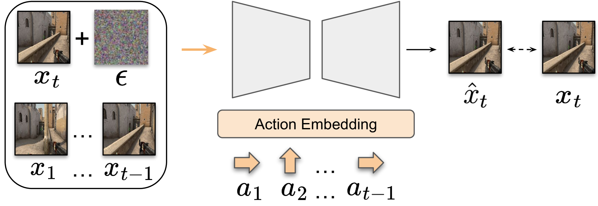
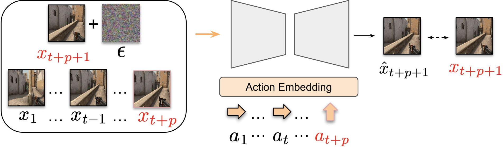
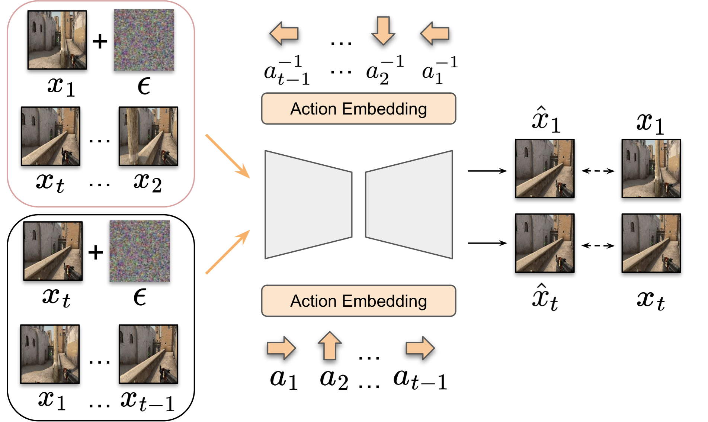
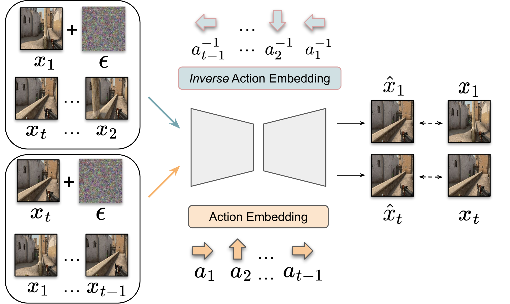
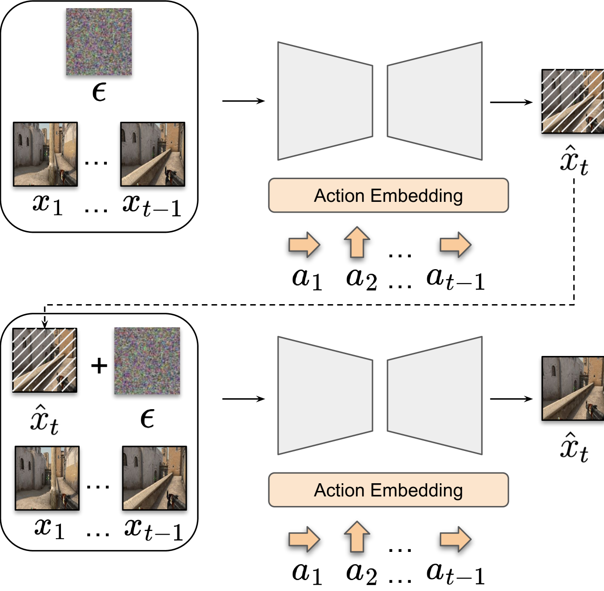
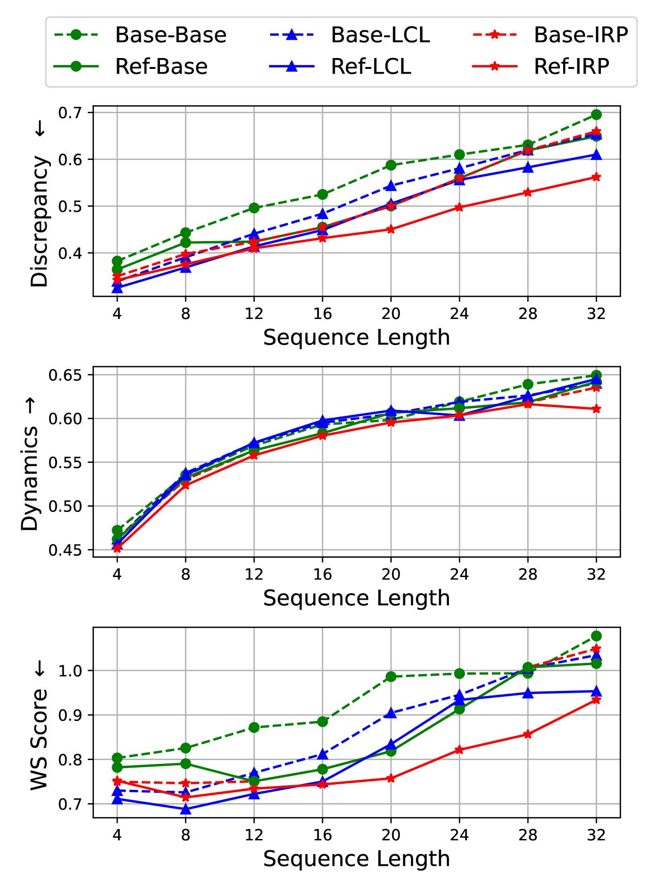

[
Back to arXiv](https://arxiv.org/)

[
Back to arXiv](https://arxiv.org/)

This is **experimental HTML** to improve accessibility. We invite you to report rendering errors. Use Alt+Y to toggle on accessible reporting links and Alt+Shift+Y to toggle off. Learn more [about this project](https://info.arxiv.org/about/accessible_HTML.html) and [help improve conversions](https://info.arxiv.org/help/submit_latex_best_practices.html).

[Why HTML?](https://info.arxiv.org/about/accessible_HTML.html)
[Report Issue](#myForm)
[Back to Abstract](https://arxiv.org/abs/2503.08122v1)
[Download PDF](https://arxiv.org/pdf/2503.08122v1)

## Table of Contents

1. [Abstract](https://arxiv.org/html/2503.08122#abstract "Abstract")
2. [1 Introduction](https://arxiv.org/html/2503.08122v1#S1 "In Toward Stable World Models: Measuring and Addressing World Instability in Generative Environments")
3. [2 Related Works](https://arxiv.org/html/2503.08122v1#S2 "In Toward Stable World Models: Measuring and Addressing World Instability in Generative Environments")
   1. [2.1 World Simulation](https://arxiv.org/html/2503.08122v1#S2.SS1 "In 2 Related Works ‣ Toward Stable World Models: Measuring and Addressing World Instability in Generative Environments")
   2. [2.2 Evaluation Metrics for World Models](https://arxiv.org/html/2503.08122v1#S2.SS2 "In 2 Related Works ‣ Toward Stable World Models: Measuring and Addressing World Instability in Generative Environments")
4. [3 Proposed Evaluation Framework](https://arxiv.org/html/2503.08122v1#S3 "In Toward Stable World Models: Measuring and Addressing World Instability in Generative Environments")
   1. [3.1 Notation](https://arxiv.org/html/2503.08122v1#S3.SS1 "In 3 Proposed Evaluation Framework ‣ Toward Stable World Models: Measuring and Addressing World Instability in Generative Environments")
   2. [3.2 Evaluation Protocol](https://arxiv.org/html/2503.08122v1#S3.SS2 "In 3 Proposed Evaluation Framework ‣ Toward Stable World Models: Measuring and Addressing World Instability in Generative Environments")
   3. [3.3 World Stability Score](https://arxiv.org/html/2503.08122v1#S3.SS3 "In 3 Proposed Evaluation Framework ‣ Toward Stable World Models: Measuring and Addressing World Instability in Generative Environments")
5. [4 Exploring Solutions for World Stability](https://arxiv.org/html/2503.08122v1#S4 "In Toward Stable World Models: Measuring and Addressing World Instability in Generative Environments")
   1. [4.1 Longer Context Length](https://arxiv.org/html/2503.08122v1#S4.SS1 "In 4 Exploring Solutions for World Stability ‣ Toward Stable World Models: Measuring and Addressing World Instability in Generative Environments")
   2. [4.2 Data Augmentation](https://arxiv.org/html/2503.08122v1#S4.SS2 "In 4 Exploring Solutions for World Stability ‣ Toward Stable World Models: Measuring and Addressing World Instability in Generative Environments")
   3. [4.3 Inject Reverse Prediction Capability](https://arxiv.org/html/2503.08122v1#S4.SS3 "In 4 Exploring Solutions for World Stability ‣ Toward Stable World Models: Measuring and Addressing World Instability in Generative Environments")
   4. [4.4 Refinement Sampling](https://arxiv.org/html/2503.08122v1#S4.SS4 "In 4 Exploring Solutions for World Stability ‣ Toward Stable World Models: Measuring and Addressing World Instability in Generative Environments")
6. [5 Experiments](https://arxiv.org/html/2503.08122v1#S5 "In Toward Stable World Models: Measuring and Addressing World Instability in Generative Environments")
   1. [5.1 Experimental Setups](https://arxiv.org/html/2503.08122v1#S5.SS1 "In 5 Experiments ‣ Toward Stable World Models: Measuring and Addressing World Instability in Generative Environments")
      1. [Environments](https://arxiv.org/html/2503.08122v1#S5.SS1.SSS0.Px1 "In 5.1 Experimental Setups ‣ 5 Experiments ‣ Toward Stable World Models: Measuring and Addressing World Instability in Generative Environments")
      2. [Base Models](https://arxiv.org/html/2503.08122v1#S5.SS1.SSS0.Px2 "In 5.1 Experimental Setups ‣ 5 Experiments ‣ Toward Stable World Models: Measuring and Addressing World Instability in Generative Environments")
      3. [Evaluation Metrics](https://arxiv.org/html/2503.08122v1#S5.SS1.SSS0.Px3 "In 5.1 Experimental Setups ‣ 5 Experiments ‣ Toward Stable World Models: Measuring and Addressing World Instability in Generative Environments")
   2. [5.2 Quantitative Results](https://arxiv.org/html/2503.08122v1#S5.SS2 "In 5 Experiments ‣ Toward Stable World Models: Measuring and Addressing World Instability in Generative Environments")
      1. [Longer Context Length](https://arxiv.org/html/2503.08122v1#S5.SS2.SSS0.Px1 "In 5.2 Quantitative Results ‣ 5 Experiments ‣ Toward Stable World Models: Measuring and Addressing World Instability in Generative Environments")
      2. [Data Augmetnation](https://arxiv.org/html/2503.08122v1#S5.SS2.SSS0.Px2 "In 5.2 Quantitative Results ‣ 5 Experiments ‣ Toward Stable World Models: Measuring and Addressing World Instability in Generative Environments")
      3. [Reverse Modeling](https://arxiv.org/html/2503.08122v1#S5.SS2.SSS0.Px3 "In 5.2 Quantitative Results ‣ 5 Experiments ‣ Toward Stable World Models: Measuring and Addressing World Instability in Generative Environments")
      4. [Refinement Sampling](https://arxiv.org/html/2503.08122v1#S5.SS2.SSS0.Px4 "In 5.2 Quantitative Results ‣ 5 Experiments ‣ Toward Stable World Models: Measuring and Addressing World Instability in Generative Environments")
   3. [5.3 Qualitative Results](https://arxiv.org/html/2503.08122v1#S5.SS3 "In 5 Experiments ‣ Toward Stable World Models: Measuring and Addressing World Instability in Generative Environments")
   4. [5.4 Analysis](https://arxiv.org/html/2503.08122v1#S5.SS4 "In 5 Experiments ‣ Toward Stable World Models: Measuring and Addressing World Instability in Generative Environments")
      1. [Ablation on Sequence Length](https://arxiv.org/html/2503.08122v1#S5.SS4.SSS0.Px1 "In 5.4 Analysis ‣ 5 Experiments ‣ Toward Stable World Models: Measuring and Addressing World Instability in Generative Environments")
      2. [Relationship between Learned Action and Inverse Action Embeddings](https://arxiv.org/html/2503.08122v1#S5.SS4.SSS0.Px2 "In 5.4 Analysis ‣ 5 Experiments ‣ Toward Stable World Models: Measuring and Addressing World Instability in Generative Environments")
7. [6 Conclusion](https://arxiv.org/html/2503.08122v1#S6 "In Toward Stable World Models: Measuring and Addressing World Instability in Generative Environments")
8. [A Additional Qualitative Results on CS:GO](https://arxiv.org/html/2503.08122v1#A1 "In Toward Stable World Models: Measuring and Addressing World Instability in Generative Environments")
9. [B Additional Qualitative Results on DMLab](https://arxiv.org/html/2503.08122v1#A2 "In Toward Stable World Models: Measuring and Addressing World Instability in Generative Environments")
10. [C Additional Possible Apporaches](https://arxiv.org/html/2503.08122v1#A3 "In Toward Stable World Models: Measuring and Addressing World Instability in Generative Environments")
11. [References](https://arxiv.org/html/2503.08122#bib "References")

HTML conversions [sometimes display errors](https://info.dev.arxiv.org/about/accessibility_html_error_messages.html) due to content that did not convert correctly from the source. This paper uses the following packages that are not yet supported by the HTML conversion tool. Feedback on these issues are not necessary; they are known and are being worked on.

* failed: kotex

Authors: achieve the best HTML results from your LaTeX submissions by following these [best practices](https://info.arxiv.org/help/submit_latex_best_practices.html).

[License: CC BY 4.0](https://info.arxiv.org/help/license/index.html#licenses-available)

arXiv:2503.08122v1 [cs.LG] 11 Mar 2025

# Toward Stable World Models: Measuring and Addressing World Instability in Generative Environments

Report issue for preceding element

Soonwoo Kwon
 Jin-Young Kim∗
 Hyojun Go1
 Kyungjune Baek2†

EverEx1 Sejong University2

{swkwon.john, seago0828, gohyojun15}@gmail.com, kyungjune.baek@sejong.ac.kr
Co-first Author ††\dagger† Corresponding Author

Report issue for preceding element

###### Abstract

Report issue for preceding element

We present a novel study on enhancing the capability of preserving the content in world models, focusing on a property we term World Stability. Recent diffusion-based generative models have advanced the synthesis of immersive and realistic environments that are pivotal for applications such as reinforcement learning and interactive game engines.
However, while these models excel in quality and diversity, they often neglect the preservation of previously generated scenes over time–a shortfall that can introduce noise into agent learning and compromise performance in safety-critical settings. In this work, we introduce an evaluation framework that measures world stability by having world models perform a sequence of actions followed by their inverses to return to their initial viewpoint, thereby quantifying the consistency between the starting and ending observations. Our comprehensive assessment of state-of-the-art diffusion-based world models reveals significant challenges in achieving high world stability. Moreover, we investigate several improvement strategies to enhance world stability.
Our results underscore the importance of world stability in world modeling and provide actionable insights for future research in this domain.

Report issue for preceding element

## 1 Introduction

Report issue for preceding element

Recent advancements in generative models, notably diffusion models [[16](https://arxiv.org/html/2503.08122v1#bib.bib16), [18](https://arxiv.org/html/2503.08122v1#bib.bib18)], have enhanced world models [[10](https://arxiv.org/html/2503.08122v1#bib.bib10)], enabling the generation of immersive, realistic environments.
They serve as engines that generate playable environments [[20](https://arxiv.org/html/2503.08122v1#bib.bib20), [4](https://arxiv.org/html/2503.08122v1#bib.bib4)] for user or agent, creating simulation setups for reinforcement learning data collection [[12](https://arxiv.org/html/2503.08122v1#bib.bib12)] and making tasks like robot learning more sample-efficient [[23](https://arxiv.org/html/2503.08122v1#bib.bib23)].

Report issue for preceding element

Figure 1: Revisiting the same place by a world model. When prompting the model to revisit the previously synthesized location, the newly generated environment fails to preserve key objects within the red box, such as a door or a picture frame. This inconsistency can be critically detrimental to both agent performance and user experience.

Report issue for preceding element

To reliably support these applications with the world model, generated content requires three key characteristics: quality, diversity, and scene preservation. While recent diffusion-based world models [[1](https://arxiv.org/html/2503.08122v1#bib.bib1), [8](https://arxiv.org/html/2503.08122v1#bib.bib8), [5](https://arxiv.org/html/2503.08122v1#bib.bib5)] excel in quality and diversity, previous studies have not paid much attention to the ability to preserve the previously generated environment over time. Despite limited focus, keeping the previously generated scene is a characteristic that significantly differentiates world models from general video generation models. While video generation models aim to synthesize creative videos with generally unidirectional temporal and spatial progression, failing to maintain the previous scene in building an environment can introduce noise into agent learning, leading to slower learning speeds or degradation of the final policy’s quality [[29](https://arxiv.org/html/2503.08122v1#bib.bib29), [17](https://arxiv.org/html/2503.08122v1#bib.bib17), [7](https://arxiv.org/html/2503.08122v1#bib.bib7)]. Furthermore, when world models are used to train agents in low fault-tolerance settings such as autonomous driving, lacking this capability may induce incorrect policy and severe safety issues [[33](https://arxiv.org/html/2503.08122v1#bib.bib33)].

Report issue for preceding element

In this work, we introduce the term “world stability” to describe the property where, after an agent performs actions and returns to the same location, the environment remains consistent with its initial observation. We inspected existing state-of-the-art (SoTA) methods [[1](https://arxiv.org/html/2503.08122v1#bib.bib1), [5](https://arxiv.org/html/2503.08122v1#bib.bib5)] and found that they struggle significantly with maintaining the environment.
For example, in the upper image sequence of Figure. [1](https://arxiv.org/html/2503.08122v1#S1.F1 "Figure 1 ‣ 1 Introduction ‣ Toward Stable World Models: Measuring and Addressing World Instability in Generative Environments"), the door on the right disappears upon the agent’s return. This can significantly impact the agent’s actions, leading to degraded policy learning performance. From a gameplay perspective, it undermines the consistency of the game’s progression, severely degrading the user experience. To highlight the problem and provide direction for future researchers, we introduce an evaluation framework and metrics to assess the world stability of various models. Specifically, our framework is applicable when inverse actions are defined within the environment. For example, if an action rotates the agent’s view to the left, the inverse action would be rotating it to the right. We design the procedure such that the agent performs the action N𝑁Nitalic\_N times, and then performs the inverse action N𝑁Nitalic\_N times to return to the initial frame. We then compute the consistency between the first frame and the frame generated after the 2⁢N2𝑁2N2 italic\_N actions. Within this framework, we evaluated the state-of-the-art methods’ world stability both quantitatively and qualitatively.
Furthermore, we explore several potential improvements, including extending the context length, data augmentation by reversing the input sequences, short fine-tuning for reverse modeling, and inference-time scaling using advanced sampling methods. We implement a subset of these approaches and highlight their effectiveness and limitations concerning both generation quality and our newly proposed metric, world stability.

Report issue for preceding element

In summary, our contributions are:

Report issue for preceding element

* •

  Introducing the novel concept of world stability and developing a structured evaluation framework to explicitly measure and emphasize the importance of environment persistency in world modeling.

  Report issue for preceding element
* •

  Evaluating current SoTA diffusion-based world models using our proposed framework and finding the lack of world stability of the SoTA methods.

  Report issue for preceding element
* •

  Investigating several methods to enhance world stability–such as context extension, reversed data augmentation, injection of reverse projection, and inference-time scaling–and analyzing their strengths and limitations.

  Report issue for preceding element

## 2 Related Works

Report issue for preceding element

### 2.1 World Simulation

Report issue for preceding element

World models, originally proposed as simulated environments for training reinforcement learning agents [[10](https://arxiv.org/html/2503.08122v1#bib.bib10)], have seen significant evolution. The following works focused on improving the environment’s realism to enhance agent policies [[11](https://arxiv.org/html/2503.08122v1#bib.bib11), [27](https://arxiv.org/html/2503.08122v1#bib.bib27), [35](https://arxiv.org/html/2503.08122v1#bib.bib35), [3](https://arxiv.org/html/2503.08122v1#bib.bib3)]. The concept has since broadened to include interactive virtual environments for user interaction [[19](https://arxiv.org/html/2503.08122v1#bib.bib19), [31](https://arxiv.org/html/2503.08122v1#bib.bib31)]. Recent advances leverage diffusion-based generative models to dramatically improve the quality and diversity of these simulated worlds [[1](https://arxiv.org/html/2503.08122v1#bib.bib1), [5](https://arxiv.org/html/2503.08122v1#bib.bib5), [8](https://arxiv.org/html/2503.08122v1#bib.bib8), [4](https://arxiv.org/html/2503.08122v1#bib.bib4)]. For example, DIAMOND [[1](https://arxiv.org/html/2503.08122v1#bib.bib1)] and DWM [[8](https://arxiv.org/html/2503.08122v1#bib.bib8)] utilize action-conditioned diffusion models for improved performance in Atari and locomotion tasks, with DIAMOND capable of learning from datasets without explicit rewards, such as Counter-Strike gameplay footage [[26](https://arxiv.org/html/2503.08122v1#bib.bib26)]. Other approaches, like Diffusion forcing [[5](https://arxiv.org/html/2503.08122v1#bib.bib5)] that combines diffusion with next-token prediction and GAMEGEN-X [[4](https://arxiv.org/html/2503.08122v1#bib.bib4)] focusing on open-world game engines), demonstrate the versatility of this technology. This work proposes an evaluation protocol for assessing the consistency of these world models and introduces a novel method to improve consistency across SoTA approaches.

Report issue for preceding element

### 2.2 Evaluation Metrics for World Models

Report issue for preceding element

World models, a specialized type of generative model, possess unique temporal dynamics, action-conditioned generation, and interactivity. Because of its unique characteristics, world models require specialized evaluation metrics.
A common indirect approach for world models for reinforcement learning is to assess policies trained within the environment [[1](https://arxiv.org/html/2503.08122v1#bib.bib1)], however, this is inapplicable outside RL. As a sidestep, previous works often adopt metrics from generative models, such as Fréchet Inception Distance (FID) [[15](https://arxiv.org/html/2503.08122v1#bib.bib15)] and Fréchet Video Distance (FVD) [[30](https://arxiv.org/html/2503.08122v1#bib.bib30)] which measure distributional distances between real and generated features, LPIPS [[34](https://arxiv.org/html/2503.08122v1#bib.bib34)] assessing diversity, and CLIP score [[14](https://arxiv.org/html/2503.08122v1#bib.bib14)] evaluating action-content alignment.
However, these metrics, designed primarily for images, are insufficient for assessing world models. FVD, despite using video features, is overly influenced by content, neglecting crucial temporal dynamics [[9](https://arxiv.org/html/2503.08122v1#bib.bib9)].
Critically, existing metrics fail to assess world stability: the coherent persistence of spatial relationships and object locations over time.
Lack of this consistency, as shown in [[33](https://arxiv.org/html/2503.08122v1#bib.bib33)], can be detrimental in safety-critical domains like autonomous driving.
Recently, MEt3R [[2](https://arxiv.org/html/2503.08122v1#bib.bib2)] is proposed to evaluate the 3D consistency of generated multi-view images regardless of the quality, content, and camera poses. However, it is not been introduced to the world models yet.
To address limitations of current evaluation that primarily relies on general generative model metrics or indirect policy assessment, we focus on the crucial aspect of world stability, and propose a novel metric for its evaluation.

Report issue for preceding element

## 3 Proposed Evaluation Framework

Report issue for preceding element

### 3.1 Notation

Report issue for preceding element

In this section, we introduce an evaluation protocol for measuring world stability. First, we define the notations to describe the proposed evaluation framework. Since the models are designed for sequential modeling conditioned on past actions and observations (frames), we denote the observation at timestep i𝑖iitalic\_i as xisubscript𝑥𝑖x\_{i}italic\_x start\_POSTSUBSCRIPT italic\_i end\_POSTSUBSCRIPT and the corresponding action condition as aisubscript𝑎𝑖a\_{i}italic\_a start\_POSTSUBSCRIPT italic\_i end\_POSTSUBSCRIPT. Similarly, we denote the i𝑖iitalic\_i-th generated frame as x^isubscript^𝑥𝑖\hat{x}\_{i}over^ start\_ARG italic\_x end\_ARG start\_POSTSUBSCRIPT italic\_i end\_POSTSUBSCRIPT.
For the base models, we can generate a new observation of the next step x^i+1subscript^𝑥𝑖1\hat{x}\_{i+1}over^ start\_ARG italic\_x end\_ARG start\_POSTSUBSCRIPT italic\_i + 1 end\_POSTSUBSCRIPT by feeding xisubscript𝑥𝑖x\_{i}italic\_x start\_POSTSUBSCRIPT italic\_i end\_POSTSUBSCRIPT and aisubscript𝑎𝑖a\_{i}italic\_a start\_POSTSUBSCRIPT italic\_i end\_POSTSUBSCRIPT as inputs.
Additionally, we use ai−1superscriptsubscript𝑎𝑖1a\_{i}^{-1}italic\_a start\_POSTSUBSCRIPT italic\_i end\_POSTSUBSCRIPT start\_POSTSUPERSCRIPT - 1 end\_POSTSUPERSCRIPT to represent the inverse action corresponding to aisubscript𝑎𝑖a\_{i}italic\_a start\_POSTSUBSCRIPT italic\_i end\_POSTSUBSCRIPT. For example, if the action ansubscript𝑎𝑛a\_{n}italic\_a start\_POSTSUBSCRIPT italic\_n end\_POSTSUBSCRIPT denotes “rotate right”, its inverse action an−1superscriptsubscript𝑎𝑛1a\_{n}^{-1}italic\_a start\_POSTSUBSCRIPT italic\_n end\_POSTSUBSCRIPT start\_POSTSUPERSCRIPT - 1 end\_POSTSUPERSCRIPT corresponds to “rotate left”.
We denote the set of all observations from step 1 to t𝑡titalic\_t as x1:tsubscript𝑥:1𝑡x\_{1:t}italic\_x start\_POSTSUBSCRIPT 1 : italic\_t end\_POSTSUBSCRIPT.
We will use these notations throughout the paper.

Report issue for preceding element

### 3.2 Evaluation Protocol

Report issue for preceding element

Recent advances in generative world models [[1](https://arxiv.org/html/2503.08122v1#bib.bib1), [3](https://arxiv.org/html/2503.08122v1#bib.bib3), [31](https://arxiv.org/html/2503.08122v1#bib.bib31), [4](https://arxiv.org/html/2503.08122v1#bib.bib4), [19](https://arxiv.org/html/2503.08122v1#bib.bib19)] have primarily focused on generation quality and controllability, paying less attention to a fundamental aspect to be a world simulator: World Stability.
As illustrated in [Fig. 1](https://arxiv.org/html/2503.08122v1#S1.F1 "In 1 Introduction ‣ Toward Stable World Models: Measuring and Addressing World Instability in Generative Environments"), when an agent executes a sequence of actions and then attempts to return to its initial state, the generated environment often exhibits significant semantic drift. However, no prior work has quantified world stability, limiting improvements in this critical capability.

Report issue for preceding element

To address this gap, we first introduce the evaluation protocol for quantifying World Stability.
Given an initial state x1subscript𝑥1x\_{1}italic\_x start\_POSTSUBSCRIPT 1 end\_POSTSUBSCRIPT, we apply a model iteratively over a sequence of N𝑁Nitalic\_N actions, 𝒜:=[a1,a2,…,aN]assign𝒜

subscript𝑎1subscript𝑎2…subscript𝑎𝑁\mathcal{A}:=[a\_{1},a\_{2},\dots,a\_{N}]caligraphic\_A := [ italic\_a start\_POSTSUBSCRIPT 1 end\_POSTSUBSCRIPT , italic\_a start\_POSTSUBSCRIPT 2 end\_POSTSUBSCRIPT , … , italic\_a start\_POSTSUBSCRIPT italic\_N end\_POSTSUBSCRIPT ], transforming the state step by step, producing state sequence {x^2,x^3,…,x^N+1}subscript^𝑥2subscript^𝑥3…subscript^𝑥𝑁1\{\hat{x}\_{2},\hat{x}\_{3},...,\hat{x}\_{N+1}\}{ over^ start\_ARG italic\_x end\_ARG start\_POSTSUBSCRIPT 2 end\_POSTSUBSCRIPT , over^ start\_ARG italic\_x end\_ARG start\_POSTSUBSCRIPT 3 end\_POSTSUBSCRIPT , … , over^ start\_ARG italic\_x end\_ARG start\_POSTSUBSCRIPT italic\_N + 1 end\_POSTSUBSCRIPT }.
For reverting the transformation to the initial state, we apply the model again using the corresponding inverse actions, 𝒜−1:=[aN−1,aN−1−1,…,a1−1]assignsuperscript𝒜1

superscriptsubscript𝑎𝑁1superscriptsubscript𝑎𝑁11…superscriptsubscript𝑎11\mathcal{A}^{-1}:=[a\_{N}^{-1},a\_{N-1}^{-1},\dots,a\_{1}^{-1}]caligraphic\_A start\_POSTSUPERSCRIPT - 1 end\_POSTSUPERSCRIPT := [ italic\_a start\_POSTSUBSCRIPT italic\_N end\_POSTSUBSCRIPT start\_POSTSUPERSCRIPT - 1 end\_POSTSUPERSCRIPT , italic\_a start\_POSTSUBSCRIPT italic\_N - 1 end\_POSTSUBSCRIPT start\_POSTSUPERSCRIPT - 1 end\_POSTSUPERSCRIPT , … , italic\_a start\_POSTSUBSCRIPT 1 end\_POSTSUBSCRIPT start\_POSTSUPERSCRIPT - 1 end\_POSTSUPERSCRIPT ] in reverse order, yielding the final state x^2⁢N+1subscript^𝑥2𝑁1\hat{x}\_{2N+1}over^ start\_ARG italic\_x end\_ARG start\_POSTSUBSCRIPT 2 italic\_N + 1 end\_POSTSUBSCRIPT.
For convenience, we reannotate the state sequence {x1,x^2,…,x^2⁢N+1}subscript𝑥1subscript^𝑥2…subscript^𝑥2𝑁1\{x\_{1},\hat{x}\_{2},...,\hat{x}\_{2N+1}\}{ italic\_x start\_POSTSUBSCRIPT 1 end\_POSTSUBSCRIPT , over^ start\_ARG italic\_x end\_ARG start\_POSTSUBSCRIPT 2 end\_POSTSUBSCRIPT , … , over^ start\_ARG italic\_x end\_ARG start\_POSTSUBSCRIPT 2 italic\_N + 1 end\_POSTSUBSCRIPT } as {x1,x^2,…,x^N,x¯^,x^N†,x^N−1†,…,x^1†}subscript𝑥1subscript^𝑥2…subscript^𝑥𝑁^¯𝑥superscriptsubscript^𝑥𝑁†superscriptsubscript^𝑥𝑁1†…superscriptsubscript^𝑥1†\{x\_{1},\hat{x}\_{2},...,\hat{x}\_{N},\hat{\bar{x}},\hat{x}\_{N}^{\dagger},\hat{x%
}\_{N-1}^{\dagger},...,\hat{x}\_{1}^{\dagger}\}{ italic\_x start\_POSTSUBSCRIPT 1 end\_POSTSUBSCRIPT , over^ start\_ARG italic\_x end\_ARG start\_POSTSUBSCRIPT 2 end\_POSTSUBSCRIPT , … , over^ start\_ARG italic\_x end\_ARG start\_POSTSUBSCRIPT italic\_N end\_POSTSUBSCRIPT , over^ start\_ARG over¯ start\_ARG italic\_x end\_ARG end\_ARG , over^ start\_ARG italic\_x end\_ARG start\_POSTSUBSCRIPT italic\_N end\_POSTSUBSCRIPT start\_POSTSUPERSCRIPT † end\_POSTSUPERSCRIPT , over^ start\_ARG italic\_x end\_ARG start\_POSTSUBSCRIPT italic\_N - 1 end\_POSTSUBSCRIPT start\_POSTSUPERSCRIPT † end\_POSTSUPERSCRIPT , … , over^ start\_ARG italic\_x end\_ARG start\_POSTSUBSCRIPT 1 end\_POSTSUBSCRIPT start\_POSTSUPERSCRIPT † end\_POSTSUPERSCRIPT }.
Note that our framework is broadly applicable to any environment and action sequence pair (𝒜(\mathcal{A}( caligraphic\_A, 𝒜−1)\mathcal{A}^{-1})caligraphic\_A start\_POSTSUPERSCRIPT - 1 end\_POSTSUPERSCRIPT ). However, given the increased complexity and stochasticity of mixed action sequences, we restrict experiments to a single action type. For instance, 𝒜𝒜\mathcal{A}caligraphic\_A may consist of N𝑁Nitalic\_N consecutive 5555-degree left rotations, while 𝒜−1superscript𝒜1\mathcal{A}^{-1}caligraphic\_A start\_POSTSUPERSCRIPT - 1 end\_POSTSUPERSCRIPT consists of N𝑁Nitalic\_N corresponding 5555-degree right rotations.
By following this framework, we systematically measure the discrepancy between x1subscript𝑥1x\_{1}italic\_x start\_POSTSUBSCRIPT 1 end\_POSTSUBSCRIPT and x^2⁢N+1subscript^𝑥2𝑁1\hat{x}\_{2N+1}over^ start\_ARG italic\_x end\_ARG start\_POSTSUBSCRIPT 2 italic\_N + 1 end\_POSTSUBSCRIPT, which serves as the basis for the quantitative assessment of world stability.

Report issue for preceding element

(a) Baseline

Report issue for preceding element

(b) Longer Context Length

Report issue for preceding element

(c) Data Augmentation

Report issue for preceding element

(d) Inject Reverse Prediction

Report issue for preceding element

Figure 2: Overview of the possible solutions for improving world stability. The orange and blue arrows indicate that the input uses action embeddings of the same type (or color) to represent the action condition. Red boxes denote the newly introduced components.

Report issue for preceding element

Figure 3: Graphical description of Refinement Sampling. We first sample an observation and inject additional noise into the generated one. Then, the model accepts the noised input and the same conditions for synthesizing a new observation.

Report issue for preceding element

### 3.3 World Stability Score

Report issue for preceding element

Building on the proposed framework, we introduce the World Stability (WS) score, guided by two key principles: (1) Discrepancy: After executing an action sequence 𝒜𝒜\mathcal{A}caligraphic\_A and its inverse 𝒜−1superscript𝒜1\mathcal{A}^{-1}caligraphic\_A start\_POSTSUPERSCRIPT - 1 end\_POSTSUPERSCRIPT, the final state should closely resemble the initial state. We quantify this as d⁢(x1,x^1†)𝑑subscript𝑥1superscriptsubscript^𝑥1†d(x\_{1},\hat{x}\_{1}^{\dagger})italic\_d ( italic\_x start\_POSTSUBSCRIPT 1 end\_POSTSUBSCRIPT , over^ start\_ARG italic\_x end\_ARG start\_POSTSUBSCRIPT 1 end\_POSTSUBSCRIPT start\_POSTSUPERSCRIPT † end\_POSTSUPERSCRIPT ), where d𝑑ditalic\_d represents a distance between two frames.
(2) Dynamics:
While ensuring consistency, the intermediate states should reflect the action condition well. Without this constraint, a model could artificially achieve a high stability score by generating nearly identical frames regardless of the action sequence.
The difficulty of maintaining stability varies depending on the extent of the agent’s movement throughout the action sequence—the more it moves, the harder it becomes. To account for this, we define the dynamics as
12⁢(d⁢(x1,x¯^)+d⁢(x^1†,x¯^))12𝑑subscript𝑥1^¯𝑥𝑑superscriptsubscript^𝑥1†^¯𝑥\frac{1}{2}(d(x\_{1},\hat{\bar{x}})+d(\hat{x}\_{1}^{\dagger},\hat{\bar{x}}))divide start\_ARG 1 end\_ARG start\_ARG 2 end\_ARG ( italic\_d ( italic\_x start\_POSTSUBSCRIPT 1 end\_POSTSUBSCRIPT , over^ start\_ARG over¯ start\_ARG italic\_x end\_ARG end\_ARG ) + italic\_d ( over^ start\_ARG italic\_x end\_ARG start\_POSTSUBSCRIPT 1 end\_POSTSUBSCRIPT start\_POSTSUPERSCRIPT † end\_POSTSUPERSCRIPT , over^ start\_ARG over¯ start\_ARG italic\_x end\_ARG end\_ARG ) ),

Report issue for preceding element

Finally, we define the WS score as the ratio of discrepancy to dynamics. In formal terms,

Report issue for preceding element

|  |  |  |  |
| --- | --- | --- | --- |
|  | WS score=2×d⁢(x1,x^1†)d⁢(x1,x¯^)+d⁢(x^1†,x¯^)WS score2𝑑subscript𝑥1superscriptsubscript^𝑥1†𝑑subscript𝑥1^¯𝑥𝑑superscriptsubscript^𝑥1†^¯𝑥\text{WS score}=2\times\frac{d(x\_{1},\hat{x}\_{1}^{\dagger})}{d(x\_{1},\hat{\bar% {x}})+d(\hat{x}\_{1}^{\dagger},\hat{\bar{x}})}WS score = 2 × divide start\_ARG italic\_d ( italic\_x start\_POSTSUBSCRIPT 1 end\_POSTSUBSCRIPT , over^ start\_ARG italic\_x end\_ARG start\_POSTSUBSCRIPT 1 end\_POSTSUBSCRIPT start\_POSTSUPERSCRIPT † end\_POSTSUPERSCRIPT ) end\_ARG start\_ARG italic\_d ( italic\_x start\_POSTSUBSCRIPT 1 end\_POSTSUBSCRIPT , over^ start\_ARG over¯ start\_ARG italic\_x end\_ARG end\_ARG ) + italic\_d ( over^ start\_ARG italic\_x end\_ARG start\_POSTSUBSCRIPT 1 end\_POSTSUBSCRIPT start\_POSTSUPERSCRIPT † end\_POSTSUPERSCRIPT , over^ start\_ARG over¯ start\_ARG italic\_x end\_ARG end\_ARG ) end\_ARG |  | (1) |

This formulation strikes a balance between stability and dynamics.
A lower WS score is better, as it indicates that the model can reliably return to the initial state after a sequence of consecutive actions while still responding appropriately to each action.
Note that any semantic similarity measure can be used for d𝑑ditalic\_d; in experiments, we employ LPIPS [[34](https://arxiv.org/html/2503.08122v1#bib.bib34)], MEt3R [[2](https://arxiv.org/html/2503.08122v1#bib.bib2)], and DINO distance, which we define as dDINO⁢(x,y)=1−cos⁡(f⁢(x),f⁢(y))subscript𝑑DINO𝑥𝑦1𝑓𝑥𝑓𝑦d\_{\text{DINO}}(x,y)=1-\cos(f(x),f(y))italic\_d start\_POSTSUBSCRIPT DINO end\_POSTSUBSCRIPT ( italic\_x , italic\_y ) = 1 - roman\_cos ( italic\_f ( italic\_x ) , italic\_f ( italic\_y ) ),
where f𝑓fitalic\_f denotes the feature extractor from DINO v2 [[25](https://arxiv.org/html/2503.08122v1#bib.bib25)], and
cos\cosroman\_cos represents cosine similarity.
Notably, the WS score is reference-free, as it can be computed without requiring a simulator or ground truth frames, making it applicable to a wide range of environments.
In [Sec. 5](https://arxiv.org/html/2503.08122v1#S5 "5 Experiments ‣ Toward Stable World Models: Measuring and Addressing World Instability in Generative Environments"), we demonstrate that even state-of-the-art world generation models suffer from instability, using the proposed evaluation framework.

Report issue for preceding element

## 4 Exploring Solutions for World Stability

Report issue for preceding element

In this section, we introduce several potential strategies for improving world stability. We briefly describe each method, highlighting its intuition, expected advantages, and potential limitations.
Among the feasible solutions, we investigate several approaches, including increasing context length, applying augmentation, incorporating a mechanism to infer reversed observations, and modifying sampling strategies. The quantitative and qualitative evaluations of these strategies are detailed in Section [5](https://arxiv.org/html/2503.08122v1#S5 "5 Experiments ‣ Toward Stable World Models: Measuring and Addressing World Instability in Generative Environments").

Report issue for preceding element

### 4.1 Longer Context Length

Report issue for preceding element

Recent research has explored increasing the context length to generate more consistent and longer videos [[22](https://arxiv.org/html/2503.08122v1#bib.bib22), [13](https://arxiv.org/html/2503.08122v1#bib.bib13)].
While the consistency problem in video generation differs from the world instability problem, simply extending the context length could help the model retain knowledge about previous states, potentially improving stability.
However, this approach has a major drawback: the computational cost grows exponentially during both training and inference, making it less scalable for long-horizon predictions.
To better understand this trade-off, we examine how the WS score changes as the context length increases.

Report issue for preceding element

### 4.2 Data Augmentation

Report issue for preceding element

The most straightforward approach is to construct the training data with sequences where the agent revisits the same states multiple times while performing diverse actions. However, collecting such sequences at scale is challenging.
To address this, we explore a simple data augmentation technique that leverages existing training data. Specifically, with state and action sequences {x1,…,xN}subscript𝑥1…subscript𝑥𝑁\{x\_{1},...,x\_{N}\}{ italic\_x start\_POSTSUBSCRIPT 1 end\_POSTSUBSCRIPT , … , italic\_x start\_POSTSUBSCRIPT italic\_N end\_POSTSUBSCRIPT } and {a1,…,aN}subscript𝑎1…subscript𝑎𝑁\{a\_{1},...,a\_{N}\}{ italic\_a start\_POSTSUBSCRIPT 1 end\_POSTSUBSCRIPT , … , italic\_a start\_POSTSUBSCRIPT italic\_N end\_POSTSUBSCRIPT }, we append inverse actions ai−1superscriptsubscript𝑎𝑖1a\_{i}^{-1}italic\_a start\_POSTSUBSCRIPT italic\_i end\_POSTSUBSCRIPT start\_POSTSUPERSCRIPT - 1 end\_POSTSUPERSCRIPT and their corresponding frames xi†superscriptsubscript𝑥𝑖†x\_{i}^{\dagger}italic\_x start\_POSTSUBSCRIPT italic\_i end\_POSTSUBSCRIPT start\_POSTSUPERSCRIPT † end\_POSTSUPERSCRIPT to the original sequence, heuristically rewinding the frames in a sequential manner for N−1𝑁1N-1italic\_N - 1 times from i=N−1𝑖𝑁1i=N-1italic\_i = italic\_N - 1 to 1111.
For instance, a sequence originally defined as
{(x1,a1),(x2,a2)}subscript𝑥1subscript𝑎1subscript𝑥2subscript𝑎2\{(x\_{1},a\_{1}),(x\_{2},a\_{2})\}{ ( italic\_x start\_POSTSUBSCRIPT 1 end\_POSTSUBSCRIPT , italic\_a start\_POSTSUBSCRIPT 1 end\_POSTSUBSCRIPT ) , ( italic\_x start\_POSTSUBSCRIPT 2 end\_POSTSUBSCRIPT , italic\_a start\_POSTSUBSCRIPT 2 end\_POSTSUBSCRIPT ) } is transformed into {(x1,a1),(x2,a2),(x3,a2−1),(x2,a1−1)}subscript𝑥1subscript𝑎1subscript𝑥2subscript𝑎2subscript𝑥3superscriptsubscript𝑎21subscript𝑥2superscriptsubscript𝑎11\{(x\_{1},a\_{1}),(x\_{2},a\_{2}),(x\_{3},a\_{2}^{-1}),(x\_{2},a\_{1}^{-1})\}{ ( italic\_x start\_POSTSUBSCRIPT 1 end\_POSTSUBSCRIPT , italic\_a start\_POSTSUBSCRIPT 1 end\_POSTSUBSCRIPT ) , ( italic\_x start\_POSTSUBSCRIPT 2 end\_POSTSUBSCRIPT , italic\_a start\_POSTSUBSCRIPT 2 end\_POSTSUBSCRIPT ) , ( italic\_x start\_POSTSUBSCRIPT 3 end\_POSTSUBSCRIPT , italic\_a start\_POSTSUBSCRIPT 2 end\_POSTSUBSCRIPT start\_POSTSUPERSCRIPT - 1 end\_POSTSUPERSCRIPT ) , ( italic\_x start\_POSTSUBSCRIPT 2 end\_POSTSUBSCRIPT , italic\_a start\_POSTSUBSCRIPT 1 end\_POSTSUBSCRIPT start\_POSTSUPERSCRIPT - 1 end\_POSTSUPERSCRIPT ) }.
Despite its benefits, this method is not inherently scalable, as it requires knowledge of the corresponding inverse actions. Defining the inverse of certain actions, such as interacting with the environment (e.g., shooting a gun), might be impossible, and in many environments, multiple actions are executed simultaneously, further complicating the process.

Report issue for preceding element

### 4.3 Inject Reverse Prediction Capability

Report issue for preceding element

We hypothesize that injecting the capability of predicting previous frames under action reversals into a model can enhance world stability.
This objective encourages the model to preserve world knowledge, leading to more coherent long-term dynamics [[6](https://arxiv.org/html/2503.08122v1#bib.bib6), [21](https://arxiv.org/html/2503.08122v1#bib.bib21)].
The challenge in equipping world models with conditional generation on inverse actions lies in the difficulty of obtaining data with exact inverse actions and corresponding frames (e.g., ’shoot’ in the CS:GO environment).
To resolve the issue in an action-agnostic manner, we introduce an inverse action embedding, which enables the model to process inverse actions alongside standard actions.
Furthermore, we employ the data augmentation strategy introduced in [Sec. 4.2](https://arxiv.org/html/2503.08122v1#S4.SS2 "4.2 Data Augmentation ‣ 4 Exploring Solutions for World Stability ‣ Toward Stable World Models: Measuring and Addressing World Instability in Generative Environments") to facilitate learning inverse action conditioning.
This augmentation strategy ensures that inverse action conditioning can be seamlessly applied to any action type, enhancing the model’s ability to maintain consistency over time.
Although this method requires additional training and a few extra parameters for inverse action embedding, these parameters are not used during inference, ensuring the same inference cost.
We fine-tune pre-trained world generative models–originally designed for next-frame generation given the original action–with a few additional epochs. Detailed settings and an analysis of the learned inverse action embedding will be provided in [Sec. 5](https://arxiv.org/html/2503.08122v1#S5 "5 Experiments ‣ Toward Stable World Models: Measuring and Addressing World Instability in Generative Environments").

Report issue for preceding element

### 4.4 Refinement Sampling

Report issue for preceding element

In addition to the training methods introduced in [Secs. 4.1](https://arxiv.org/html/2503.08122v1#S4.SS1 "4.1 Longer Context Length ‣ 4 Exploring Solutions for World Stability ‣ Toward Stable World Models: Measuring and Addressing World Instability in Generative Environments"), [4.2](https://arxiv.org/html/2503.08122v1#S4.SS2 "4.2 Data Augmentation ‣ 4 Exploring Solutions for World Stability ‣ Toward Stable World Models: Measuring and Addressing World Instability in Generative Environments") and [4.3](https://arxiv.org/html/2503.08122v1#S4.SS3 "4.3 Inject Reverse Prediction Capability ‣ 4 Exploring Solutions for World Stability ‣ Toward Stable World Models: Measuring and Addressing World Instability in Generative Environments"), we also explore a sampling time refinement technique.
We are inspired by a line of work that utilizes existing images as priors for generation [[24](https://arxiv.org/html/2503.08122v1#bib.bib24), [28](https://arxiv.org/html/2503.08122v1#bib.bib28)].
These approaches enhance image generation by incorporating information from existing images rather than relying solely on pure noise. By leveraging conditional information, they minimize undesired noise and improve control over the resulting content.
In conventional diffusion-based sampling, the next state is generated as: xt−1∼p⁢(xt−1∣xt)similar-tosuperscript𝑥𝑡1𝑝conditionalsuperscript𝑥𝑡1superscript𝑥𝑡x^{t-1}\sim p(x^{t-1}\mid x^{t})italic\_x start\_POSTSUPERSCRIPT italic\_t - 1 end\_POSTSUPERSCRIPT ∼ italic\_p ( italic\_x start\_POSTSUPERSCRIPT italic\_t - 1 end\_POSTSUPERSCRIPT ∣ italic\_x start\_POSTSUPERSCRIPT italic\_t end\_POSTSUPERSCRIPT ), where xtsuperscript𝑥𝑡x^{t}italic\_x start\_POSTSUPERSCRIPT italic\_t end\_POSTSUPERSCRIPT is the image at the t𝑡titalic\_t-th denoising step and x0superscript𝑥0x^{0}italic\_x start\_POSTSUPERSCRIPT 0 end\_POSTSUPERSCRIPT is the original image.
As an additional refinement phase, we propose the following steps:

Report issue for preceding element

1. Initial Generation:
Starting from random noise xTsuperscript𝑥𝑇x^{T}italic\_x start\_POSTSUPERSCRIPT italic\_T end\_POSTSUPERSCRIPT, iteratively denoise to obtain x^0superscript^𝑥0\hat{x}^{0}over^ start\_ARG italic\_x end\_ARG start\_POSTSUPERSCRIPT 0 end\_POSTSUPERSCRIPT.

Report issue for preceding element

2. Noise Injection:
Add Gaussian noise ϵitalic-ϵ\epsilonitalic\_ϵ to x^0superscript^𝑥0\hat{x}^{0}over^ start\_ARG italic\_x end\_ARG start\_POSTSUPERSCRIPT 0 end\_POSTSUPERSCRIPT to produce a noisy version x^noisy0subscriptsuperscript^𝑥0noisy\hat{x}^{0}\_{\text{noisy}}over^ start\_ARG italic\_x end\_ARG start\_POSTSUPERSCRIPT 0 end\_POSTSUPERSCRIPT start\_POSTSUBSCRIPT noisy end\_POSTSUBSCRIPT, defined as x^noisy0=x^0+ϵ.subscriptsuperscript^𝑥0noisysubscript^𝑥0italic-ϵ\hat{x}^{0}\_{\text{noisy}}=\hat{x}\_{0}+\epsilon.over^ start\_ARG italic\_x end\_ARG start\_POSTSUPERSCRIPT 0 end\_POSTSUPERSCRIPT start\_POSTSUBSCRIPT noisy end\_POSTSUBSCRIPT = over^ start\_ARG italic\_x end\_ARG start\_POSTSUBSCRIPT 0 end\_POSTSUBSCRIPT + italic\_ϵ .

Report issue for preceding element

3. Refinement:
Use x^noisy0subscriptsuperscript^𝑥0noisy\hat{x}^{0}\_{\text{noisy}}over^ start\_ARG italic\_x end\_ARG start\_POSTSUPERSCRIPT 0 end\_POSTSUPERSCRIPT start\_POSTSUBSCRIPT noisy end\_POSTSUBSCRIPT as the starting point for another denoising process to obtain the refined image x^refined0subscriptsuperscript^𝑥0refined\hat{x}^{0}\_{\text{refined}}over^ start\_ARG italic\_x end\_ARG start\_POSTSUPERSCRIPT 0 end\_POSTSUPERSCRIPT start\_POSTSUBSCRIPT refined end\_POSTSUBSCRIPT.

Report issue for preceding element

This approach enables the model to re-evaluate and refine the generated image, leading to improved quality and stability over temporal sequences. The effect of the proposed refinement sampling is demonstrated in [Figs. 4](https://arxiv.org/html/2503.08122v1#S5.F4 "In Refinement Sampling ‣ 5.2 Quantitative Results ‣ 5 Experiments ‣ Toward Stable World Models: Measuring and Addressing World Instability in Generative Environments") and [6](https://arxiv.org/html/2503.08122v1#S5.F6 "Figure 6 ‣ 5.3 Qualitative Results ‣ 5 Experiments ‣ Toward Stable World Models: Measuring and Addressing World Instability in Generative Environments").

Report issue for preceding element

## 5 Experiments

Report issue for preceding element

In this section, we evaluate whether state-of-the-art models suffer world instability using our proposed framework and validate the effectiveness of the possible solutions in addressing the instability.
We begin by outlining the experimental setup in [Sec. 5.1](https://arxiv.org/html/2503.08122v1#S5.SS1 "5.1 Experimental Setups ‣ 5 Experiments ‣ Toward Stable World Models: Measuring and Addressing World Instability in Generative Environments").
Then, in [Sec. 5.2](https://arxiv.org/html/2503.08122v1#S5.SS2 "5.2 Quantitative Results ‣ 5 Experiments ‣ Toward Stable World Models: Measuring and Addressing World Instability in Generative Environments"), we present a quantitative evaluation using the proposed evaluation framework, demonstrating that our approach significantly improves stability over the baselines. Additionally, in [Sec. 5.3](https://arxiv.org/html/2503.08122v1#S5.SS3 "5.3 Qualitative Results ‣ 5 Experiments ‣ Toward Stable World Models: Measuring and Addressing World Instability in Generative Environments"),
we validate that the proposed score effectively measures world stability and provides qualitative insights across diverse models.
Finally, in  [Sec. 5.4](https://arxiv.org/html/2503.08122v1#S5.SS4.SSS0.Px1 "Ablation on Sequence Length ‣ 5.4 Analysis ‣ 5 Experiments ‣ Toward Stable World Models: Measuring and Addressing World Instability in Generative Environments"), we provide detailed analysis for the deeper insight.

Report issue for preceding element

### 5.1 Experimental Setups

Report issue for preceding element

In this section, we describe the experimental settings used to evaluate the world instability exhibited by the state-of-the-art world models and the effectiveness of our methods.

Report issue for preceding element

#### Environments

Report issue for preceding element

Although our evaluation framework is applicable to any environment that features both actions and their corresponding inverse actions, we focus on two complex 3D environments where world instability leads to critical issues: Counter-Strike: Global Offensive (CS:GO) [[26](https://arxiv.org/html/2503.08122v1#bib.bib26)] and DeepMind Lab navigation (DMLab) [[32](https://arxiv.org/html/2503.08122v1#bib.bib32)].

Report issue for preceding element

CS:GO is a popular video game played on the Dust2 map that includes dynamic gameplay and detailed backgrounds with multiple objects. In this context, instability is exemplified by situations where objects present at an initial position vanish after the agent executes a series of actions. Unless otherwise specified, the evaluation frame begins with an action sequence 𝒜𝒜\mathcal{A}caligraphic\_A consisting of a leftward rotation and is followed by an inverse sequence 𝒜−1superscript𝒜1\mathcal{A}^{-1}caligraphic\_A start\_POSTSUPERSCRIPT - 1 end\_POSTSUPERSCRIPT involving a rightward rotation, each of which spans 16 actions. For further details on the dataset, please refer to [[1](https://arxiv.org/html/2503.08122v1#bib.bib1), [26](https://arxiv.org/html/2503.08122v1#bib.bib26)].

Report issue for preceding element

In the DMLab Navigation dataset, which consists of walks in a 3D maze, retracing one’s steps is a frequent occurrence. When solving the maze, any change in the map–such as a shift in color or the emergence of unexpected obstacles–can critically impact performance. Detailed information about the dataset can be found in [[5](https://arxiv.org/html/2503.08122v1#bib.bib5), [32](https://arxiv.org/html/2503.08122v1#bib.bib32)].

Report issue for preceding element

#### Base Models

Report issue for preceding element

Proposed methods can be applied to diffusion-based world models with minimal change.
We exploit two pre-trained models within our target environments.
The first, DIAMOND [[1](https://arxiv.org/html/2503.08122v1#bib.bib1)], utilizes latent space diffusion models and has demonstrated that training on CS:GO can generate playable environments.
The second, Diffusion Forcing [[5](https://arxiv.org/html/2503.08122v1#bib.bib5)] balances teacher forcing and autoregressive next-step prediction by assigning distinct noise levels at each timestep. It is trained on the DMLab dataset.
To inject reverse prediction capability, we shortly fine-tune the model with our objective function.
While DIAMOND was originally trained for 800 epochs, we trained only 10 extra epochs, and for DMLab, we reduced 100k steps to 5k.
Our evaluation across both latent and pixel space diffusion models demonstrates the generalizability of our methods.

Report issue for preceding element

Table 1: Comparison of World Stability (WS) Score for world generative models using the proposed evaluation framework.
We employ three metrics-LPIPS, MEt3R, and DINO features-to measure semantic distance as the basis for WS score.
Additionally, we report commonly used generative model evaluation metrics, including MSE, PSNR, and SSIM, to assess overall generation quality.
“LCL”, “IRP”, and “DA” denote long context length, injected reverse prediction, and data augmentation, respectively.
Bold values indicate the best performance across all settings, while underlined values highlight the best performance within the base sampling category.
To the best of our knowledge, this is the first study to evaluate the world stability of state-of-the-art world generative models.”

| Environment | Sampling | Method | Metrics | | | | | | |
| --- | --- | --- | --- | --- | --- | --- | --- | --- | --- |
| WS-LPIPS↓↓\downarrow↓ | WS-MEt3R↓↓\downarrow↓ | WS-DINO↓↓\downarrow↓ | FVD↓↓\downarrow↓ | MSE↓↓\downarrow↓ | PSNR↑↑\uparrow↑ | SSIM↑↑\uparrow↑ |
| CS:GO | Base | (a) Base | 0.8791 | 0.7618 | 0.8702 | 611.5 | 0.1678 | 13.9723 | 0.1971 |
| (b) LCL | 0.8159 | 0.7460 | 0.8485 | 609.7 | 0.1461 | 14.5170 | 0.2597 |
| (c) IRP | 0.7774 | 0.7583 | 0.8608 | 610.5 | 0.1431 | 14.6141 | 0.2226 |
| Refinement | (d) Base | 0.8615 | 0.7449 | 0.8082 | 607.8 | 0.1708 | 13.7549 | 0.2082 |
| (e) LCL | 0.7506 | 0.7423 | 0.8135 | 604.5 | 0.1283 | 15.0776 | 0.2891 |
| (f) IRP | 0.7451 | 0.7222 | 0.8097 | 606.4 | 0.1367 | 14.7531 | 0.2350 |
| DMLab | Base | (g) Base | 0.9846 | 1.1798 | 1.0803 | 453.5 | 0.0656 | 17.8548 | 0.6378 |
| (h) DA | 0.9253 | 1.1688 | 0.9818 | 433.5 | 0.0665 | 17.7900 | 0.6408 |
| (i) IRP | 0.9590 | 1.0979 | 1.0233 | 434.5 | 0.0642 | 17.9437 | 0.6408 |
| Refinement | (j) Base | 0.9946 | 1.1117 | 1.0566 | 436.4 | 0.0653 | 17.8737 | 0.6342 |
| (k) DA | 0.9226 | 1.1229 | 0.9594 | 441.2 | 0.0668 | 17.7730 | 0.6366 |
| (l) IRP | 0.9450 | 1.0813 | 1.0045 | 422.7 | 0.0631 | 18.0227 | 0.6479 |

Report issue for preceding element

#### Evaluation Metrics

Report issue for preceding element

To measure the proposed world stability, we can leverage various metrics to quantify the perceptual similarity between corresponding frames a distance d𝑑ditalic\_d in [Eq. 1](https://arxiv.org/html/2503.08122v1#S3.E1 "In 3.3 World Stability Score ‣ 3 Proposed Evaluation Framework ‣ Toward Stable World Models: Measuring and Addressing World Instability in Generative Environments").
In our experiments, we employ three metrics to measure the similarity: LPIPS [[34](https://arxiv.org/html/2503.08122v1#bib.bib34)], MEt3R [[2](https://arxiv.org/html/2503.08122v1#bib.bib2)], and DINO features [[25](https://arxiv.org/html/2503.08122v1#bib.bib25)].
LPIPS and DINO features are widely recognized metrics for quantifying perceptual similarity between images. MEt3R assesses multi-view consistency by warping image content from one view to align with the other. Instead of independently extracting features from each image, MEt3R transforms one image with reference to the other, making it a promising metric for measuring world stability.
Moreover, we utilize commonly used metrics for generation–MSE, PSNR, and SSIM–to measure the discrepancy between x1subscript𝑥1x\_{1}italic\_x start\_POSTSUBSCRIPT 1 end\_POSTSUBSCRIPT and x^1†superscriptsubscript^𝑥1†\hat{x}\_{1}^{\dagger}over^ start\_ARG italic\_x end\_ARG start\_POSTSUBSCRIPT 1 end\_POSTSUBSCRIPT start\_POSTSUPERSCRIPT † end\_POSTSUPERSCRIPT and FVD to assess the quality of the generated frame sequence.

Report issue for preceding element

### 5.2 Quantitative Results

Report issue for preceding element

In this section, we apply our evaluation framework to measure world stability in state-of-the-art diffusion-based world models trained in two environments: CS:GO and DMLab. We quantitatively assess their performance and demonstrate the effectiveness of the proposed solutions introduced in [Sec. 4](https://arxiv.org/html/2503.08122v1#S4 "4 Exploring Solutions for World Stability ‣ Toward Stable World Models: Measuring and Addressing World Instability in Generative Environments"). [Tab. 1](https://arxiv.org/html/2503.08122v1#S5.T1 "In Base Models ‣ 5.1 Experimental Setups ‣ 5 Experiments ‣ Toward Stable World Models: Measuring and Addressing World Instability in Generative Environments") summarizes the performance of baselines and the proposed approaches. For clarity, we abbreviate each method as Sampling Method–Training Method. We consider two sampling methods—original (Base) and refinement (Refinement)–and four training methods: original (Base), longer context length (LCL), data augmentation (DA), and injecting reverse prediction capability (IRP). Note that DA is inapplicable to CS:GO, and we found that diffusion forcing with LCL is unstable on DMLab.

Report issue for preceding element

#### Longer Context Length

Report issue for preceding element

To investigate the impact of context length on world instability, we train and evaluate a model with an extended context length of 16 (LCL) instead of the original 4 (Base) on the CS:GO dataset.
(b) Base-LCL achieves a lower WS score than (a) Base-Base across all metrics.
However, (c) Base-IRP, despite using a shorter context length, outperforms in WS-LPIPS and discrepancy metrics.
Additionally, (e) Ref-LCL further improves LCL through refinement sampling.
The results suggest that increasing context length is not the only solution to world instability; orthogonal approaches can also be effective.

Report issue for preceding element

#### Data Augmetnation

Report issue for preceding element

We train a model using the augmented training dataset ([Sec. 4.2](https://arxiv.org/html/2503.08122v1#S4.SS2 "4.2 Data Augmentation ‣ 4 Exploring Solutions for World Stability ‣ Toward Stable World Models: Measuring and Addressing World Instability in Generative Environments")). Since inverse actions in CS:GO are nearly impossible to define, we experiment only with three invertible actions on DMLab.
While this data augmentation approach (h) Base-DA is not scalable, it significantly improves WS-LPIPS and shows a slight performance gain in other metrics compared to (g) Base-Base.

Report issue for preceding element

#### Reverse Modeling

Report issue for preceding element

We train a model to incorporate reverse prediction capability using the proposed data augmentation strategy ([Sec. 4.3](https://arxiv.org/html/2503.08122v1#S4.SS3 "4.3 Inject Reverse Prediction Capability ‣ 4 Exploring Solutions for World Stability ‣ Toward Stable World Models: Measuring and Addressing World Instability in Generative Environments")) across both environments. (i) Base-IRP performs slightly worse than explicit data augmentation ((h) Base-DA). However, reverse modeling significantly improves performance in CS:GO, where data augmentation is infeasible ((c) Base-IRP).
Moreover, (c) Base-IRP even outperforms the longer-context model (b) Base-LCL, which incurs a substantially higher computational cost during inference.
These results suggest that enhancing the model with reverse prediction ability is strongly linked to improving world stability.

Report issue for preceding element

#### Refinement Sampling

Report issue for preceding element

Although refinement sampling ([Sec. 4.4](https://arxiv.org/html/2503.08122v1#S4.SS4 "4.4 Refinement Sampling ‣ 4 Exploring Solutions for World Stability ‣ Toward Stable World Models: Measuring and Addressing World Instability in Generative Environments")) doubles the inference time, it consistently improves world stability across all methods, as shown in the rows of Refinement ((d)-(f), (j)-(l)) compared to Base ((a)-(c), (g)-(i)).
Its effectiveness highlights the importance of sampling in generating a world-stable environment.
A detailed analysis of refinement sampling is provided in the qualitative results  [Sec. 5.3](https://arxiv.org/html/2503.08122v1#S5.SS3 "5.3 Qualitative Results ‣ 5 Experiments ‣ Toward Stable World Models: Measuring and Addressing World Instability in Generative Environments") and ablation study in [Fig. 5](https://arxiv.org/html/2503.08122v1#S5.F5 "In 5.3 Qualitative Results ‣ 5 Experiments ‣ Toward Stable World Models: Measuring and Addressing World Instability in Generative Environments").

Report issue for preceding element

|  |  |  |  |  |  |  |  |
| --- | --- | --- | --- | --- | --- | --- | --- |
| Base-Base (WS=1.07) | Report issue for preceding element | Report issue for preceding element | Report issue for preceding element | Report issue for preceding element | Report issue for preceding element | Report issue for preceding element | Report issue for preceding element |
| Base-LCL (WS=1.09) | Report issue for preceding element | Report issue for preceding element | Report issue for preceding element | Report issue for preceding element | Report issue for preceding element | Report issue for preceding element | Report issue for preceding element |
| Base-IRP (WS=1.03) | Report issue for preceding element | Report issue for preceding element | Report issue for preceding element | Report issue for preceding element | Report issue for preceding element | Report issue for preceding element | Report issue for preceding element |
| Ref-IRP (WS=0.99) | Report issue for preceding element | Report issue for preceding element | Report issue for preceding element | Report issue for preceding element | Report issue for preceding element | Report issue for preceding element | Report issue for preceding element |

Figure 4: Qualitative evaluation with the World Stability score on CS:GO. To evaluate world stability, we follow the proposed evaluation protocol by rotating the camera position left by a certain angle and then rotating it back to the original position by the same amount. A smaller discrepancy between the first and last frames indicates higher world stability.
In the Base model(Base-Base), unintended position shifts occur, and the door disappears. Base-LCL preserves the door but introduces significant distortions. Base-IRP produces the most stable results, while refinement sampling(Ref-IRP) further aligns the door’s position with the ground truth and improves details such as texture quality. Notably, these qualitative observations align with the WS scores, demonstrating that WS score effectively measures world stability.

Report issue for preceding element

### 5.3 Qualitative Results

Report issue for preceding element

We present qualitative results to examine the relationship between generated samples and their WS score, as well as to illustrate the improvements with the proposed methods.

Report issue for preceding element

As shown in [Fig. 4](https://arxiv.org/html/2503.08122v1#S5.F4 "In Refinement Sampling ‣ 5.2 Quantitative Results ‣ 5 Experiments ‣ Toward Stable World Models: Measuring and Addressing World Instability in Generative Environments"), in the CS:GO settings, when performing a leftward rotation followed by a rightward rotation of equal magnitude at the same position with a sequence length of 16, the baseline model struggles to generate a stable world.
The frames generated by Base-Base exhibit unintended shifts, with the door disappearing entirely. In contrast, our proposed methods significantly improve world stability.
Base-LCL preserves the door’s presence but introduces noticeable distortions.
Base-IRP produces more stable results, and refinement sampling Ref-IRP further enhances the alignment with the ground truth, ensuring the door remains in place with improved texture details.
These qualitative observations strongly align with the WS-LPIPS scores, confirming that the WS-LPIPS score effectively captures world stability.

Report issue for preceding element

A similar trend is observed in the DMLab setting, as shown in [Fig. 6](https://arxiv.org/html/2503.08122v1#S5.F6 "In 5.3 Qualitative Results ‣ 5 Experiments ‣ Toward Stable World Models: Measuring and Addressing World Instability in Generative Environments").
When performing a rotation to the left and subsequently returning to the original viewpoint by rotating right, the baseline model demonstrates visual instability: the picture frame on the wall completely disappears, and an unintended alteration in the color of the floor occurs.
In contrast, other methods effectively address these issues, preserving both structural and color consistency throughout similar rotational movements.
These qualitative findings closely mirror the WS-DINO scores, reinforcing that this metric effectively reflects world stability.

Report issue for preceding element

These results collectively demonstrate two key findings: (1) the WS score is a meaningful metric that accurately measures world stability, and (2) the proposed methods can improve world stability.
Due to space constraints, additional qualitative examples are provided in the Appendix.

Report issue for preceding element

Figure 5: Ablation study on sequence length. We investigate how the sequence length |𝒜|𝒜|\mathcal{A}|| caligraphic\_A | affects the two components of the World Stability (WS) score: discrepancy and dynamics. The experiments are conducted on the CS:GO dataset. The line plots depict the trends of discrepancy, dynamics, and following WS score across different sequence lengths.

Report issue for preceding element

(a) Base-Base (WS=1.58)

Report issue for preceding element

(b) Base-DA (WS=1.40)

Report issue for preceding element

(c) Base-IRP (WS=0.85)

Report issue for preceding element

(d) Ref-Base (WS=0.91)

Report issue for preceding element

(e) Ref-DA (WS=1.13)

Report issue for preceding element

(f) Ref-IRP(WS=0.81)

Report issue for preceding element

Figure 6: Qualitative evaluation with the World Stability score on DMLab. To evaluate world stability, after the given four actions corresponding to the first four frames with red edge, we follow the proposed evaluation protocol by rotating the camera position left by a certain angle and then rotating it back to the original position by the same amount. With the Base method (Base-Base and Ref-Base), the picture frame on the wall completely disappears. However, the Ref-Base model preserves the floor’s color better than the Base-Base model. In contrast, other models effectively maintain both the picture frame on the wall and the floor’s color.

Report issue for preceding element

### 5.4 Analysis

Report issue for preceding element

To elucidate the effectiveness of our approach, we present a series of analyses. All studies are conducted on the CS:GO dataset, using pre-trained DIAMOND as a baseline.

Report issue for preceding element

#### Ablation on Sequence Length

Report issue for preceding element

The world stability metric consists of two components: discrepancy and dynamics. We analyze how these values change as the action sequence length increases and how this, in turn, affects world stability. To investigate, we conduct experiments by varying the sequence length on CS:GO. Here, the sequence length refers to the length of the action sequence, |𝒜|𝒜|\mathcal{A}|| caligraphic\_A |.

Report issue for preceding element

The discrepancy metric naturally degrades as sequence length increases, due to accumulated generation errors and the increased difficulty of the task.
However, both of the training methods, Base-LCL and Base-IRP, consistently reduce discrepancy while maintaining dynamics similar to the base model, Base-Base.
Base-LCL slightly outperforms Base-IRP up to its context length (16), corresponding to a sequence length of 8 as the context is twice the sequence length.
These results highlight the strength of IRP, as it can retain information about previous states even when they are not explicitly provided as conditions.

Report issue for preceding element

[Fig. 5](https://arxiv.org/html/2503.08122v1#S5.F5 "In 5.3 Qualitative Results ‣ 5 Experiments ‣ Toward Stable World Models: Measuring and Addressing World Instability in Generative Environments") describes the effect of refinement sampling.
While it slightly degrades the dynamics, it significantly improves discrepancy across sequence lengths and training methods (Base, LCL, and IRP).
The impact of refinement sampling becomes more pronounced as sequence length increases. This effect may be related to its ability to correct object positions and refine details by reducing blurriness, as shown in [Sec. 5.3](https://arxiv.org/html/2503.08122v1#S5.SS3 "5.3 Qualitative Results ‣ 5 Experiments ‣ Toward Stable World Models: Measuring and Addressing World Instability in Generative Environments").
The best-performing combination is Ref-LCL for short sequence lengths (under 12), while for longer sequences, Ref-IRP achieves the lowest WS score.

Report issue for preceding element

#### Relationship between Learned Action and Inverse Action Embeddings

Report issue for preceding element

IRP method, described in [Sec. 4.3](https://arxiv.org/html/2503.08122v1#S4.SS3 "4.3 Inject Reverse Prediction Capability ‣ 4 Exploring Solutions for World Stability ‣ Toward Stable World Models: Measuring and Addressing World Instability in Generative Environments"), trains the model conditioned generation based on the inverse of the action with data augmentation. To analyze the relationship between the original action embeddings and the introduced inverse action embeddings, we visualize the cosine similarity between the learned inverse embeddings and the original embeddings as a heatmap, as shown in [Fig. 7](https://arxiv.org/html/2503.08122v1#S5.F7 "In Relationship between Learned Action and Inverse Action Embeddings ‣ 5.4 Analysis ‣ 5 Experiments ‣ Toward Stable World Models: Measuring and Addressing World Instability in Generative Environments").

Report issue for preceding element

In the heatmap, the y-axis represents the actual actions, while the x-axis represents their corresponding inverse actions. For clarity, we focus only on valid action-inverse pairs among diverse actions. As observed in [Fig. 7](https://arxiv.org/html/2503.08122v1#S5.F7 "In Relationship between Learned Action and Inverse Action Embeddings ‣ 5.4 Analysis ‣ 5 Experiments ‣ Toward Stable World Models: Measuring and Addressing World Instability in Generative Environments"), diagonal elements—representing each action and its corresponding inverse—consistently exhibit higher similarity.
These findings indicate that our model successfully captures and leverages inverse action relationships through the proposed augmentation and training strategy.

Report issue for preceding element

Figure 7: Similarity matrix of action and inverse action embeddings learned from the CS:GO dataset by IRP. High diagonal similarity indicates successful inverse relationship learning.

Report issue for preceding element

## 6 Conclusion

Report issue for preceding element

In this work, we introduce world stability, a key yet overlooked aspect of world models, and propose a metric and framework to measure it. We evaluate the diffusion-based world models, showing their struggles with world stability. Several strategies to enhance stability–such as increasing context length, data augmentation, reverse modeling, and improved sampling–are explored and evaluated under the proposed framework. This work positions world stability as a vital evaluation criterion, expected to guide future research, particularly in world models. Challenges remain, including better ways to improve stability across diverse actions, and its impact on agent learning. In summary, this work emphasizes the importance of world stability and lays the foundation for advancements by proposing enhancement methods.

Report issue for preceding element

## References

Report issue for preceding element

* Alonso et al. [2024]↑

  Eloi Alonso, Adam Jelley, Vincent Micheli, Anssi Kanervisto, Amos J Storkey, Tim Pearce, and François Fleuret.
  Diffusion for world modeling: Visual details matter in atari.
  In *Advances in Neural Information Processing Systems*, pages 58757–58791. Curran Associates, Inc., 2024.
* Asim et al. [2025]↑

  Mohammad Asim, Christopher Wewer, Thomas Wimmer, Bernt Schiele, and Jan Eric Lenssen.
  Met3r: Measuring multi-view consistency in generated images, 2025.
* Bruce et al. [2024]↑

  Jake Bruce, Michael D Dennis, Ashley Edwards, Jack Parker-Holder, Yuge Shi, Edward Hughes, Matthew Lai, Aditi Mavalankar, Richie Steigerwald, Chris Apps, Yusuf Aytar, Sarah Maria Elisabeth Bechtle, Feryal Behbahani, Stephanie C.Y. Chan, Nicolas Heess, Lucy Gonzalez, Simon Osindero, Sherjil Ozair, Scott Reed, Jingwei Zhang, Konrad Zolna, Jeff Clune, Nando de Freitas, Satinder Singh, and Tim Rocktäschel.
  Genie: Generative interactive environments.
  In *Forty-first International Conference on Machine Learning*, 2024.
* Che et al. [2024]↑

  Haoxuan Che, Xuanhua He, Quande Liu, Cheng Jin, and Hao Chen.
  Gamegen-x: Interactive open-world game video generation.
  *arXiv preprint arXiv:2411.00769*, 2024.
* Chen et al. [2024]↑

  Boyuan Chen, Diego Martí Monsó, Yilun Du, Max Simchowitz, Russ Tedrake, and Vincent Sitzmann.
  Diffusion forcing: Next-token prediction meets full-sequence diffusion.
  In *The Thirty-eighth Annual Conference on Neural Information Processing Systems*, 2024.
* Chen et al. [2017]↑

  Xiongtao Chen, Wenmin Wang, and Jinzhuo Wang.
  Long-term video interpolation with bidirectional predictive network.
  In *2017 IEEE Visual Communications and Image Processing (VCIP)*, pages 1–4. IEEE, 2017.
* Cheng et al. [2024]↑

  Jie Cheng, Gang Xiong, Xingyuan Dai, Qinghai Miao, Yisheng Lv, and Fei-Yue Wang.
  Rime: Robust preference-based reinforcement learning with noisy preferences.
  *arXiv preprint arXiv:2402.17257*, 2024.
* Ding et al. [2024]↑

  Zihan Ding, Amy Zhang, Yuandong Tian, and Qinqing Zheng.
  Diffusion world model: Future modeling beyond step-by-step rollout for offline reinforcement learning.
  *arXiv preprint arXiv:2402.03570*, 2024.
* Ge et al. [2024]↑

  Songwei Ge, Aniruddha Mahapatra, Gaurav Parmar, Jun-Yan Zhu, and Jia-Bin Huang.
  On the content bias in fréchet video distance.
  In *Proceedings of the IEEE/CVF Conference on Computer Vision and Pattern Recognition*, pages 7277–7288, 2024.
* Ha and Schmidhuber [2018]↑

  David Ha and Jürgen Schmidhuber.
  Recurrent world models facilitate policy evolution.
  In *Advances in Neural Information Processing Systems*. Curran Associates, Inc., 2018.
* Hafner et al. [2020]↑

  Danijar Hafner, Timothy Lillicrap, Jimmy Ba, and Mohammad Norouzi.
  Dream to control: Learning behaviors by latent imagination.
  In *International Conference on Learning Representations*, 2020.
* Hafner et al. [2021]↑

  Danijar Hafner, Timothy P Lillicrap, Mohammad Norouzi, and Jimmy Ba.
  Mastering atari with discrete world models.
  In *International Conference on Learning Representations*, 2021.
* Henschel et al. [2024]↑

  Roberto Henschel, Levon Khachatryan, Daniil Hayrapetyan, Hayk Poghosyan, Vahram Tadevosyan, Zhangyang Wang, Shant Navasardyan, and Humphrey Shi.
  Streamingt2v: Consistent, dynamic, and extendable long video generation from text.
  *arXiv preprint arXiv:2403.14773*, 2024.
* Hessel et al. [2021]↑

  Jack Hessel, Ari Holtzman, Maxwell Forbes, Ronan Le Bras, and Yejin Choi.
  Clipscore: A reference-free evaluation metric for image captioning.
  *arXiv preprint arXiv:2104.08718*, 2021.
* Heusel et al. [2017]↑

  Martin Heusel, Hubert Ramsauer, Thomas Unterthiner, Bernhard Nessler, and Sepp Hochreiter.
  Gans trained by a two time-scale update rule converge to a local nash equilibrium.
  *Advances in neural information processing systems*, 30, 2017.
* Ho et al. [2020]↑

  Jonathan Ho, Ajay Jain, and Pieter Abbeel.
  Denoising diffusion probabilistic models.
  In *Advances in Neural Information Processing Systems*, pages 6840–6851. Curran Associates, Inc., 2020.
* Huang et al. [2024]↑

  Sukai Huang, Shu-Wei Liu, Nir Lipovetzky, and Trevor Cohn.
  The dark side of rich rewards: Understanding and mitigating noise in vlm rewards.
  *arXiv preprint arXiv:2409.15922*, 2024.
* Karras et al. [2022]↑

  Tero Karras, Miika Aittala, Timo Aila, and Samuli Laine.
  Elucidating the design space of diffusion-based generative models.
  In *Proc. NeurIPS*, 2022.
* Kim et al. [2020]↑

  Seung Wook Kim, Yuhao Zhou, Jonah Philion, Antonio Torralba, and Sanja Fidler.
  Learning to simulate dynamic environments with gamegan.
  In *IEEE/CVF Conference on Computer Vision and Pattern Recognition (CVPR)*, 2020.
* Labs [2024]↑

  World Labs.
  World labs blog, 2024.
  Published: 2024-12-02.
* Li [2018]↑

  Yuke Li.
  Video forecasting with forward-backward-net: Delving deeper into spatiotemporal consistency.
  In *Proceedings of the 26th ACM international conference on Multimedia*, pages 211–219, 2018.
* Liu et al. [2025]↑

  Hao Liu, Wilson Yan, Matei Zaharia, and Pieter Abbeel.
  World model on million-length video and language with blockwise ringattention.
  In *The Thirteenth International Conference on Learning Representations*, 2025.
* Mendonca et al. [2023]↑

  Russell Mendonca, Shikhar Bahl, and Deepak Pathak.
  Structured World Models from Human Videos.
  In *Proceedings of Robotics: Science and Systems*, Daegu, Republic of Korea, 2023.
* Meng et al. [2022]↑

  Chenlin Meng, Yutong He, Yang Song, Jiaming Song, Jiajun Wu, Jun-Yan Zhu, and Stefano Ermon.
  SDEdit: Guided image synthesis and editing with stochastic differential equations.
  In *International Conference on Learning Representations*, 2022.
* Oquab et al. [2024]↑

  Maxime Oquab, Timothée Darcet, Théo Moutakanni, Huy V. Vo, Marc Szafraniec, Vasil Khalidov, Pierre Fernandez, Daniel HAZIZA, Francisco Massa, Alaaeldin El-Nouby, Mido Assran, Nicolas Ballas, Wojciech Galuba, Russell Howes, Po-Yao Huang, Shang-Wen Li, Ishan Misra, Michael Rabbat, Vasu Sharma, Gabriel Synnaeve, Hu Xu, Herve Jegou, Julien Mairal, Patrick Labatut, Armand Joulin, and Piotr Bojanowski.
  DINOv2: Learning robust visual features without supervision.
  *Transactions on Machine Learning Research*, 2024.
* Pearce and Zhu [2022]↑

  Tim Pearce and Jun Zhu.
  Counter-strike deathmatch with large-scale behavioural cloning.
  In *2022 IEEE Conference on Games (CoG)*, pages 104–111. IEEE, 2022.
* Robine et al. [2023]↑

  Jan Robine, Marc Höftmann, Tobias Uelwer, and Stefan Harmeling.
  Transformer-based world models are happy with 100k interactions.
  In *The Eleventh International Conference on Learning Representations*, 2023.
* Saharia et al. [2021]↑

  Chitwan Saharia, Jonathan Ho, William Chan, Tim Salimans, David J. Fleet, and Mohammad Norouzi.
  Image super-resolution via iterative refinement, 2021.
* Sun et al. [2023]↑

  Ke Sun, Yingnan Zhao, Shangling Jui, and Linglong Kong.
  Exploring the training robustness of distributional reinforcement learning against noisy state observations.
  In *Joint European Conference on Machine Learning and Knowledge Discovery in Databases*, pages 36–51. Springer, 2023.
* Unterthiner et al. [2018]↑

  Thomas Unterthiner, Sjoerd Van Steenkiste, Karol Kurach, Raphael Marinier, Marcin Michalski, and Sylvain Gelly.
  Towards accurate generative models of video: A new metric & challenges.
  *arXiv preprint arXiv:1812.01717*, 2018.
* Valevski et al. [2025]↑

  Dani Valevski, Yaniv Leviathan, Moab Arar, and Shlomi Fruchter.
  Diffusion models are real-time game engines.
  In *The Thirteenth International Conference on Learning Representations*, 2025.
* Yan et al. [2023]↑

  Wilson Yan, Danijar Hafner, Stephen James, and Pieter Abbeel.
  Temporally consistent transformers for video generation.
  In *Proceedings of the 40th International Conference on Machine Learning*, pages 39062–39098. PMLR, 2023.
* Zeng et al. [2024]↑

  Zifan Zeng, Chongzhe Zhang, Feng Liu, Joseph Sifakis, Qunli Zhang, Shiming Liu, and Peng Wang.
  World models: The safety perspective.
  In *2024 IEEE 35th International Symposium on Software Reliability Engineering Workshops (ISSREW)*, pages 369–376. IEEE, 2024.
* Zhang et al. [2018]↑

  Richard Zhang, Phillip Isola, Alexei A Efros, Eli Shechtman, and Oliver Wang.
  The unreasonable effectiveness of deep features as a perceptual metric.
  In *Proceedings of the IEEE conference on computer vision and pattern recognition*, pages 586–595, 2018.
* Zhang et al. [2023]↑

  Weipu Zhang, Gang Wang, Jian Sun, Yetian Yuan, and Gao Huang.
  STORM: Efficient stochastic transformer based world models for reinforcement learning.
  In *Thirty-seventh Conference on Neural Information Processing Systems*, 2023.

## Appendix A Additional Qualitative Results on CS:GO

Report issue for preceding element

We present additional qualitative results on CS:GO.
First, we illustrate additional generated samples using the proposed evaluation framework. While the main manuscript focuses on the case of rotating the camera left by a certain angle and returning to the original position, here we explore alternative actions in [Fig. 8](https://arxiv.org/html/2503.08122v1#A1.F8 "In Appendix A Additional Qualitative Results on CS:GO ‣ Toward Stable World Models: Measuring and Addressing World Instability in Generative Environments").

Report issue for preceding element

We also present additional generated examples of the baseline and proposed methods under the same setting as Fig. 4.
These examples not only support our observations described in the manuscript but also include failure cases. The results are shown in [Figs. 9](https://arxiv.org/html/2503.08122v1#A1.F9 "In Appendix A Additional Qualitative Results on CS:GO ‣ Toward Stable World Models: Measuring and Addressing World Instability in Generative Environments") and [10](https://arxiv.org/html/2503.08122v1#A1.F10 "Figure 10 ‣ Appendix A Additional Qualitative Results on CS:GO ‣ Toward Stable World Models: Measuring and Addressing World Instability in Generative Environments").

Report issue for preceding element

Moreover, we provide examples of generated samples with increased sequence length, which were used for experimental results in Fig. 5.

Report issue for preceding element

|  |  |  |  |  |  |  |
| --- | --- | --- | --- | --- | --- | --- |
| Report issue for preceding element | Report issue for preceding element | Report issue for preceding element | Report issue for preceding element | Report issue for preceding element | Report issue for preceding element | Report issue for preceding element |
| Report issue for preceding element | Report issue for preceding element | Report issue for preceding element | Report issue for preceding element | Report issue for preceding element | Report issue for preceding element | Report issue for preceding element |
| Report issue for preceding element | Report issue for preceding element | Report issue for preceding element | Report issue for preceding element | Report issue for preceding element | Report issue for preceding element | Report issue for preceding element |
| Report issue for preceding element | Report issue for preceding element | Report issue for preceding element | Report issue for preceding element | Report issue for preceding element | Report issue for preceding element | Report issue for preceding element |
| Report issue for preceding element | Report issue for preceding element | Report issue for preceding element | Report issue for preceding element | Report issue for preceding element | Report issue for preceding element | Report issue for preceding element |

Figure 8: Generated samples following the proposed world stability evaluation framework with action-inverse action pairs. The first three rows are generated using the left(”a” key) and right(”b” key) movement. The last two rows correspond to moving forward(”w” key) and backward(”s” key) in CS:GO game.

Report issue for preceding element

|  |  |  |  |  |  |  |  |
| --- | --- | --- | --- | --- | --- | --- | --- |
| Base-Base (WS=0.85) | Report issue for preceding element | Report issue for preceding element | Report issue for preceding element | Report issue for preceding element | Report issue for preceding element | Report issue for preceding element | Report issue for preceding element |
| Base-LCL (WS=1.08) | Report issue for preceding element | Report issue for preceding element | Report issue for preceding element | Report issue for preceding element | Report issue for preceding element | Report issue for preceding element | Report issue for preceding element |
| Base-IRP (WS=0.98) | Report issue for preceding element | Report issue for preceding element | Report issue for preceding element | Report issue for preceding element | Report issue for preceding element | Report issue for preceding element | Report issue for preceding element |
| Ref-Base (WS=0.90) | Report issue for preceding element | Report issue for preceding element | Report issue for preceding element | Report issue for preceding element | Report issue for preceding element | Report issue for preceding element | Report issue for preceding element |
| Ref-LCL (WS=0.84) | Report issue for preceding element | Report issue for preceding element | Report issue for preceding element | Report issue for preceding element | Report issue for preceding element | Report issue for preceding element | Report issue for preceding element |
| Ref-IRP (WS=0.86) | Report issue for preceding element | Report issue for preceding element | Report issue for preceding element | Report issue for preceding element | Report issue for preceding element | Report issue for preceding element | Report issue for preceding element |

Figure 9: Qualitative evaluation with the World Stability score on CS:GO.
In the Base model (Base-Base), the wall of the building in front becomes noticeably blurry. Base-LCL preserves the building but fails to revert to the original state, resulting in a high WS score. While Base-IRP correctly captures the viewpoint, the entrance disappears. Refinement sampling (Ref) significantly improves all three methods, enhancing both generation quality and world stability.

Report issue for preceding element

|  |  |  |  |  |  |  |  |
| --- | --- | --- | --- | --- | --- | --- | --- |
| Base-Base (WS=0.93) | Report issue for preceding element | Report issue for preceding element | Report issue for preceding element | Report issue for preceding element | Report issue for preceding element | Report issue for preceding element | Report issue for preceding element |
| Base-LCL (WS=0.67) | Report issue for preceding element | Report issue for preceding element | Report issue for preceding element | Report issue for preceding element | Report issue for preceding element | Report issue for preceding element | Report issue for preceding element |
| Base-IRP (WS=0.82) | Report issue for preceding element | Report issue for preceding element | Report issue for preceding element | Report issue for preceding element | Report issue for preceding element | Report issue for preceding element | Report issue for preceding element |
| Ref-Base (WS=0.85) | Report issue for preceding element | Report issue for preceding element | Report issue for preceding element | Report issue for preceding element | Report issue for preceding element | Report issue for preceding element | Report issue for preceding element |
| Ref-LCL (WS=0.69) | Report issue for preceding element | Report issue for preceding element | Report issue for preceding element | Report issue for preceding element | Report issue for preceding element | Report issue for preceding element | Report issue for preceding element |
| Ref-IRP (WS=0.77) | Report issue for preceding element | Report issue for preceding element | Report issue for preceding element | Report issue for preceding element | Report issue for preceding element | Report issue for preceding element | Report issue for preceding element |

Figure 10: Qualitative evaluation with the World Stability score on CS:GO.
Base-Base fails to return to the original state as the boxes in front of the wll become blurry.
While other methods successfully restore the initial viewpoint, the enemy disappears in all cases. Notably, although Ref-IRP achieves better generation quality than Ref-LCL and Base-LCL, the background trees are removed, leading to a worse WS score.

Report issue for preceding element

| (SeqLen=8) | Report issue for preceding element | Report issue for preceding element | Report issue for preceding element | Report issue for preceding element | Report issue for preceding element | Report issue for preceding element | Report issue for preceding element |
| --- | --- | --- | --- | --- | --- | --- | --- |
| (SeqLen=8) | Report issue for preceding element | Report issue for preceding element | Report issue for preceding element | Report issue for preceding element | Report issue for preceding element | Report issue for preceding element | Report issue for preceding element |
| (SeqLen=16) | Report issue for preceding element | Report issue for preceding element | Report issue for preceding element | Report issue for preceding element | Report issue for preceding element | Report issue for preceding element | Report issue for preceding element |
| (SeqLen=16 | Report issue for preceding element | Report issue for preceding element | Report issue for preceding element | Report issue for preceding element | Report issue for preceding element | Report issue for preceding element | Report issue for preceding element |
| (SeqLen=24) | Report issue for preceding element | Report issue for preceding element | Report issue for preceding element | Report issue for preceding element | Report issue for preceding element | Report issue for preceding element | Report issue for preceding element |
| (SeqLen=24) | Report issue for preceding element | Report issue for preceding element | Report issue for preceding element | Report issue for preceding element | Report issue for preceding element | Report issue for preceding element | Report issue for preceding element |

Figure 11: Qualitative evaluation with the World Stability score on CS:GO.
Base-Base fails to generate stable world as the sequence length is increased.

Report issue for preceding element

## Appendix B Additional Qualitative Results on DMLab

Report issue for preceding element

We provide additional qualitative results on DMLab in Figures [12](https://arxiv.org/html/2503.08122v1#A2.F12 "Figure 12 ‣ Appendix B Additional Qualitative Results on DMLab ‣ Toward Stable World Models: Measuring and Addressing World Instability in Generative Environments") and [13](https://arxiv.org/html/2503.08122v1#A2.F13 "Figure 13 ‣ Appendix B Additional Qualitative Results on DMLab ‣ Toward Stable World Models: Measuring and Addressing World Instability in Generative Environments"). Besides, the failure cases are also illustrated in Figures [14](https://arxiv.org/html/2503.08122v1#A2.F14 "Figure 14 ‣ Appendix B Additional Qualitative Results on DMLab ‣ Toward Stable World Models: Measuring and Addressing World Instability in Generative Environments") and [15](https://arxiv.org/html/2503.08122v1#A2.F15 "Figure 15 ‣ Appendix B Additional Qualitative Results on DMLab ‣ Toward Stable World Models: Measuring and Addressing World Instability in Generative Environments"). All examples are generated based on real action sequences present in the test dataset, with the first four frames provided as context.

Report issue for preceding element

(a) Base-Base

Report issue for preceding element

(b) Base-DA

Report issue for preceding element

(c) Base-IRP

Report issue for preceding element

(d) Ref-Base

Report issue for preceding element

(e) Ref-DA

Report issue for preceding element

(f) Ref-IRP

Report issue for preceding element

Figure 12: Qualitative evaluation with the World Stability score on DMLab. The action sequence is ‘forward-left-forward-left’. The Base-Base model violates world stability by generating a red wall that replaced the green wall visible in the context. The Base-DA and Ref-Base models also change the wall color from green to gray. However, other models achieve world stability successfully by maintaining the wall color shown in the context even though the wall is out of sight for a moment.

Report issue for preceding element

(a) Base-Base

Report issue for preceding element

(b) Base-DA

Report issue for preceding element

(c) Base-IRP

Report issue for preceding element

(d) Ref-Base

Report issue for preceding element

(e) Ref-DA

Report issue for preceding element

(f) Ref-IRP

Report issue for preceding element

Figure 13: Qualitative evaluation with the World Stability score on DMLab. The action sequence is ‘forward-left-left-right-right’, i.e. ‘forward-turn around-turn around’. By focusing on the first frame after the context and the last frame, three key points must be stable in this case: wall color, floor color and the road shape. The Base-Base model fails to be stable in all cases. However, after applying the refinement sampling, the floor color can be maintained. Other models except Base-IRP achieve world stability for all three key points.

Report issue for preceding element

(a) Base-Base

Report issue for preceding element

(b) Base-DA

Report issue for preceding element

(c) Base-IRP

Report issue for preceding element

(d) Ref-Base

Report issue for preceding element

(e) Ref-DA

Report issue for preceding element

(f) Ref-IRP

Report issue for preceding element

Figure 14: Qualitative evaluation with the World Stability score on DMLab. The action sequence is ‘right-forward-forward-left’. This is a case where world stability is lost by hitting the wall while doing ‘forward’ twice. In Base-Base, the color of the wall changes immediately after the context frame.

Report issue for preceding element

(a) Base-Base

Report issue for preceding element

(b) Base-DA

Report issue for preceding element

(c) Base-IRP

Report issue for preceding element

(d) Ref-Base

Report issue for preceding element

(e) Ref-DA

Report issue for preceding element

(f) Ref-IRP

Report issue for preceding element

Figure 15: Qualitative evaluation with the World Stability score on DMLab. The action sequence is ’left-left-right-right’. In all cases, the models fail to retain the picture frame on the wall, likely due to its small size.

Report issue for preceding element

## Appendix C Additional Possible Apporaches

Report issue for preceding element

In this work, we introduced several ways to improve the world stability including longer context length, data augmentation for generating samples in reverse order, an additional fine-tuning method, and a sampling way to utilize the prior.
Even if we introduce possible solutions from various perspectives, we introduce the concepts without implementation.

Report issue for preceding element

Memory
We can utilize memory to store the experiences in a separate field might be one of them. Specifically, inspired by memory-augmented deep models, we can leverage explicit memory structures to preserve previously observed scenes and potentially enhance world stability. However, practical challenges include efficient real-time memory management and accurate recognition of revisited states, known as loop closure detection which is a huge field itself.

Report issue for preceding element

Temporal Coherence Regularization Temporal coherence regularization adds a penalty to the loss function that discourages abrupt changes or inconsistencies in the model’s outputs or internal representations over time. This can be particularly effective in dynamic environments where maintaining world stability is critical, such as robotics, autonomous navigation, or interactive simulations. The regularization term typically measures the difference between consecutive outputs or states and minimizes this difference unless justified by significant changes in the input data. However, excessive regularization might prevent the model from adapting to legitimate changes in the environment.

Report issue for preceding element

Report Issue

##### Report Github Issue

Title:Content selection saved. Describe the issue below:Description:

Submit without GithubSubmit in Github

Report Issue for Selection

Generated by
[L
A
T
E
xml
![[LOGO]](data:image/png;base64...)](https://math.nist.gov/~BMiller/LaTeXML/)

## Instructions for reporting errors

We are continuing to improve HTML versions of papers, and your feedback helps enhance accessibility and mobile support. To report errors in the HTML that will help us improve conversion and rendering, choose any of the methods listed below:

* Click the "Report Issue" button.
* Open a report feedback form via keyboard, use "**Ctrl + ?**".
* Make a text selection and click the "Report Issue for Selection" button near your cursor.
* You can use Alt+Y to toggle on and Alt+Shift+Y to toggle off accessible reporting links at each section.

Our team has already identified [the following issues](https://github.com/arXiv/html_feedback/issues). We appreciate your time reviewing and reporting rendering errors we may not have found yet. Your efforts will help us improve the HTML versions for all readers, because disability should not be a barrier to accessing research. Thank you for your continued support in championing open access for all.

Have a free development cycle? Help support accessibility at arXiv! Our collaborators at LaTeXML maintain a [list of packages that need conversion](https://github.com/brucemiller/LaTeXML/wiki/Porting-LaTeX-packages-for-LaTeXML), and welcome [developer contributions](https://github.com/brucemiller/LaTeXML/issues).