# Questions and Answers about Genie series

## What is so special about Genie?

- trained using video only (table 1)

## What is genie architecture?

Genie consists of **three main components** working together to enable controllable video generation from unlabeled video data:

### High-Level Architecture Overview

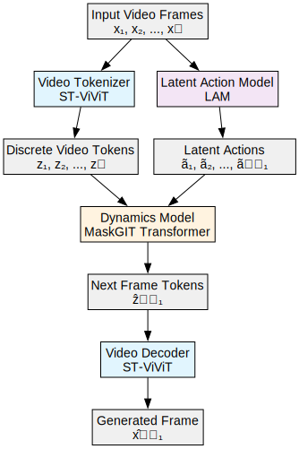

*Source: [genie-architecture-overview.dot](qa/genie-architecture-overview.dot)*

### Component Details

#### 1. Video Tokenizer (ST-ViViT)
**Purpose**: Compress raw video frames into discrete tokens for efficient processing

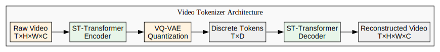

*Source: [video-tokenizer-architecture.dot](qa/video-tokenizer-architecture.dot)*

**Key Features**:
- **Spatiotemporal aware**: Each token zₜ contains information from all previous frames x₁:ₜ
- **Parameters**: 200M params, patch size 4, codebook size 1024
- **Efficiency**: O(n) scaling vs O(n²) for full attention

#### 2. Latent Action Model (LAM)
**Purpose**: Learn discrete action representations from frame transitions without supervision

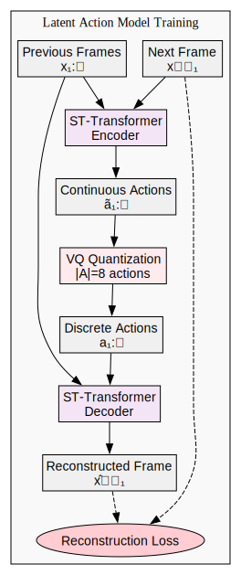

*Source: [latent-action-model.dot](qa/latent-action-model.dot)*

**Key Features**:
- **Unsupervised learning**: No action labels required
- **Small vocabulary**: 8 discrete actions for human playability
- **Parameters**: 300M params, patch size 16
- **Training only**: Decoder discarded at inference

#### 3. Dynamics Model
**Purpose**: Predict next frame tokens given history and user actions

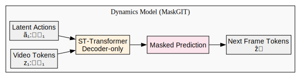

*Source: [dynamics-model.dot](qa/dynamics-model.dot)*

**Key Features**:
- **MaskGIT architecture**: Iterative masked token prediction
- **Additive embeddings**: Actions added to token embeddings (not concatenated)
- **Parameters**: 10.1B params in final model
- **Training**: Random masking rate 0.5-1.0

### Spatiotemporal (ST) Transformer Architecture

The core innovation enabling efficient video processing:

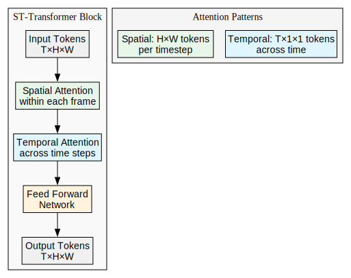

*Source: [st-transformer.dot](qa/st-transformer.dot)*

**Efficiency Advantage**:
- **Traditional Transformer**: O(T²H²W²) complexity
- **ST-Transformer**: O(THW(T+HW)) ≈ O(n) for video

### Training Pipeline

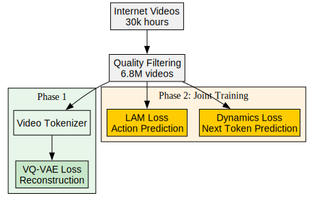

*Source: [training-pipeline.dot](qa/training-pipeline.dot)*

### Inference Pipeline

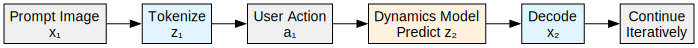

*Source: [inference-pipeline.dot](qa/inference-pipeline.dot)*

### Architecture Comparison

| Component | Traditional World Model | Genie |
|-----------|------------------------|-------|
| **Training Data** | Video + Actions | Video Only |
| **Action Space** | Ground Truth | Learned Latent |
| **Controllability** | Frame-level | Frame-level |
| **Generalization** | Domain-specific | Cross-domain |
| **Supervision** | Supervised | Unsupervised |

The key innovation is learning meaningful action representations purely from observing frame transitions in unlabeled video data, enabling interactive control without requiring expensive action annotations.

## How does genie uses memory?

Genie has **limited but structured memory** - it can only "remember" the last **16 frames** (1.6 seconds at 10 FPS). However, it uses this memory very efficiently through its **Spatiotemporal Transformer** architecture.

### Memory Architecture Overview

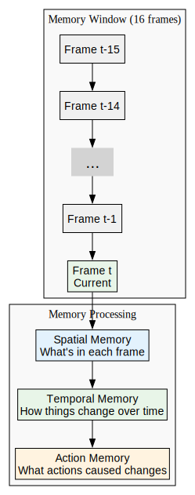

*Source: [memory-architecture-overview.dot](qa/memory-architecture-overview.dot)*

### Three Types of Memory in Genie

#### 1. **Spatial Memory** - "What's Where"
Each frame stores spatial information about objects and their locations

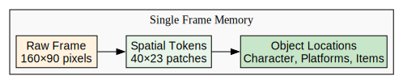

*Source: [spatial-memory.dot](qa/spatial-memory.dot)*

#### 2. **Temporal Memory** - "How Things Change"
The model remembers how objects moved and changed across the 16-frame window

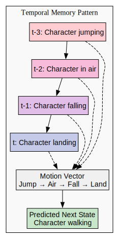

*Source: [temporal-memory.dot](qa/temporal-memory.dot)*

#### 3. **Action Memory** - "What Caused What"
The model remembers which latent actions led to which changes

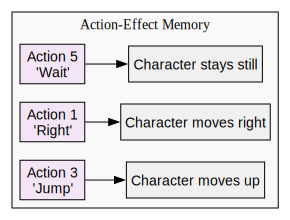

*Source: [action-memory.dot](qa/action-memory.dot)*

### How Memory Works During Generation

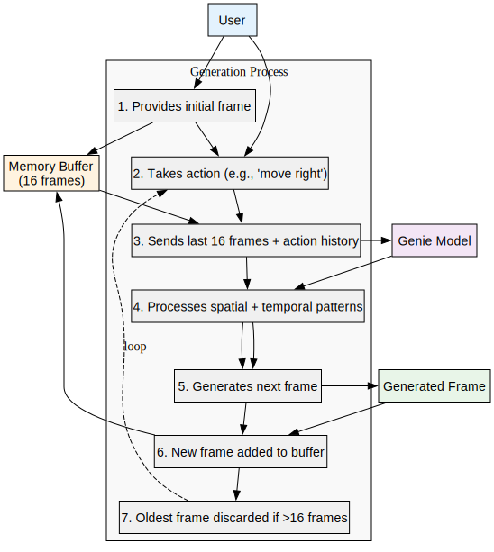

*Source: [memory-generation-process.dot](qa/memory-generation-process.dot)*

### Memory Limitations and Solutions

#### 🚫 **Current Limitations**

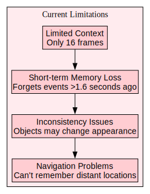

*Source: [memory-limitations.dot](qa/memory-limitations.dot)*

#### ✅ **How Genie Compensates**

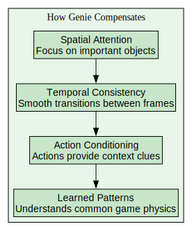

*Source: [memory-compensation.dot](qa/memory-compensation.dot)*

### Memory Efficiency Tricks

#### **1. Hierarchical Token Representation**
Instead of storing raw pixels, Genie compresses frames into tokens

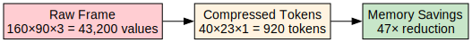

*Source: [token-representation.dot](qa/token-representation.dot)*

#### **2. Causal Attention Pattern**
Each frame can only "see" previous frames, not future ones

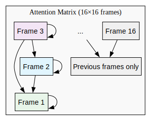

*Source: [causal-attention.dot](qa/causal-attention.dot)*

### Real-World Memory Comparison

| System | Memory Span | Memory Type | Efficiency |
|--------|-------------|-------------|------------|
| **Human Playing Games** | Minutes-Hours | Semantic + Episodic | High |
| **Traditional Game AI** | State-based | Perfect but limited | Medium |
| **Genie** | 1.6 seconds | Spatiotemporal patterns | High within window |
| **Video Diffusion Models** | Fixed video length | Static generation | Low |

### Future Memory Improvements

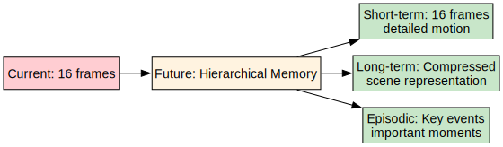

*Source: [future-memory.dot](qa/future-memory.dot)*

**Key Insight**: Genie's memory is like having a **very good short-term memory** but no long-term memory. It can perfectly track what happened in the last 1.6 seconds and use that to predict what should happen next, but it can't remember events from earlier in the game session. This is both a limitation (can't maintain long-term consistency) and a strength (very efficient processing of immediate context).