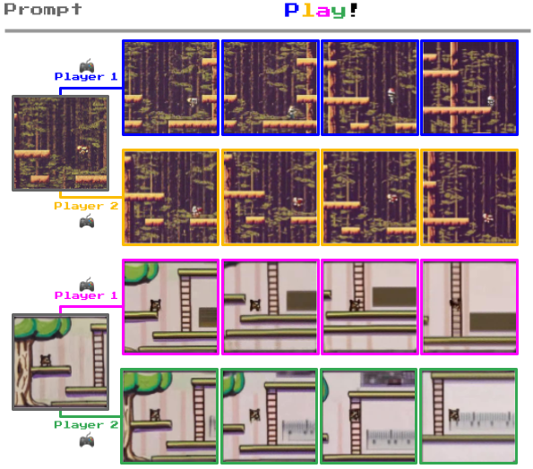

<!-- _class: lead -->

# Genie: Generative Interactive Environments
## by Google DeepMind, 2024

---

<!-- _class: -->

## What Does Genie Do?

## **Input**
- Single image prompt (text-generated, sketch, photo, or game frame)
- User actions (8 discrete latent actions)

## **Output**
- **Playable interactive environments**
- Frame-by-frame controllable video generation
- Endless variety of action-controllable virtual worlds

## **Key Innovation**
- **Learned without ground-truth action labels**
- Trained purely from unlabeled Internet videos
- Creates "foundation world model" for interactive generation

<strong>Figure 1:</strong> Diverse trajectories generated by Genie from different prompts (generated image top, hand-drawn sketch bottom), showing character movement through latent actions.

